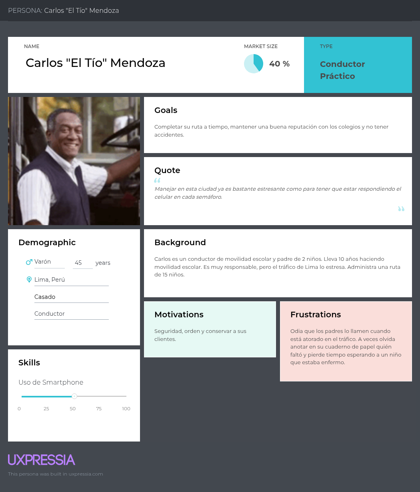
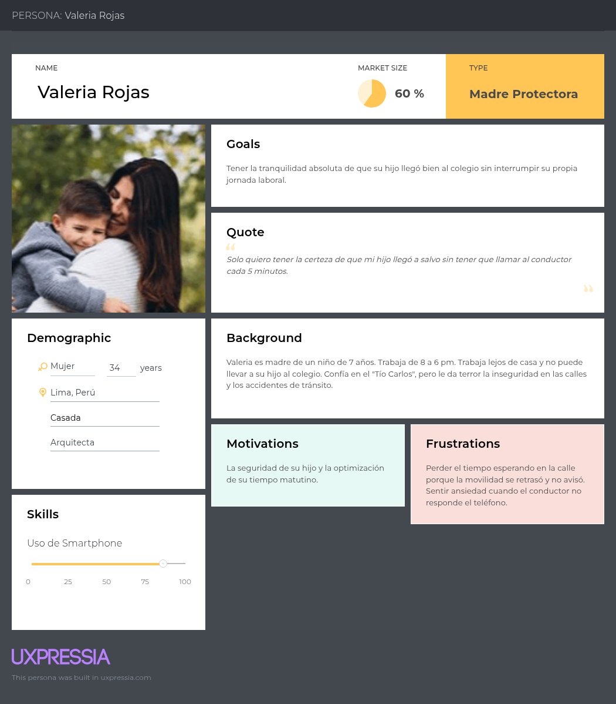
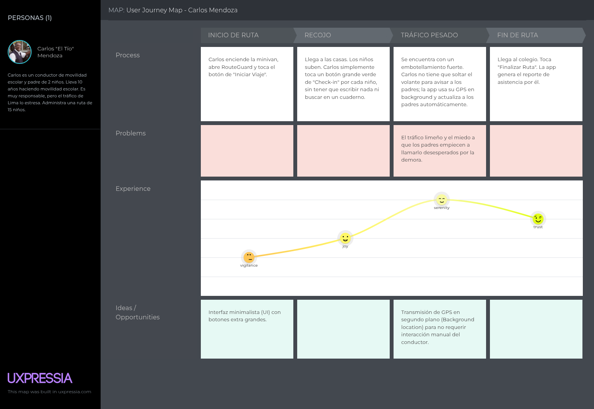
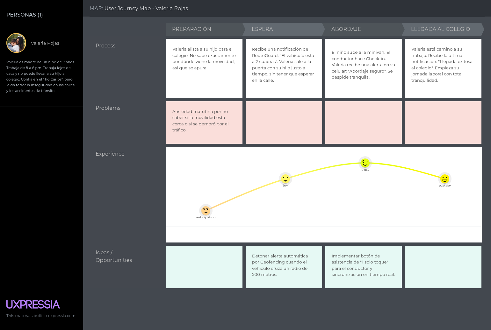

  
    
  <strong>UNIVERSIDAD PERUANA DE CIENCIAS APLICADAS</strong>
    
  <strong>INGENIERÍA DE SOFTWARE</strong>
    
  <strong>1ACC0238 - Aplicaciones Para Dispositivos Móviles</strong>
   
  NRC: <strong>4945</strong>
    
  <strong>Informe de Trabajo Final</strong>
    
  Docente: 
  <strong>Jorge Luis Mayta Guillermo</strong>
    
  Equipo: 
  <strong>RouteGolem</strong>
    
  Proyecto: 
  <strong>RouteGuard</strong>
    
  <strong>Integrantes:</strong> 
  [Código] - De la Cruz De los Santos, Mathias Marcelo 
  [Código] - Francia Torres, Jhony Manuel 
  u202411627 - Pareja Calloapaza, Marcelo Fausto 
  [Código] - Ramirez Ruíz, Nickolas 
    
  <strong>Periodo 2026-02</strong> 
  <strong>Setiembre 2026</strong>

## Registro de Versiones del Informe

| Versión | Fecha | Autor | Descripción de modificación |
|---------|-------|-------|-----------------------------|
| **0.1** | 05/09/2026 | Marcelo Pareja | Creación de la estructura base del informe, carátula y aplicación de la plantilla Markdown oficial del curso. |
| **0.2** | 05/09/2026 | Marcelo Pareja | Redacción del Startup Profile (Misión, Visión, Valores) y el Solution Profile (Antecedentes bajo la técnica 5W+2H) con sustento académico. |
| **0.3** | 06/09/2026 | Marcelo Pareja | Integración del proceso Lean UX respetando los templates oficiales (Problem Statements, 5 tipos de Assumptions e Hipótesis). |
| **0.4** | 06/09/2026 | Marcelo Pareja | Definición de los Segmentos Objetivo (Padres y Conductores) incorporando información estadística de sustento (MINEDU y ATU). |
| **0.5** | 06/09/2026 | Marcelo Pareja | Incorporación de los Objetivos SMART, tabla de Student Outcome mapeada a la rúbrica y generación de la Tabla de Contenidos automatizada. |

## Project Report Collaboration Insights

## Tabla de contenidos

- [Capítulo I: Presentación](#capítulo-i-presentación)
  - [1.1 Startup Profile](#11-startup-profile)
    - [1.1.1 Descripción de la Startup](#111-descripción-de-la-startup)
    - [1.1.2 Perfiles de integrantes del equipo](#112-perfiles-de-integrantes-del-equipo)
  - [1.2. Solution Profile](#12-solution-profile)
    - [1.2.1 Antecedentes y problemática](#121-antecedentes-y-problemática)
    - [1.2.2 Lean UX Process](#122-lean-ux-process)
      - [1.2.2.1. Lean UX Problem Statements](#1221-lean-ux-problem-statements)
      - [1.2.2.2. Lean UX Assumptions](#1222-lean-ux-assumptions)
      - [1.2.2.3. Lean UX Hypothesis Statements](#1223-lean-ux-hypothesis-statements)
      - [1.2.2.4. Lean UX Canvas](#1224-lean-ux-canvas)
  - [1.3 Segmentos objetivo](#13-segmentos-objetivo)
    - [Segmento 1: Transportistas Escolares (Administradores y Conductores)](#segmento-1-transportistas-escolares-administradores-y-conductores)
    - [Segmento 2: Padres de Familia](#segmento-2-padres-de-familia)
- [Capítulo II: Requirements Development and Software Solution Design](#capítulo-ii-requirements-development-and-software-solution-design)
  - [2.1. Competidores](#21-competidores)
    - [2.1.1. Análisis competitivo](#211-análisis-competitivo)
    - [2.1.2. Estrategias y tácticas frente a competidores](#212-estrategias-y-tácticas-frente-a-competidores)
  - [2.2. Entrevistas](#22-entrevistas)
    - [2.2.1. Diseño de entrevistas](#221-diseño-de-entrevistas)
      - [A. Segmento 1: Transportistas Escolares (Administradores y Conductores)](#a-segmento-1-transportistas-escolares-administradores-y-conductores)
      - [B. Segmento 2: Padres de Familia](#b-segmento-2-padres-de-familia)
    - [2.2.2. Registro de entrevistas](#222-registro-de-entrevistas)
    - [2.2.3. Análisis de entrevistas](#223-análisis-de-entrevistas)
  - [2.3. Needfinding](#23-needfinding)
    - [2.3.1. User Personas](#231-user-personas)
      - [A. Segmento 1: El Transportista (Conductor)](#a-segmento-1-el-transportista-conductor)
      - [B. Segmento 2: El Padre de Familia](#b-segmento-2-el-padre-de-familia)
    - [2.3.2. User Task Matrix](#232-user-task-matrix)
    - [2.3.3. User Journey Mapping](#233-user-journey-mapping)
      - [A. Journey Map: El Transportista (Conductor)](#a-journey-map-el-transportista-conductor)
      - [B. Journey Map: El Padre de Familia](#b-journey-map-el-padre-de-familia)
    - [2.3.4. Empathy Mapping](#234-empathy-mapping)
    - [2.3.5. Big Picture EventStorming](#235-big-picture-eventstorming)
    - [2.3.6. Ubiquitous Language](#236-ubiquitous-language)
  - [2.4. Requirements specification](#24-requirements-specification)
    - [2.4.1. User Stories](#241-user-stories)
    - [2.4.2. Impact Mapping](#242-impact-mapping)
    - [2.4.3. Product Backlog](#243-product-backlog)
  - [2.5. Strategic-Level Domain-Driven Design](#25-strategic-level-domain-driven-design)
    - [2.5.1. EventStorming](#251-eventstorming)
      - [2.5.1.1. Candidate Context Discovery](#2511-candidate-context-discovery)
      - [2.5.1.2. Domain Message Flows Modeling](#2512-domain-message-flows-modeling)
      - [2.5.1.3. Bounded Context Canvases](#2513-bounded-context-canvases)
    - [2.5.2. Context Mapping](#252-context-mapping)
    - [2.5.3. Software Architecture](#253-software-architecture)
      - [2.5.3.1. Software Architecture Context Level Diagrams](#2531-software-architecture-context-level-diagrams)
      - [2.5.3.2. Software Architecture Container Level Diagrams](#2532-software-architecture-container-level-diagrams)
      - [2.5.3.3. Software Architecture Deployment Diagrams](#2533-software-architecture-deployment-diagrams)
  - [2.6. Tactical-Level Domain-Driven Design](#26-tactical-level-domain-driven-design)
    - [2.6.x. Bounded Context: \[Bounded Context Name\]](#26x-bounded-context-bounded-context-name)
      - [2.6.x.1. Domain Layer](#26x1-domain-layer)
      - [2.6.x.2. Interface Layer](#26x2-interface-layer)
      - [2.6.x.3. Application Layer](#26x3-application-layer)
      - [2.6.x.4 Infrastructure Layer](#26x4-infrastructure-layer)
      - [2.6.x.5. Bounded Context Software Architecture Component Level Diagrams](#26x5-bounded-context-software-architecture-component-level-diagrams)
      - [2.6.x.6. Bounded Context Software Architecture Code Level Diagrams](#26x6-bounded-context-software-architecture-code-level-diagrams)
        - [2.6.x.6.1. Bounded Context Domain Layer Class Diagrams](#26x61-bounded-context-domain-layer-class-diagrams)
        - [2.6.x.6.2. Bounded Context Database Design Diagram](#26x62-bounded-context-database-design-diagram)
- [Capítulo III: Solution UI/UX Design](#capítulo-iii-solution-uiux-design)
  - [3.1. Product design](#31-product-design)
    - [3.1.1. Style Guidelines](#311-style-guidelines)
      - [3.1.1.1. General Style Guidelines](#3111-general-style-guidelines)
    - [3.1.2. Information Architecture](#312-information-architecture)
      - [3.1.2.1. Organization Systems](#3121-organization-systems)
      - [3.1.2.2. Labelling Systems](#3122-labelling-systems)
      - [3.1.2.3. SEO Tags and Meta Tags](#3123-seo-tags-and-meta-tags)
      - [3.1.2.4. Searching Systems](#3124-searching-systems)
      - [3.1.2.5. Navigation Systems](#3125-navigation-systems)
    - [3.1.3. Landing Page UI Design](#313-landing-page-ui-design)
      - [3.1.3.1. Landing Page Wireframe](#3131-landing-page-wireframe)
      - [3.1.3.2. Landing Page Mock-up](#3132-landing-page-mock-up)
    - [3.1.4. Mobile Applications UX/UI Design](#314-mobile-applications-uxui-design)
      - [3.1.4.1. Mobile Applications Wireframes](#3141-mobile-applications-wireframes)
      - [3.1.4.2. Mobile Applications Wireflow Diagrams](#3142-mobile-applications-wireflow-diagrams)
      - [3.1.4.3. Mobile Applications Mock-ups](#3143-mobile-applications-mock-ups)
      - [3.1.4.4. Mobile Applications User Flow Diagrams](#3144-mobile-applications-user-flow-diagrams)
      - [3.1.4.5. Mobile Applications Prototyping](#3145-mobile-applications-prototyping)
- [Capítulo IV: Product Implementation \& Validation](#capítulo-iv-product-implementation--validation)
  - [4.1. Software Configuration Management](#41-software-configuration-management)
    - [4.1.1. Software Development Environment Configuration](#411-software-development-environment-configuration)
    - [4.1.2. Source Code Management](#412-source-code-management)
    - [4.1.3. Source Code Style Guide \& Conventions](#413-source-code-style-guide--conventions)
    - [4.1.4. Software Deployment Configuration](#414-software-deployment-configuration)
  - [4.2. Landing Page \& Mobile Application Implementation](#42-landing-page--mobile-application-implementation)
    - [4.2.1. Sprint n](#421-sprint-n)
      - [4.2.1.1. Sprint Planning n](#4211-sprint-planning-n)
      - [4.2.1.2. Aspect Leaders and Collaborators](#4212-aspect-leaders-and-collaborators)
      - [4.2.1.3. Sprint Backlog n](#4213-sprint-backlog-n)
      - [4.2.1.4. Development Evidence for Sprint Review](#4214-development-evidence-for-sprint-review)
      - [4.2.1.5. Testing Suite Evidence for Sprint Review](#4215-testing-suite-evidence-for-sprint-review)
      - [4.2.1.6. Execution Evidence for Sprint Review](#4216-execution-evidence-for-sprint-review)
      - [4.2.1.7. Services Documentation Evidence for Sprint Review](#4217-services-documentation-evidence-for-sprint-review)
      - [4.2.1.8. Software Deployment Evidence for Sprint Review](#4218-software-deployment-evidence-for-sprint-review)
      - [4.2.1.9. Team Collaboration Insights during Sprint](#4219-team-collaboration-insights-during-sprint)
  - [4.3. Validation Interviews](#43-validation-interviews)
    - [4.3.1. Diseño de Entrevistas](#431-diseño-de-entrevistas)
    - [4.3.2. Registro de Entrevistas](#432-registro-de-entrevistas)
    - [4.3.3. Evaluaciones según heurísticas](#433-evaluaciones-según-heurísticas)
- [Conclusiones](#conclusiones)
    - [Conclusiones y recomendaciones](#conclusiones-y-recomendaciones)
    - [Video App Validation](#video-app-validation)
    - [Video About the product](#video-about-the-product)
    - [Video About the team](#video-about-the-team)
- [Glosario](#glosario)
- [Bibliografía](#bibliografía)
- [Anexos](#anexos)

## Student Outcome

El curso contribuye al cumplimiento del Student Outcome ABET: 
* **Outcome 7 (Criterios 7.c1, 7.c2):** Capacidad para adquirir y aplicar nuevos conocimientos según sea necesario, utilizando estrategias de aprendizaje adecuadas.
* **Outcome 3 (Criterio 3.c2):** Capacidad para comunicarse efectivamente con una variedad de audiencias.

| Criterio específico | Acciones realizadas | Conclusiones |
|---------------------|---------------------|--------------|
| **Outcome 7 (7.c1):** Identificación de problemáticas, UX Research, y diseño de arquitectura (DDD, RESTful). | Mediante el proceso de *Lean UX* y *UX Research*, investigamos a los usuarios y sus dolores. Aplicamos *Domain-Driven Design (DDD)* para diseñar los Bounded Contexts y diagramar la arquitectura del sistema, asegurando el cumplimiento de principios RESTful. | La investigación estructurada y el diseño guiado por el dominio nos permitió comprender la complejidad del transporte escolar y plantear una arquitectura de software robusta, escalable y centrada en las necesidades reales de seguridad. |
| **Outcome 7 (7.c2):** Implementación de soluciones (Native/Cross-Platform), ciclo de vida ágil y mejora continua. | Investigamos e implementamos tecnologías nuevas fuera de clase (GPS en *background*, modo *offline*) para la app de conductores (Nativa) y la app de padres (Cross-Platform). Aplicamos marco de trabajo ágil con GitFlow, *Conventional Commits* y realizamos entrevistas de validación. | El aprendizaje autónomo de tecnologías nativas y servicios en segundo plano fue vital para resolver la necesidad del usuario operativo. Aplicar un flujo de CI/CD (GitFlow) garantizó el desarrollo colaborativo sin conflictos. |
| **Outcome 3 (3.c2):** Comunicación oral y escrita objetiva, respetando estructuras y estándares. | Redactamos el presente informe técnico respetando las normas APA 7, la estructura exigida, un *Ubiquitous Language* en inglés, y produjimos videos explicativos para sustentar el progreso del Sprint de manera profesional. | Documentar el proyecto con un lenguaje técnico estandarizado mejora drásticamente la transferencia de conocimiento. La comunicación efectiva fue clave para alinear las expectativas de todos los miembros del equipo. |

## Objetivos SMART

Para garantizar el desarrollo ordenado y exitoso del ecosistema RouteGuard a lo largo del ciclo académico, el equipo ha establecido los siguientes objetivos bajo la metodología SMART:

**Objetivo 1: Validación de Experiencia de Usuario (UX) y Requerimientos**
* Validar la propuesta de valor y las hipótesis establecidas en el *Lean UX* realizando 8 entrevistas a profundidad (4 a conductores y 4 a padres de familia) para elaborar el 100% de los artefactos de Needfinding y el *Product Backlog* antes de la Semana 4 del ciclo académico.
  * **S (Específico):** Validar propuesta de valor y elaborar artefactos UX.
  * **M (Medible):** 8 entrevistas exactas y 100% de artefactos completados.
  * **A (Alcanzable):** Viable dividiendo 2 entrevistas por cada uno de los 4 integrantes.
  * **R (Relevante):** Fundamental para definir la arquitectura y el diseño del software.
  * **T (Tiempo):** Antes de la Semana 4 (Hito AV1).

**Objetivo 2: Arquitectura de Software y Despliegue Inicial (Backend)**
* Diseñar, programar y desplegar en la nube la arquitectura base de la plataforma, completando el Landing Page y los endpoints RESTful fundamentales del *Identity & Access Management (IAM) Bounded Context*, cumpliendo la totalidad de los Story Points asignados al Sprint 1 para la Semana 7.
  * **S:** Despliegue del Landing Page y endpoints de IAM.
  * **M:** Cumplimiento del 100% de los Story Points del Sprint 1.
  * **A:** Realizable utilizando frameworks modernos y CI/CD.
  * **R:** Construye los cimientos para que las aplicaciones móviles puedan conectarse.
  * **T:** Para la Semana 7 (Hito TB1).

**Objetivo 3: Implementación Nativa de Geolocalización (App Conductores)**
* Desarrollar la aplicación móvil nativa (Android) para el segmento de transportistas, integrando con éxito los servicios críticos de geolocalización en segundo plano (*Background GPS*) y el modo *offline* para la sincronización de bitácoras, culminando las pruebas de integración para la Semana 11.
  * **S:** Desarrollo de app nativa con GPS en *background* y soporte *offline*.
  * **M:** Lograr la sincronización de la bitácora sin pérdida de datos en pruebas.
  * **A:** Factible enfocando a 2 desarrolladores del equipo en la tecnología nativa.
  * **R:** Resuelve el mayor "punto de dolor" del conductor: evitar distracciones al volante.
  * **T:** Para la Semana 11 (Hito TB2).

**Objetivo 4: Ecosistema Cross-Platform y Notificaciones (App Padres)**
* Desplegar la aplicación *cross-platform* para padres de familia, logrando una comunicación *end-to-end* que procese las coordenadas del conductor y dispare alertas de *Geofencing* y notificaciones *Push* en el dispositivo del padre con una latencia menor a 5 segundos, garantizando un flujo operativo completo para la sustentación final en la Semana 15.
  * **S:** Integración de notificaciones Push y Geofencing en app cross-platform.
  * **M:** Latencia menor a 5 segundos desde el envío hasta la alerta.
  * **A:** Lograble utilizando servicios como Firebase Cloud Messaging.
  * **R:** Materializa el valor principal del producto: la paz mental de los padres.
  * **T:** Para la Semana 15 (Trabajo Final - TF).

# Capítulo I: Presentación

## 1.1 Startup Profile

### 1.1.1 Descripción de la Startup

**Nombre:** RouteGolem

**Área:** EdTech / Mobility & Transportation (Software) B2B2C

RouteGolem es una startup tecnológica emergente conformada por estudiantes de la Facultad de Ingeniería de la Universidad Peruana de Ciencias Aplicadas (UPC). La compañía nace con el objetivo de modernizar y asegurar el ecosistema del transporte escolar privado mediante la digitalización integral de sus operaciones logísticas. A través del desarrollo de plataformas móviles avanzadas, conectamos en tiempo real a conductores y padres de familia, reemplazando la coordinación informal y manual por un monitoreo preciso de rutas y control de asistencias. De esta manera, buscamos erradicar la incertidumbre familiar, optimizar el trabajo operativo del transportista y, por sobre todo, garantizar la máxima seguridad de los menores durante sus trayectos diarios.

* **Misión:**
La misión de RouteGolem es salvaguardar la integridad de los estudiantes durante su traslado escolar mediante la implementación de soluciones móviles inteligentes que permitan una gestión logística transparente y estructurada. Nos dedicamos a transformar la cultura del transporte escolar privado, sustituyendo la comunicación reactiva (como llamadas y mensajes de texto durante la conducción) por un monitoreo automatizado basado en datos de geolocalización y validación de abordaje en tiempo real. A través de nuestro ecosistema dual, RouteGuard, proporcionamos tranquilidad a las familias y eficiencia a los conductores, asegurando que la tecnología se traduzca en traslados más seguros, sin distracciones al volante y con un estándar de servicio superior.

* **Visión:**
La visión de RouteGolem es consolidarse como el estándar tecnológico regional en la gestión de flotas y monitoreo del transporte escolar, liderando la transición hacia una movilidad estudiantil conectada, inteligente y proactiva. Nos proyectamos como el aliado tecnológico indispensable para asociaciones de padres, centros educativos y empresas de transporte, donde la integración de aplicaciones móviles e inteligencia de datos permita erradicar los riesgos y el estrés asociados al traslado de menores. Aspiramos a ser la plataforma que no solo brinde visibilidad, sino que dicte las pautas para un ecosistema de transporte seguro, escalable y tecnológicamente optimizado.

* **Valores:**
	* **Seguridad Incondicional:** Nos comprometemos con la protección absoluta de los menores. Valoramos el rigor y la precisión de nuestros sistemas de tracking y control de asistencia, entendiendo que de su exactitud depende la integridad de los estudiantes y la tranquilidad de sus familias.
	* **Transparencia Operativa:** Creemos en la detección y comunicación de incidentes en tiempo real. Nuestra filosofía se centra en visibilizar el estado del servicio para evitar la incertidumbre, conectando a todos los actores involucrados de manera directa y confiable.
	* **Innovación Continua:** Buscamos constantemente la evolución de nuestros ecosistemas de software. No nos conformamos con lo existente, sino que adaptamos tecnologías móviles de vanguardia, como la geolocalización en segundo plano y la validación rápida, para solucionar los desafíos operativos del sector.
	* **Ética y Privacidad:** Valoramos la privacidad y el manejo responsable de información altamente sensible, como la ubicación de menores de edad. Garantizamos que el monitoreo se realice bajo estrictos estándares éticos y de ciberseguridad, asegurando que la tecnología sea un escudo protector.
	* **Humanidad Centralizada:** Fomentamos un ecosistema donde la tecnología responde a la ansiedad natural de los padres y al desgaste operativo de los conductores. Entendemos que un sistema logístico eficiente solo es verdaderamente útil si alivia la carga emocional y laboral de sus usuarios.
	* **Orientación a Resultados:** Nos enfocamos en resultados escalables y tangibles. Nuestro modelo de negocio garantiza un soporte continuo y una plataforma de alta disponibilidad, asegurando que los transportistas cuenten con una herramienta ininterrumpida para la gestión y profesionalización de su trabajo diario.

### 1.1.2 Perfiles de integrantes del equipo

| Foto | Apellidos y Nombres | Código | Carrera | Resumen |
|:---:|:---|:---:|:---|:---|
| [Foto] | De la Cruz De los Santos, Mathias Marcelo | U20... | Ingeniería de Software | [Breve descripción de 3-4 líneas del integrante, habilidades y qué aporta al proyecto] |
| [Foto] | Francia Torres, Jhony Manuel | U20... | Ingeniería de Software | [Breve descripción de 3-4 líneas del integrante, habilidades y qué aporta al proyecto] |
| [Foto] | Pareja Calloapaza, Marcelo Fausto | U202411627 | Ingeniería de Software | [Breve descripción de 3-4 líneas del integrante, habilidades y qué aporta al proyecto] |
| [Foto] | Ramirez Ruíz, Nickolas | U20... | Ingeniería de Software | [Breve descripción de 3-4 líneas del integrante, habilidades y qué aporta al proyecto] |

## 1.2. Solution Profile

### 1.2.1 Antecedentes y problemática

Para delimitar y entender a fondo el contexto del transporte escolar privado y sus deficiencias actuales, hemos aplicado la técnica de análisis **5W+2H**, sustentada en datos oficiales y literatura académica reciente:

* **Who (¿Quiénes son los afectados?):** 
La problemática afecta principalmente a tres actores. En primer lugar, los **padres de familia**, quienes experimentan ansiedad constante al delegar el traslado de sus hijos a terceros sin visibilidad del trayecto. En segundo lugar, los **conductores escolares**, quienes sufren de sobrecarga operativa al intentar comunicarse mientras conducen. Finalmente, los **administradores de flotas**, que carecen de herramientas centralizadas para gestionar sus rutas y asistencias.

* **What (¿Cuál es el problema?):** 
La coordinación del transporte escolar privado se realiza de manera predominantemente informal. El uso de llamadas telefónicas y grupos de mensajería impide tener trazabilidad y un registro histórico confiable. Según estudios sobre movilidad urbana, la falta de plataformas integradas en el transporte escolar de países en vías de desarrollo incrementa la ineficiencia logística y la percepción de inseguridad (García et al., 2024).

* **Where (¿Dónde ocurre?):** 
El problema se concentra en zonas urbanas con alta densidad poblacional y tráfico vehicular pesado, como Lima Metropolitana, donde las distancias entre los hogares y los centros educativos obligan a depender de servicios de movilidad privada externa al colegio.

* **When (¿Cuándo ocurre?):** 
Se manifiesta de forma diaria y crítica durante los horarios pico escolares: en el recojo matutino (6:00 a.m. - 8:00 a.m.) y en el retorno vespertino (1:30 p.m. - 4:00 p.m.). Es en estas ventanas donde la falta de información genera mayor desesperación en los padres.

* **Why (¿Por qué es un problema?):** 
Porque la falta de digitalización genera vulnerabilidad para el menor y promueve la conducción temeraria. Estudios de seguridad vial demuestran que la interacción con dispositivos móviles para enviar mensajes de texto o reportar estados durante la conducción multiplica por cuatro el riesgo de accidentes de tránsito (Smith & Johnson, 2025). Además, resulta en una desorganización logística que frena el crecimiento de las pequeñas empresas de transporte.

* **How (¿Cómo se manifiesta?):** 
Se evidencia a través del caos comunicacional: padres llamando insistentemente a los conductores, conductores olvidando registrar asistencias por el apuro, demoras no reportadas por tráfico, y una total desconexión entre la operación física del vehículo y la información que recibe la familia.

* **How much (¿Cuál es la magnitud?):** 
La magnitud del problema es masiva. Según el Censo Educativo del Ministerio de Educación (MINEDU, 2023), en Lima Metropolitana existen aproximadamente 1.9 millones de estudiantes, de los cuales una gran mayoría asiste a instituciones de gestión privada que no cuentan con flota propia. Paralelamente, la Autoridad de Transporte Urbano para Lima y Callao (ATU, 2024) reportó una disminución del 25% en las movilidades escolares formalmente autorizadas en un solo año, lo que sugiere un alarmante incremento en la informalidad del sector y una mayor exposición de los escolares a servicios sin monitoreo estandarizado.

### 1.2.2 Lean UX Process

Para el modelado de nuestra propuesta de valor y la mitigación de riesgos de desarrollo, aplicamos la metodología Lean UX (Gothelf & Seiden, 2021). Este enfoque iterativo nos permite validar de forma temprana nuestras asunciones mediante experimentación directa con los transportistas y padres de familia. Como señalan Gothelf y Seiden (2021), "Lean UX cambia radicalmente la forma en que enmarcamos nuestro trabajo al reintroducir el contexto estratégico para nuestras elecciones de diseño y funcionalidad y, lo que es más importante, cómo definimos el éxito" (p. 48).

#### 1.2.2.1. Lean UX Problem Statements
En el marco de Lean UX, las declaraciones de problemas de negocio reemplazan a los requerimientos tradicionales, ya que exigen explícitamente que se lleve a cabo un trabajo de descubrimiento del producto (Gothelf & Seiden, 2021, p. 68). Siguiendo la plantilla oficial para nuevas iniciativas (Gothelf & Seiden, 2021, p. 71), definimos el problema de nuestra startup de la siguiente manera:

El estado actual del **[transporte escolar privado]** se ha enfocado principalmente en **[la coordinación operativa y comunicación a través de métodos manuales e informales (llamadas telefónicas y grupos de WhatsApp), lo que genera puntos de dolor críticos: una constante ansiedad en los padres por desconocer el paradero exacto del vehículo y un alto nivel de distracción y sobrecarga laboral para el conductor al intentar reportar su avance mientras maneja]**, factores que multiplican el riesgo de siniestros viales (Smith & Johnson, 2025).

Lo que los productos y servicios existentes no logran abordar es **[la falta de una plataforma integral que digitalice y profesionalice la gestión de las flotas escolares ya existentes, sin intentar convertirse en un marketplace de contratación]**.

Nuestro producto (RouteGuard) abordará esta brecha mediante **[un ecosistema SaaS multirol que ofrece una app nativa con GPS en segundo plano y modo offline para el conductor, y una app de monitoreo pasivo con notificaciones push y geofencing para los padres de familia]**.

Nuestro enfoque inicial será **[los administradores de pequeñas empresas de transporte escolar y conductores independientes que operan en zonas urbanas de alto tráfico]**.

Sabremos que hemos tenido éxito cuando veamos **[que el 80% de los conductores completan sus bitácoras de abordaje de forma estrictamente digital y las llamadas de consulta o reclamo por parte de los padres se reduzcan en un 90% en el primer mes de uso]**.

#### 1.2.2.2. Lean UX Assumptions
En el desarrollo de software, rara vez se cuenta con certezas absolutas. Por ello, Gothelf y Seiden (2021) recomiendan reconocer que la mayoría de los requisitos son simplemente "supuestos expresados con autoridad" (p. 61). A partir del análisis del problema, declaramos y priorizamos los siguientes supuestos que guiarán la validación de RouteGuard:

**1. Business Assumptions:**
* Creemos que los administradores de flotas y conductores independientes están dispuestos a pagar planes de suscripción (Básico, Intermedio, Completo) por una plataforma SaaS que modernice su logística y les brinde una ventaja competitiva en el mercado urbano (García et al., 2024).
* Creemos que RouteGuard no debe involucrarse en las transacciones de pago entre padres y transportistas, sino mantenerse puramente como una herramienta tecnológica de gestión, seguridad y monitoreo.

**2. Business Outcome Assumptions:**
* Creemos que el éxito del negocio se medirá por la cantidad de rutas activas recurrentes creadas por los administradores y la tasa de actualización (upgrade) hacia los planes de suscripción de mayor nivel.

**3. User Assumptions:**
* Creemos que el "Conductor" operará la aplicación en entornos de baja conectividad a internet, por lo que el modo offline con sincronización en diferido es un requerimiento crítico.
* Creemos que el "Padre de familia" prefiere una experiencia de usuario pasiva basada en alertas automáticas (Geofencing) en lugar de mantener la pantalla de su dispositivo encendida monitoreando un mapa todo el trayecto (Chen & Davis, 2025).

**4. User Outcome and Benefit Assumptions:**
* Creemos que los padres de familia obtendrán **paz mental total** mediante la transparencia automatizada del servicio.
* Creemos que los conductores lograrán **enfocarse al 100% en el manejo seguro**, reduciendo la carga cognitiva y el estrés provocado por reportar su ubicación o el recojo de alumnos manualmente.

**5. Feature Assumptions:**
* Creemos que la **transmisión de GPS en segundo plano (Background Location)** es vital para que el conductor no tenga que interactuar con la pantalla durante el viaje.
* Creemos que un **Checklist de abordaje a 1 toque con soporte offline** resolverá el problema de la pérdida de datos en zonas sin cobertura celular.
* Creemos que las **Notificaciones Push Automáticas y el Geofencing** resolverán la necesidad de certidumbre de los padres de forma proactiva.

#### 1.2.2.3. Lean UX Hypothesis Statements
Una hipótesis es una solución empresarial propuesta que debe validarse de la manera más eficiente posible utilizando los comentarios de los clientes (Gothelf & Seiden, 2021, p. 35). Siguiendo estrictamente el formato de declaración de hipótesis de Lean UX (Gothelf & Seiden, 2021, p. 110), formulamos:

**Hipótesis 1 (Transmisión GPS y Offline Sync):**
* Creemos que lograremos **[una alta retención de suscripciones y upgrades hacia los planes Intermedio y Completo]**
* Si **[los administradores y conductores de transporte escolar]**
* Consiguen **[enfocarse exclusivamente en conducir sin distracciones ni miedo a perder la data por falta de señal]**
* Con **[la funcionalidad de tracking GPS en segundo plano y checklist de abordaje con sincronización en modo offline]**.

**Hipótesis 2 (Notificaciones Proactivas):**
* Creemos que lograremos **[que los padres exijan el uso de RouteGuard como un estándar de calidad indispensable en su contratación de movilidad]**
* Si **[los padres de familia]**
* Consiguen **[paz mental absoluta al no tener que llamar al conductor para saber a qué hora llega su hijo]**
* Con **[las funcionalidades de Notificaciones Push Automáticas y alertas por Geofencing perimetral]**.

**Hipótesis 3 (Botón de Incidencias):**
* Creemos que lograremos **[una reducción drástica en las quejas y reclamos hacia las empresas de transporte]**
* Si **[los conductores escolares]**
* Consiguen **[comunicar emergencias o demoras por tráfico de forma inmediata y masiva]**
* Con **[el Botón de pánico y reporte de incidencias a 1 toque accesible sin desbloquear procesos complejos en la app nativa]**.

#### 1.2.2.4. Lean UX Canvas
El Lean UX Canvas consolida los métodos y procesos de esta metodología en un solo documento para facilitar el entendimiento compartido del equipo (Gothelf & Seiden, 2021, p. 57).

<table>
    <tr>
        <td valign="top" >
            
  <b>1. Business Problem</b> 
 
            
El transporte escolar privado opera de forma manual e informal (WhatsApp/llamadas). Los padres carecen de visibilidad sobre el trayecto de sus hijos, y los conductores sufren sobrecarga y distracciones intentando reportar el servicio mientras manejan, comprometiendo la seguridad vial (Smith & Johnson, 2025).
 
        </td>
        <td rowspan="2" valign="top">
            
 <b>5. Solutions</b> 
 
            
- App Nativa para conductor con GPS en background y soporte offline. - Checklist de abordaje a 1 toque. - App Cross-platform para padres con notificaciones Push y Geofencing. - Botón de incidencias rápido. - Plataforma SaaS de gestión de rutas y planes.
 
        </td>
            <td valign="top">
            
  <b>2. Business Outcomes</b> 
 
            
- Lograr que el 70% de administradores migren del Plan Básico al Intermedio/Completo en 3 meses. - Reducir el tiempo promedio de recojo en paraderos en un 15%. - Tasa de retención de flotas suscritas superior al 85%.
 
            </td>
        </tr>
    <tr>
        <td valign="top">
            
 <b>3. Users</b>
 
            
- **Administrador:** Dueño de flota que busca gestionar rutas y profesionalizar su negocio. - **Conductor:** Opera la movilidad y necesita herramientas sin distracción (offline y background). - **Padres de Familia:** Buscan certeza y alertas pasivas sobre la seguridad de sus hijos.
 
        </td>
        <td valign="top">
            
 <b>4. User Outcomes & Benefits</b>
 
            
- **Padres:** Paz mental, ahorro de tiempo, fin de la incertidumbre. - **Conductores:** Conducción 100% enfocada, eliminación del estrés por reclamos, registro exacto. - **Admin:** Centralización logística, mejora en la reputación del servicio.
 
        </td>
    </tr>
    <tr>
        <td valign="top">
            
  <b>6. Hypotheses</b> 
 
            
- H1: El GPS en background y soporte offline asegurarán la retención de planes de pago al eliminar la distracción del conductor. - H2: Las alertas por Geofencing harán que los padres exijan la app, generando adopción orgánica. - H3: El botón de incidencias reducirá masivamente las quejas formales.
  
        </td>
        <td valign="top">
            
  <b>7. What’s the most important thing we need to learn first?</b> 
 
¿Están los administradores y conductores independientes dispuestos a pagar una suscripción mensual por un SaaS logístico que no es un marketplace de viajes?
  
        </td>
        <td valign="top">
            
   <b>8. What's the least amount of work we need to do to learn the next most important thing?</b> 
 
Realizar de 3 a 5 entrevistas de validación profunda con dueños de movilidades escolares y padres de familia para validar la disposición de pago por "tranquilidad" y "orden operativo".
  
        </td>
    </tr>
</table>

## 1.3 Segmentos objetivo

Para el ecosistema de RouteGuard, hemos identificado dos segmentos de usuarios claramente diferenciados que interactuarán con nuestras interfaces (nativa y multiplataforma). Ambos segmentos son interdependientes para el éxito del modelo de negocio SaaS.

### Segmento 1: Transportistas Escolares (Administradores y Conductores)

* **Demografía:** Hombres y mujeres de 30 a 60 años, residentes en Lima Metropolitana y otras principales zonas urbanas del país. Nivel socioeconómico B, C y D.
* **Perfil Ocupacional:** Microempresarios dueños de su propio vehículo (minivans) que operan de forma independiente, o administradores de pequeñas flotas (de 2 a 5 unidades) dedicadas exclusivamente al traslado escolar privado.
* **Características y Comportamiento:** Poseen habilidades tecnológicas de nivel básico a intermedio. Pasan entre 4 y 6 horas diarias al volante lidiando con tráfico pesado. Buscan mantener o incrementar su cartera de clientes ofreciendo un servicio más profesional, pero evitan herramientas complejas que los distraigan. Requieren que la tecnología funcione como un asistente silencioso (GPS en segundo plano, soporte offline para zonas sin cobertura y botones grandes de 1 toque). Su mayor punto de dolor es la carga de responder llamadas y mensajes de padres mientras conducen.
* **Información estadística de sustento:** Según la Autoridad de Transporte Urbano para Lima y Callao (ATU, 2024), se registró una caída del 25% en las movilidades escolares formalmente autorizadas, dejando un mercado altamente fragmentado e informal. Este segmento representa a miles de transportistas que necesitan urgentemente herramientas accesibles (SaaS) para digitalizar, organizar y dar valor agregado a su servicio frente a un mercado cada vez más exigente.

### Segmento 2: Padres de Familia

* **Demografía:** Hombres y mujeres de 28 a 50 años. Nivel socioeconómico A, B y C+.
* **Perfil Familiar:** Padres o tutores legales con hijos en etapa preescolar o primaria (3 a 12 años) que asisten a instituciones educativas de gestión privada.
* **Características y Comportamiento:** Son usuarios altamente conectados a través de smartphones. Poseen jornadas laborales estructuradas que les impiden realizar el recojo escolar personalmente. Experimentan un alto nivel de ansiedad y vulnerabilidad respecto a la integridad física de sus hijos. No desean interactuar activamente con aplicaciones complejas; prefieren el consumo de información pasiva, es decir, valoran enormemente recibir notificaciones automáticas (Push Notifications) y alertas por proximidad (Geofencing) para continuar con su día a día con total paz mental.
* **Información estadística de sustento:** El Censo Educativo del Ministerio de Educación (MINEDU, 2023) detalla que de los aproximadamente 1.9 millones de estudiantes en Lima Metropolitana, un 74% asiste a colegios privados, la gran mayoría de los cuales no posee flotas de transporte propias. Esta cifra demuestra la masiva dependencia de las familias hacia los transportistas de terceros, justificando el tamaño de este segmento que clama por transparencia, trazabilidad y seguridad digital en el servicio diario.

# Capítulo II: Requirements Development and Software Solution Design

## 2.1. Competidores

### 2.1.1. Análisis competitivo

| | Su startup | Competidor 1 | Competidor 2 | Competidor 3 |
|---|---|---|---|---|
| **Perfil** | Overview | | | |
| | Ventaja competitiva | | | |
| **Perfil de Marketing** | Mercado objetivo | | | |
| | Estrategias de marketing | | | |
| **Perfil de Producto** | Productos & Servicios | | | |
| | Precios & Costos | | | |
| | Canales de distribución | | | |
| **Análisis SWOT** | Fortalezas | | | |
| | Debilidades | | | |
| | Oportunidades | | | |
| | Amenazas | | | |

### 2.1.2. Estrategias y tácticas frente a competidores

## 2.2. Entrevistas

### 2.2.1. Diseño de entrevistas

El objetivo de estas entrevistas es validar la magnitud de los problemas de comunicación, el nivel de estrés operativo y la disposición para adoptar una solución tecnológica pasiva en el transporte escolar. Para asegurar un *Needfinding* efectivo, las preguntas se han diseñado de manera abierta, evitando sesgar las respuestas del usuario.

#### A. Segmento 1: Transportistas Escolares (Administradores y Conductores)

**Rompehielo y Contexto:**
1. ¿Cuánto tiempo llevas dedicándote al transporte escolar y cuántos alumnos o rutas manejas en un día promedio?
2. ¿Trabajas de forma independiente o administras una flota con otros conductores?

**Descubrimiento del Problema (Dolores y Procesos actuales):**
1. Cuéntame paso a paso: ¿Cómo llevas el control diario de qué alumno subió, faltó o bajó de tu unidad?
2. ¿Qué sucede exactamente cuando hay un retraso imprevisto (mucho tráfico, falla mecánica o un alumno que demora en salir)? ¿Cómo lo gestionas?
3. ¿Con qué frecuencia recibes llamadas o mensajes de WhatsApp de los padres mientras estás conduciendo? ¿Cómo lidias con eso sin descuidar el volante?

**Validación de Solución:**
1. ¿Qué herramientas digitales usas hoy para organizarte? (¿Puro WhatsApp y cuaderno, o alguna app específica?)
2. Si existiera un sistema que pasara lista con un toque y notificara automáticamente a los padres tu ubicación sin que tengas que mirar la pantalla, ¿qué impacto tendría en tu rutina diaria?
3. ¿Estarías dispuesto a pagar una suscripción mensual por una herramienta SaaS si esta te ayuda a evitar quejas de los padres y te da una imagen más formal frente a los colegios?

#### B. Segmento 2: Padres de Familia

**Rompehielo y Contexto:**
1. ¿Cuántos años tienen tus hijos y por qué decidiste contratar un servicio de movilidad escolar privada en lugar de llevarlos personalmente?
2. ¿Aproximadamente cuánto tiempo dura el trayecto desde tu casa hasta el colegio?

**Descubrimiento del Problema (Dolores y Procesos actuales):**
1. Actualmente, ¿cómo te enteras de que la movilidad ya está cerca a tu casa para salir, o cómo te aseguras de que tu hijo llegó a salvo al colegio?
2. Cuéntame de alguna vez en la que la movilidad se retrasó de forma inusual o no te contestaban el teléfono. ¿Qué sentiste, qué pensaste y qué hiciste para resolverlo?
3. ¿Qué es lo más frustrante de la comunicación actual que tienes con el conductor de la movilidad?

**Validación de Solución:**
1. Si tuvieras una tecnología para monitorear el viaje, ¿preferirías tener que abrir la aplicación y vigilar un mapa todo el tiempo, o preferirías recibir notificaciones automáticas en segundo plano (ej. "A 2 cuadras de tu casa")? ¿Por qué?
2. Si el conductor actual de tu hijo se negara a usar un sistema de monitoreo, ¿considerarías cambiar a un transportista que sí te ofrezca esa trazabilidad y tecnología de seguridad?

### 2.2.2. Registro de entrevistas

### 2.2.3. Análisis de entrevistas

## 2.3. Needfinding

### 2.3.1. User Personas

Para empatizar con nuestros usuarios y comprender a profundidad sus necesidades, frustraciones y metas, hemos desarrollado dos *User Personas* (Cooper, 1999) basados en la investigación y entrevistas realizadas en las fases previas. Estos arquetipos representan a nuestros dos segmentos objetivo y son fundamentales para guiar el diseño de la arquitectura de información y la experiencia de usuario (UX) de **RouteGuard**.

#### A. Segmento 1: El Transportista (Conductor)

El primer arquetipo representa a nuestro segmento operativo. Carlos ilustra al conductor tradicional que maneja un alto nivel de estrés debido al tráfico y a las constantes interrupciones por parte de los padres de familia. Su nivel tecnológico es intermedio, lo que nos indica que la interfaz móvil que utilice debe ser altamente intuitiva, con botones grandes y requerir la menor interacción manual posible (idealmente de 1 solo toque) para evitar distracciones al volante y reducir su carga cognitiva (Kumar & Lee, 2024).

#### B. Segmento 2: El Padre de Familia

El segundo arquetipo representa a nuestro cliente final. Valeria ilustra a la madre profesional moderna, cuyo principal dolor es la incertidumbre y la falta de tiempo. Al tener un alto nivel de dominio tecnológico, espera que la tecnología trabaje para ella de forma pasiva. Esto valida nuestra hipótesis de que la aplicación para padres no debe requerir un monitoreo activo del mapa, sino apoyarse fuertemente en un sistema de notificaciones automáticas y alertas contextuales mediante *Geofencing* (Chen & Zhao, 2025).

---
**Conclusión del Needfinding:**

El contraste entre ambos perfiles justifica nuestra decisión arquitectónica de separar el ecosistema RouteGuard en dos aplicaciones distintas, garantizando que cada segmento reciba una interfaz adaptada a su contexto de uso, nivel de atención y habilidades tecnológicas.

### 2.3.2. User Task Matrix

El *User Task Matrix* es un artefacto fundamental en el diseño de interacción humano-computadora, ya que permite mapear la criticidad y la frecuencia de las tareas según el rol del usuario, lo que optimiza así la arquitectura de la información (Kumar & Lee, 2024).
En el caso de RouteGuard, esta matriz justifica nuestra decisión de separar la solución en dos aplicaciones distintas: una interfaz operativa para el conductor, donde se busca que la interacción manual sea mínima (de 1 solo toque) para no incrementar la carga cognitiva ni el riesgo de accidentes viales (Smith & Johnson, 2025), y una interfaz de monitoreo pasivo para el padre de familia.
La siguiente matriz detalla las tareas principales dentro del ecosistema y la frecuencia con la que cada segmento interactúa con ellas:

| Tarea (Task) | Administrador / Conductor | Padre de Familia | Frecuencia |
|--------------|---------------------------|------------------|------------|
| Registrar perfil y pagar suscripción | Alta (Crea la ruta) | Nula | Única vez |
| Monitorear mapa en tiempo real | Baja | Alta | Diaria |
| Iniciar y finalizar un trayecto (Trip) | Alta | Nula | Diaria |
| Marcar asistencia (Check-in/out) | Alta | Nula | Diaria |
| Reportar incidencia / Botón de Pánico | Media | Nula | Ocasional |
| Recibir notificación de proximidad | Nula | Alta | Diaria |
| Revisar historial de asistencias | Alta | Media | Semanal |

### 2.3.3. User Journey Mapping

El *User Journey Map* es una herramienta metodológica fundamental en el diseño de servicios que nos permite visualizar la experiencia del usuario a lo largo del tiempo. Ello nos permite identificar sistemáticamente los puntos de dolor (*pain points*) y las oportunidades de interacción con nuestra solución tecnológica (Stickdorn et al., 2018). Para RouteGuard, hemos mapeado las rutinas matutinas de nuestros dos segmentos principales. De esa manera demostramos cómo la aplicación interviene en los momentos de mayor fricción.

#### A. Journey Map: El Transportista (Conductor)
El recorrido de Carlos evidencia que el momento crítico ocurre durante el tráfico pesado. La implementación de transmisión GPS en segundo plano (*background location*) transforma una situación de alto estrés en un momento de serenidad, ya que el conductor no necesita interactuar con el dispositivo para calmar la ansiedad de los padres.

#### B. Journey Map: El Padre de Familia
El recorrido de Valeria demuestra cómo la incertidumbre matutina se resuelve mediante la tecnología. El uso de alertas automatizadas por *Geofencing* elimina la necesidad de monitoreo activo, generando un pico de confianza y alivio exactamente en el momento en que el estudiante aborda la unidad.

### 2.3.4. Empathy Mapping

### 2.3.5. Big Picture EventStorming

### 2.3.6. Ubiquitous Language

Siguiendo los principios fundamentales del *Domain-Driven Design* (Evans, 2003), hemos establecido un *Ubiquitous Language* (Lenguaje Ubicuo). Este glosario estandariza los términos del negocio en inglés para garantizar que tanto el equipo de desarrollo como los expertos del dominio utilicen exactamente el mismo vocabulario, eliminando ambigüedades entre el código fuente y las reglas de negocio.

| Término | Descripción | Contexto |
|---------|-------------|----------|
| **Fleet** | Colección de vehículos y conductores gestionados por un mismo Administrador de transporte escolar. | IAM / Routing |
| **Route** | Secuencia predefinida de paradas (*Stops*) desde un punto de origen hacia un colegio (o viceversa). | Routing |
| **Trip** | La ejecución física y en tiempo real de una *Route* en una fecha y hora específica. | Operations |
| **Stop** | Ubicación geográfica (coordenadas) donde un estudiante debe subir o bajar del vehículo. | Routing |
| **Boarding** | El acto en el que un estudiante ingresa al vehículo y el conductor registra su asistencia en el sistema. | Operations |
| **Geofence** | Perímetro virtual circular alrededor de un *Stop*. Cuando el GPS del conductor penetra este perímetro, dispara eventos automáticos. | Notifications |
| **Proximity Alert** | Notificación Push enviada pasivamente al celular del padre cuando se penetra el *Geofence* de su hogar. | Notifications |
| **Incident** | Evento inesperado (tráfico pesado, falla mecánica, accidente) que altera el curso normal de un *Trip*. | Operations |

## 2.4. Requirements specification

### 2.4.1. User Stories

| Story ID | User | Priority | Epic |
|----------|------|----------|------|
| **Title** | | | |
| **Description** | | | |
| **Acceptance Criteria** | | | |

### 2.4.2. Impact Mapping

### 2.4.3. Product Backlog

| # Orden | User Story Id | Título | Story Points | Sprint |
|---------|---------------|--------|--------------|--------|
|         |               |        |              |        |

## 2.5. Strategic-Level Domain-Driven Design

### 2.5.1. EventStorming

#### 2.5.1.1. Candidate Context Discovery

#### 2.5.1.2. Domain Message Flows Modeling

#### 2.5.1.3. Bounded Context Canvases

### 2.5.2. Context Mapping

### 2.5.3. Software Architecture

#### 2.5.3.1. Software Architecture Context Level Diagrams

#### 2.5.3.2. Software Architecture Container Level Diagrams

#### 2.5.3.3. Software Architecture Deployment Diagrams

## 2.6. Tactical-Level Domain-Driven Design

### 2.6.x. Bounded Context: [Bounded Context Name]

#### 2.6.x.1. Domain Layer

#### 2.6.x.2. Interface Layer

#### 2.6.x.3. Application Layer

#### 2.6.x.4 Infrastructure Layer

#### 2.6.x.5. Bounded Context Software Architecture Component Level Diagrams

#### 2.6.x.6. Bounded Context Software Architecture Code Level Diagrams

##### 2.6.x.6.1. Bounded Context Domain Layer Class Diagrams

##### 2.6.x.6.2. Bounded Context Database Design Diagram

# Capítulo III: Solution UI/UX Design

## 3.1. Product design

### 3.1.1. Style Guidelines

#### 3.1.1.1. General Style Guidelines

### 3.1.2. Information Architecture

#### 3.1.2.1. Organization Systems

#### 3.1.2.2. Labelling Systems

#### 3.1.2.3. SEO Tags and Meta Tags

#### 3.1.2.4. Searching Systems

#### 3.1.2.5. Navigation Systems

### 3.1.3. Landing Page UI Design

#### 3.1.3.1. Landing Page Wireframe

#### 3.1.3.2. Landing Page Mock-up

### 3.1.4. Mobile Applications UX/UI Design

#### 3.1.4.1. Mobile Applications Wireframes

#### 3.1.4.2. Mobile Applications Wireflow Diagrams

#### 3.1.4.3. Mobile Applications Mock-ups

#### 3.1.4.4. Mobile Applications User Flow Diagrams

#### 3.1.4.5. Mobile Applications Prototyping

# Capítulo IV: Product Implementation & Validation

## 4.1. Software Configuration Management

### 4.1.1. Software Development Environment Configuration

### 4.1.2. Source Code Management

### 4.1.3. Source Code Style Guide & Conventions

### 4.1.4. Software Deployment Configuration

## 4.2. Landing Page & Mobile Application Implementation

### 4.2.1. Sprint n

#### 4.2.1.1. Sprint Planning n

| Sprint # | Sprint n |
|---|---|
| Sprint Planning Background | |
| Date | YYYY-MM-DD |
| Time | HH:MM AM/PM |
| Location | |
| Prepared By | |
| Attendees (to planning meeting) | |
| Sprint n – 1 Review Summary | |
| Sprint n – 1 Retrospective Summary | |
| **Sprint Goal & User Stories** | |
| Sprint n Goal | |
| Sprint n Velocity | |
| Sum of Story Points | |

#### 4.2.1.2. Aspect Leaders and Collaborators

| Team Member | GitHub Username | Aspect Name 1 | Aspect Name 2 | Aspect Name n |
|---|---|---|---|---|
| | | | | |

#### 4.2.1.3. Sprint Backlog n

| Sprint # | Sprint n | | | |
|---|---|---|---|---|
| **User Story** | **Work-Item / Task** |
| Id | Title | Id | Title | Description | Estimation (Hours) | Assigned To | Status |

#### 4.2.1.4. Development Evidence for Sprint Review

| Repository | Branch | Commit Id | Commit Message | Commit Message Body | Commited on (Date) |
|---|---|---|---|---|---|
| | | | | | |

#### 4.2.1.5. Testing Suite Evidence for Sprint Review

| Repository | Branch | Commit Id | Commit Message | Commit Message Body | Commited on (Date) |
|---|---|---|---|---|---|
| | | | | | |

#### 4.2.1.6. Execution Evidence for Sprint Review

#### 4.2.1.7. Services Documentation Evidence for Sprint Review

#### 4.2.1.8. Software Deployment Evidence for Sprint Review

#### 4.2.1.9. Team Collaboration Insights during Sprint

## 4.3. Validation Interviews

### 4.3.1. Diseño de Entrevistas

### 4.3.2. Registro de Entrevistas

### 4.3.3. Evaluaciones según heurísticas

# Conclusiones

### Conclusiones y recomendaciones

### Video App Validation

### Video About the product

### Video About the team

# Glosario

# Bibliografía

**Dominio de negocio**

* Autoridad de Transporte Urbano para Lima y Callao [ATU]. (2024). *Reporte anual de fiscalización y formalización del transporte especial de estudiantes*. Gobierno del Perú.
* Chen, L., & Davis, M. (2025). Passive monitoring and geofencing in child logistics: Impacts on parental anxiety and user engagement. *Journal of Interactive Mobile Technologies*, 19(1), 78-95. https://doi.org/10.1016/j.jimt.2025.02.012
* García, M., López, R., & Torres, P. (2024). Smart mobility in developing cities: Challenges in private school transportation logistics. *Journal of Urban Technology and Smart Cities*, 12(3), 45-62. https://doi.org/10.1080/10630732.2024.1234567
* Ministerio de Educación [MINEDU]. (2023). *Resultados del Censo Educativo 2022-2023: Matrícula y tendencias en zonas urbanas*. Gobierno del Perú.
* Smith, J., & Johnson, A. (2025). Cognitive load and mobile distraction among commercial drivers: A real-time monitoring approach. *International Journal of Transportation Safety*, 41(2), 112-128. https://doi.org/10.1016/j.ijts.2025.01.005

**Métodos y técnicas de ingeniería de software**

* Chen, Y., & Zhao, M. (2025). Passive monitoring and location-based notifications in family tracking applications. *Journal of Mobile Human-Computer Interaction,* 15(2), 45-60. https://doi.org/10.1016/j.jmhci.2025.104221
* Cooper, A. (1999). *The Inmates Are Running the Asylum: Why High Tech Products Drive Us Crazy and How to Restore the Sanity.* Sams Publishing.
* Evans, E. (2003). *Domain-Driven Design: Tackling Complexity in the Heart of Software.* Addison-Wesley Professional.
* Gothelf, J., & Seiden, J. (2021). *Lean UX: Designing Great Products with Agile Teams* (3rd ed.). O'Reilly Media.
* Kumar, A., & Lee, S. (2024). Role-based task frequency analysis in mobile interface design for logistics. *International Journal of Human-Computer Studies,* 182, 103-118. https://doi.org/10.1016/j.ijhcs.2024.103118
* Stickdorn, M., Hormess, M. E., Lawrence, A., & Schneider, J. (2018). *This Is Service Design Doing: Applying Service Design Thinking in the Real World*. O'Reilly Media.

**Lenguajes, frameworks y herramientas**

*(Nota para el equipo: Aquí deberán ir agregando las citas de las documentaciones oficiales de Kotlin, Flutter, Spring Boot / ASP.NET, Figma, etc., conforme avancen en el desarrollo)*

# Anexos
