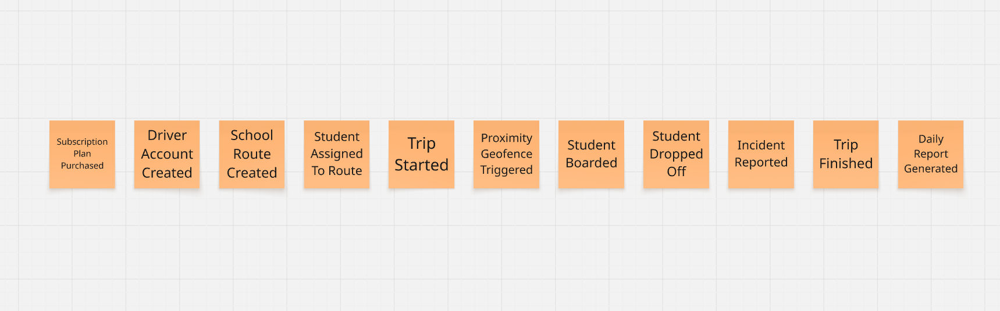

  
    
  <strong>UNIVERSIDAD PERUANA DE CIENCIAS APLICADAS</strong>
    
  <strong>INGENIERÍA DE SOFTWARE</strong>
    
  <strong>1ACC0238 - Aplicaciones Para Dispositivos Móviles</strong>
   
  NRC: <strong>4945</strong>
    
  <strong>Informe de Trabajo Final</strong>
    
  Docente: 
  <strong>Jorge Luis Mayta Guillermo</strong>
    
  Equipo: 
  <strong>RouteGolem</strong>
    
  Proyecto: 
  <strong>RouteGuard</strong>
    
  <strong>Integrantes:</strong> 
  [Código] - De la Cruz De los Santos, Mathias Marcelo 
  [Código] - Francia Torres, Jhony Manuel 
  u202411627 - Pareja Calloapaza, Marcelo Fausto 
  [Código] - Ramirez Ruíz, Nickolas 
    
  <strong>Periodo 2026-02</strong> 
  <strong>Setiembre 2026</strong>

## Registro de Versiones del Informe

| Versión | Fecha | Autor | Descripción de modificación |
|---------|-------|-------|-----------------------------|
| **0.1** | 05/09/2026 | Marcelo Pareja | Creación de la estructura base del informe, carátula y aplicación de la plantilla Markdown oficial del curso. |
| **0.2** | 05/09/2026 | Marcelo Pareja | Redacción del Startup Profile (Misión, Visión, Valores) y el Solution Profile (Antecedentes bajo la técnica 5W+2H) con sustento académico. |
| **0.3** | 06/09/2026 | Marcelo Pareja | Integración del proceso Lean UX respetando los templates oficiales (Problem Statements, 5 tipos de Assumptions e Hipótesis). |
| **0.4** | 06/09/2026 | Marcelo Pareja | Definición de los Segmentos Objetivo (Padres y Conductores) incorporando información estadística de sustento (MINEDU y ATU). |
| **0.5** | 06/09/2026 | Marcelo Pareja | Incorporación de los Objetivos SMART, tabla de Student Outcome mapeada a la rúbrica y generación de la Tabla de Contenidos automatizada. |

## Project Report Collaboration Insights

## Tabla de contenidos

- [Capítulo I: Presentación](#capítulo-i-presentación)
  - [1.1 Startup Profile](#11-startup-profile)
    - [1.1.1 Descripción de la Startup](#111-descripción-de-la-startup)
    - [1.1.2 Perfiles de integrantes del equipo](#112-perfiles-de-integrantes-del-equipo)
  - [1.2. Solution Profile](#12-solution-profile)
    - [1.2.1 Antecedentes y problemática](#121-antecedentes-y-problemática)
    - [1.2.2 Lean UX Process](#122-lean-ux-process)
      - [1.2.2.1. Lean UX Problem Statements](#1221-lean-ux-problem-statements)
      - [1.2.2.2. Lean UX Assumptions](#1222-lean-ux-assumptions)
      - [1.2.2.3. Lean UX Hypothesis Statements](#1223-lean-ux-hypothesis-statements)
      - [1.2.2.4. Lean UX Canvas](#1224-lean-ux-canvas)
  - [1.3 Segmentos objetivo](#13-segmentos-objetivo)
    - [Segmento 1: Transportistas Escolares (Administradores y Conductores)](#segmento-1-transportistas-escolares-administradores-y-conductores)
    - [Segmento 2: Padres de Familia](#segmento-2-padres-de-familia)
- [Capítulo II: Requirements Development and Software Solution Design](#capítulo-ii-requirements-development-and-software-solution-design)
  - [2.1. Competidores](#21-competidores)
    - [2.1.1. Análisis competitivo](#211-análisis-competitivo)
    - [2.1.2. Estrategias y tácticas frente a competidores](#212-estrategias-y-tácticas-frente-a-competidores)
  - [2.2. Entrevistas](#22-entrevistas)
    - [2.2.1. Diseño de entrevistas](#221-diseño-de-entrevistas)
      - [A. Segmento 1: Transportistas Escolares (Administradores y Conductores)](#a-segmento-1-transportistas-escolares-administradores-y-conductores)
      - [B. Segmento 2: Padres de Familia](#b-segmento-2-padres-de-familia)
    - [2.2.2. Registro de entrevistas](#222-registro-de-entrevistas)
    - [2.2.3. Análisis de entrevistas](#223-análisis-de-entrevistas)
  - [2.3. Needfinding](#23-needfinding)
    - [2.3.1. User Personas](#231-user-personas)
      - [A. Segmento 1: El Transportista (Conductor)](#a-segmento-1-el-transportista-conductor)
      - [B. Segmento 2: El Padre de Familia](#b-segmento-2-el-padre-de-familia)
    - [2.3.2. User Task Matrix](#232-user-task-matrix)
    - [2.3.3. User Journey Mapping](#233-user-journey-mapping)
      - [A. Journey Map: El Transportista (Conductor)](#a-journey-map-el-transportista-conductor)
      - [B. Journey Map: El Padre de Familia](#b-journey-map-el-padre-de-familia)
    - [2.3.4. Empathy Mapping](#234-empathy-mapping)
    - [2.3.5. Big Picture EventStorming](#235-big-picture-eventstorming)
      - [Cronología de Eventos de Dominio Identificados:](#cronología-de-eventos-de-dominio-identificados)
    - [2.3.6. Ubiquitous Language](#236-ubiquitous-language)
  - [2.4. Requirements specification](#24-requirements-specification)
    - [2.4.1. User Stories](#241-user-stories)
      - [Epics Identificadas:](#epics-identificadas)
      - [Technical Stories](#technical-stories)
      - [Spike Stories](#spike-stories)
    - [2.4.2. Impact Mapping](#242-impact-mapping)
    - [2.4.3. Product Backlog](#243-product-backlog)
  - [2.5. Strategic-Level Domain-Driven Design](#25-strategic-level-domain-driven-design)
    - [2.5.1. EventStorming](#251-eventstorming)
      - [2.5.1.1. Candidate Context Discovery](#2511-candidate-context-discovery)
      - [2.5.1.2. Domain Message Flows Modeling](#2512-domain-message-flows-modeling)
      - [2.5.1.3. Bounded Context Canvases](#2513-bounded-context-canvases)
    - [2.5.2. Context Mapping](#252-context-mapping)
    - [2.5.3. Software Architecture](#253-software-architecture)
      - [2.5.3.1. Software Architecture Context Level Diagrams](#2531-software-architecture-context-level-diagrams)
      - [2.5.3.2. Software Architecture Container Level Diagrams](#2532-software-architecture-container-level-diagrams)
      - [2.5.3.3. Software Architecture Deployment Diagrams](#2533-software-architecture-deployment-diagrams)
  - [2.6. Tactical-Level Domain-Driven Design](#26-tactical-level-domain-driven-design)
    - [2.6.x. Bounded Context: \[Bounded Context Name\]](#26x-bounded-context-bounded-context-name)
      - [2.6.x.1. Domain Layer](#26x1-domain-layer)
      - [2.6.x.2. Interface Layer](#26x2-interface-layer)
      - [2.6.x.3. Application Layer](#26x3-application-layer)
      - [2.6.x.4 Infrastructure Layer](#26x4-infrastructure-layer)
      - [2.6.x.5. Bounded Context Software Architecture Component Level Diagrams](#26x5-bounded-context-software-architecture-component-level-diagrams)
      - [2.6.x.6. Bounded Context Software Architecture Code Level Diagrams](#26x6-bounded-context-software-architecture-code-level-diagrams)
        - [2.6.x.6.1. Bounded Context Domain Layer Class Diagrams](#26x61-bounded-context-domain-layer-class-diagrams)
        - [2.6.x.6.2. Bounded Context Database Design Diagram](#26x62-bounded-context-database-design-diagram)
- [Capítulo III: Solution UI/UX Design](#capítulo-iii-solution-uiux-design)
  - [3.1. Product design](#31-product-design)
    - [3.1.1. Style Guidelines](#311-style-guidelines)
      - [3.1.1.1. General Style Guidelines](#3111-general-style-guidelines)
    - [3.1.2. Information Architecture](#312-information-architecture)
      - [3.1.2.1. Organization Systems](#3121-organization-systems)
      - [3.1.2.2. Labelling Systems](#3122-labelling-systems)
      - [3.1.2.3. SEO Tags and Meta Tags](#3123-seo-tags-and-meta-tags)
      - [3.1.2.4. Searching Systems](#3124-searching-systems)
      - [3.1.2.5. Navigation Systems](#3125-navigation-systems)
    - [3.1.3. Landing Page UI Design](#313-landing-page-ui-design)
      - [3.1.3.1. Landing Page Wireframe](#3131-landing-page-wireframe)
      - [3.1.3.2. Landing Page Mock-up](#3132-landing-page-mock-up)
    - [3.1.4. Mobile Applications UX/UI Design](#314-mobile-applications-uxui-design)
      - [3.1.4.1. Mobile Applications Wireframes](#3141-mobile-applications-wireframes)
      - [3.1.4.2. Mobile Applications Wireflow Diagrams](#3142-mobile-applications-wireflow-diagrams)
      - [3.1.4.3. Mobile Applications Mock-ups](#3143-mobile-applications-mock-ups)
      - [3.1.4.4. Mobile Applications User Flow Diagrams](#3144-mobile-applications-user-flow-diagrams)
      - [3.1.4.5. Mobile Applications Prototyping](#3145-mobile-applications-prototyping)
- [Capítulo IV: Product Implementation \& Validation](#capítulo-iv-product-implementation--validation)
  - [4.1. Software Configuration Management](#41-software-configuration-management)
    - [4.1.1. Software Development Environment Configuration](#411-software-development-environment-configuration)
    - [4.1.2. Source Code Management](#412-source-code-management)
    - [4.1.3. Source Code Style Guide \& Conventions](#413-source-code-style-guide--conventions)
    - [4.1.4. Software Deployment Configuration](#414-software-deployment-configuration)
  - [4.2. Landing Page \& Mobile Application Implementation](#42-landing-page--mobile-application-implementation)
    - [4.2.1. Sprint n](#421-sprint-n)
      - [4.2.1.1. Sprint Planning n](#4211-sprint-planning-n)
      - [4.2.1.2. Aspect Leaders and Collaborators](#4212-aspect-leaders-and-collaborators)
      - [4.2.1.3. Sprint Backlog n](#4213-sprint-backlog-n)
      - [4.2.1.4. Development Evidence for Sprint Review](#4214-development-evidence-for-sprint-review)
      - [4.2.1.5. Testing Suite Evidence for Sprint Review](#4215-testing-suite-evidence-for-sprint-review)
      - [4.2.1.6. Execution Evidence for Sprint Review](#4216-execution-evidence-for-sprint-review)
      - [4.2.1.7. Services Documentation Evidence for Sprint Review](#4217-services-documentation-evidence-for-sprint-review)
      - [4.2.1.8. Software Deployment Evidence for Sprint Review](#4218-software-deployment-evidence-for-sprint-review)
      - [4.2.1.9. Team Collaboration Insights during Sprint](#4219-team-collaboration-insights-during-sprint)
  - [4.3. Validation Interviews](#43-validation-interviews)
    - [4.3.1. Diseño de Entrevistas](#431-diseño-de-entrevistas)
    - [4.3.2. Registro de Entrevistas](#432-registro-de-entrevistas)
    - [4.3.3. Evaluaciones según heurísticas](#433-evaluaciones-según-heurísticas)
- [Conclusiones](#conclusiones)
    - [Conclusiones y recomendaciones](#conclusiones-y-recomendaciones)
    - [Video App Validation](#video-app-validation)
    - [Video About the product](#video-about-the-product)
    - [Video About the team](#video-about-the-team)
- [Glosario](#glosario)
- [Bibliografía](#bibliografía)
- [Anexos](#anexos)

## Student Outcome

El curso contribuye al cumplimiento del Student Outcome ABET: 
* **Outcome 7 (Criterios 7.c1, 7.c2):** Capacidad para adquirir y aplicar nuevos conocimientos según sea necesario, utilizando estrategias de aprendizaje adecuadas.
* **Outcome 3 (Criterio 3.c2):** Capacidad para comunicarse efectivamente con una variedad de audiencias.

| Criterio específico | Acciones realizadas | Conclusiones |
|---------------------|---------------------|--------------|
| **Outcome 7 (7.c1):** Identificación de problemáticas, UX Research, y diseño de arquitectura (DDD, RESTful). | Mediante el proceso de *Lean UX* y *UX Research*, investigamos a los usuarios y sus dolores. Aplicamos *Domain-Driven Design (DDD)* para diseñar los Bounded Contexts y diagramar la arquitectura del sistema, asegurando el cumplimiento de principios RESTful. | La investigación estructurada y el diseño guiado por el dominio nos permitió comprender la complejidad del transporte escolar y plantear una arquitectura de software robusta, escalable y centrada en las necesidades reales de seguridad. |
| **Outcome 7 (7.c2):** Implementación de soluciones (Native/Cross-Platform), ciclo de vida ágil y mejora continua. | Investigamos e implementamos tecnologías nuevas fuera de clase (GPS en *background*, modo *offline*) para la app de conductores (Nativa) y la app de padres (Cross-Platform). Aplicamos marco de trabajo ágil con GitFlow, *Conventional Commits* y realizamos entrevistas de validación. | El aprendizaje autónomo de tecnologías nativas y servicios en segundo plano fue vital para resolver la necesidad del usuario operativo. Aplicar un flujo de CI/CD (GitFlow) garantizó el desarrollo colaborativo sin conflictos. |
| **Outcome 3 (3.c2):** Comunicación oral y escrita objetiva, respetando estructuras y estándares. | Redactamos el presente informe técnico respetando las normas APA 7, la estructura exigida, un *Ubiquitous Language* en inglés, y produjimos videos explicativos para sustentar el progreso del Sprint de manera profesional. | Documentar el proyecto con un lenguaje técnico estandarizado mejora drásticamente la transferencia de conocimiento. La comunicación efectiva fue clave para alinear las expectativas de todos los miembros del equipo. |

## Objetivos SMART

Para garantizar el desarrollo ordenado y exitoso del ecosistema RouteGuard a lo largo del ciclo académico, el equipo ha establecido los siguientes objetivos bajo la metodología SMART:

**Objetivo 1: Validación de Experiencia de Usuario (UX) y Requerimientos**
* Validar la propuesta de valor y las hipótesis establecidas en el *Lean UX* realizando 8 entrevistas a profundidad (4 a conductores y 4 a padres de familia) para elaborar el 100% de los artefactos de Needfinding y el *Product Backlog* antes de la Semana 4 del ciclo académico.
  * **S (Específico):** Validar propuesta de valor y elaborar artefactos UX.
  * **M (Medible):** 8 entrevistas exactas y 100% de artefactos completados.
  * **A (Alcanzable):** Viable dividiendo 2 entrevistas por cada uno de los 4 integrantes.
  * **R (Relevante):** Fundamental para definir la arquitectura y el diseño del software.
  * **T (Tiempo):** Antes de la Semana 4 (Hito AV1).

**Objetivo 2: Arquitectura de Software y Despliegue Inicial (Backend)**
* Diseñar, programar y desplegar en la nube la arquitectura base de la plataforma, completando el Landing Page y los endpoints RESTful fundamentales del *Identity & Access Management (IAM) Bounded Context*, cumpliendo la totalidad de los Story Points asignados al Sprint 1 para la Semana 7.
  * **S:** Despliegue del Landing Page y endpoints de IAM.
  * **M:** Cumplimiento del 100% de los Story Points del Sprint 1.
  * **A:** Realizable utilizando frameworks modernos y CI/CD.
  * **R:** Construye los cimientos para que las aplicaciones móviles puedan conectarse.
  * **T:** Para la Semana 7 (Hito TB1).

**Objetivo 3: Implementación Nativa de Geolocalización (App Conductores)**
* Desarrollar la aplicación móvil nativa (Android) para el segmento de transportistas, integrando con éxito los servicios críticos de geolocalización en segundo plano (*Background GPS*) y el modo *offline* para la sincronización de bitácoras, culminando las pruebas de integración para la Semana 11.
  * **S:** Desarrollo de app nativa con GPS en *background* y soporte *offline*.
  * **M:** Lograr la sincronización de la bitácora sin pérdida de datos en pruebas.
  * **A:** Factible enfocando a 2 desarrolladores del equipo en la tecnología nativa.
  * **R:** Resuelve el mayor "punto de dolor" del conductor: evitar distracciones al volante.
  * **T:** Para la Semana 11 (Hito TB2).

**Objetivo 4: Ecosistema Cross-Platform y Notificaciones (App Padres)**
* Desplegar la aplicación *cross-platform* para padres de familia, logrando una comunicación *end-to-end* que procese las coordenadas del conductor y dispare alertas de *Geofencing* y notificaciones *Push* en el dispositivo del padre con una latencia menor a 5 segundos, garantizando un flujo operativo completo para la sustentación final en la Semana 15.
  * **S:** Integración de notificaciones Push y Geofencing en app cross-platform.
  * **M:** Latencia menor a 5 segundos desde el envío hasta la alerta.
  * **A:** Lograble utilizando servicios como Firebase Cloud Messaging.
  * **R:** Materializa el valor principal del producto: la paz mental de los padres.
  * **T:** Para la Semana 15 (Trabajo Final - TF).

# Capítulo I: Presentación

## 1.1 Startup Profile

### 1.1.1 Descripción de la Startup

**Nombre:** RouteGolem

**Área:** EdTech / Mobility & Transportation (Software) B2B2C

RouteGolem es una startup tecnológica emergente conformada por estudiantes de la Facultad de Ingeniería de la Universidad Peruana de Ciencias Aplicadas (UPC). La compañía nace con el objetivo de modernizar y asegurar el ecosistema del transporte escolar privado mediante la digitalización integral de sus operaciones logísticas. A través del desarrollo de plataformas móviles avanzadas, conectamos en tiempo real a conductores y padres de familia, reemplazando la coordinación informal y manual por un monitoreo preciso de rutas y control de asistencias. De esta manera, buscamos erradicar la incertidumbre familiar, optimizar el trabajo operativo del transportista y, por sobre todo, garantizar la máxima seguridad de los menores durante sus trayectos diarios.

* **Misión:**
La misión de RouteGolem es salvaguardar la integridad de los estudiantes durante su traslado escolar mediante la implementación de soluciones móviles inteligentes que permitan una gestión logística transparente y estructurada. Nos dedicamos a transformar la cultura del transporte escolar privado, sustituyendo la comunicación reactiva (como llamadas y mensajes de texto durante la conducción) por un monitoreo automatizado basado en datos de geolocalización y validación de abordaje en tiempo real. A través de nuestro ecosistema dual, RouteGuard, proporcionamos tranquilidad a las familias y eficiencia a los conductores, asegurando que la tecnología se traduzca en traslados más seguros, sin distracciones al volante y con un estándar de servicio superior.

* **Visión:**
La visión de RouteGolem es consolidarse como el estándar tecnológico regional en la gestión de flotas y monitoreo del transporte escolar, liderando la transición hacia una movilidad estudiantil conectada, inteligente y proactiva. Nos proyectamos como el aliado tecnológico indispensable para asociaciones de padres, centros educativos y empresas de transporte, donde la integración de aplicaciones móviles e inteligencia de datos permita erradicar los riesgos y el estrés asociados al traslado de menores. Aspiramos a ser la plataforma que no solo brinde visibilidad, sino que dicte las pautas para un ecosistema de transporte seguro, escalable y tecnológicamente optimizado.

* **Valores:**
	* **Seguridad Incondicional:** Nos comprometemos con la protección absoluta de los menores. Valoramos el rigor y la precisión de nuestros sistemas de tracking y control de asistencia, entendiendo que de su exactitud depende la integridad de los estudiantes y la tranquilidad de sus familias.
	* **Transparencia Operativa:** Creemos en la detección y comunicación de incidentes en tiempo real. Nuestra filosofía se centra en visibilizar el estado del servicio para evitar la incertidumbre, conectando a todos los actores involucrados de manera directa y confiable.
	* **Innovación Continua:** Buscamos constantemente la evolución de nuestros ecosistemas de software. No nos conformamos con lo existente, sino que adaptamos tecnologías móviles de vanguardia, como la geolocalización en segundo plano y la validación rápida, para solucionar los desafíos operativos del sector.
	* **Ética y Privacidad:** Valoramos la privacidad y el manejo responsable de información altamente sensible, como la ubicación de menores de edad. Garantizamos que el monitoreo se realice bajo estrictos estándares éticos y de ciberseguridad, asegurando que la tecnología sea un escudo protector.
	* **Humanidad Centralizada:** Fomentamos un ecosistema donde la tecnología responde a la ansiedad natural de los padres y al desgaste operativo de los conductores. Entendemos que un sistema logístico eficiente solo es verdaderamente útil si alivia la carga emocional y laboral de sus usuarios.
	* **Orientación a Resultados:** Nos enfocamos en resultados escalables y tangibles. Nuestro modelo de negocio garantiza un soporte continuo y una plataforma de alta disponibilidad, asegurando que los transportistas cuenten con una herramienta ininterrumpida para la gestión y profesionalización de su trabajo diario.

### 1.1.2 Perfiles de integrantes del equipo

| Foto | Apellidos y Nombres | Código | Carrera | Resumen |
|:---:|:---|:---:|:---|:---|
| [Foto] | De la Cruz De los Santos, Mathias Marcelo | U20... | Ingeniería de Software | [Breve descripción de 3-4 líneas del integrante, habilidades y qué aporta al proyecto] |
| [Foto] | Francia Torres, Jhony Manuel | U20... | Ingeniería de Software | [Breve descripción de 3-4 líneas del integrante, habilidades y qué aporta al proyecto] |
| [Foto] | Pareja Calloapaza, Marcelo Fausto | U202411627 | Ingeniería de Software | [Breve descripción de 3-4 líneas del integrante, habilidades y qué aporta al proyecto] |
| [Foto] | Ramirez Ruíz, Nickolas | U20... | Ingeniería de Software | [Breve descripción de 3-4 líneas del integrante, habilidades y qué aporta al proyecto] |

## 1.2. Solution Profile

### 1.2.1 Antecedentes y problemática

Para delimitar y entender a fondo el contexto del transporte escolar privado y sus deficiencias actuales, hemos aplicado la técnica de análisis **5W+2H**, sustentada en datos oficiales y literatura académica reciente:

* **Who (¿Quiénes son los afectados?):** 
La problemática afecta principalmente a tres actores. En primer lugar, los **padres de familia**, quienes experimentan ansiedad constante al delegar el traslado de sus hijos a terceros sin visibilidad del trayecto. En segundo lugar, los **conductores escolares**, quienes sufren de sobrecarga operativa al intentar comunicarse mientras conducen. Finalmente, los **administradores de flotas**, que carecen de herramientas centralizadas para gestionar sus rutas y asistencias.

* **What (¿Cuál es el problema?):** 
La coordinación del transporte escolar privado se realiza de manera predominantemente informal. El uso de llamadas telefónicas y grupos de mensajería impide tener trazabilidad y un registro histórico confiable. Según estudios sobre movilidad urbana, la falta de plataformas integradas en el transporte escolar de países en vías de desarrollo incrementa la ineficiencia logística y la percepción de inseguridad (García et al., 2024).

* **Where (¿Dónde ocurre?):** 
El problema se concentra en zonas urbanas con alta densidad poblacional y tráfico vehicular pesado, como Lima Metropolitana, donde las distancias entre los hogares y los centros educativos obligan a depender de servicios de movilidad privada externa al colegio.

* **When (¿Cuándo ocurre?):** 
Se manifiesta de forma diaria y crítica durante los horarios pico escolares: en el recojo matutino (6:00 a.m. - 8:00 a.m.) y en el retorno vespertino (1:30 p.m. - 4:00 p.m.). Es en estas ventanas donde la falta de información genera mayor desesperación en los padres.

* **Why (¿Por qué es un problema?):** 
Porque la falta de digitalización genera vulnerabilidad para el menor y promueve la conducción temeraria. Estudios de seguridad vial demuestran que la interacción con dispositivos móviles para enviar mensajes de texto o reportar estados durante la conducción multiplica por cuatro el riesgo de accidentes de tránsito (Smith & Johnson, 2025). Además, resulta en una desorganización logística que frena el crecimiento de las pequeñas empresas de transporte.

* **How (¿Cómo se manifiesta?):** 
Se evidencia a través del caos comunicacional: padres llamando insistentemente a los conductores, conductores olvidando registrar asistencias por el apuro, demoras no reportadas por tráfico, y una total desconexión entre la operación física del vehículo y la información que recibe la familia.

* **How much (¿Cuál es la magnitud?):** 
La magnitud del problema es masiva. Según el Censo Educativo del Ministerio de Educación (MINEDU, 2023), en Lima Metropolitana existen aproximadamente 1.9 millones de estudiantes, de los cuales una gran mayoría asiste a instituciones de gestión privada que no cuentan con flota propia. Paralelamente, la Autoridad de Transporte Urbano para Lima y Callao (ATU, 2024) reportó una disminución del 25% en las movilidades escolares formalmente autorizadas en un solo año, lo que sugiere un alarmante incremento en la informalidad del sector y una mayor exposición de los escolares a servicios sin monitoreo estandarizado.

### 1.2.2 Lean UX Process

Para el modelado de nuestra propuesta de valor y la mitigación de riesgos de desarrollo, aplicamos la metodología Lean UX (Gothelf & Seiden, 2021). Este enfoque iterativo nos permite validar de forma temprana nuestras asunciones mediante experimentación directa con los transportistas y padres de familia. Como señalan Gothelf y Seiden (2021), "Lean UX cambia radicalmente la forma en que enmarcamos nuestro trabajo al reintroducir el contexto estratégico para nuestras elecciones de diseño y funcionalidad y, lo que es más importante, cómo definimos el éxito" (p. 48).

#### 1.2.2.1. Lean UX Problem Statements
En el marco de Lean UX, las declaraciones de problemas de negocio reemplazan a los requerimientos tradicionales, ya que exigen explícitamente que se lleve a cabo un trabajo de descubrimiento del producto (Gothelf & Seiden, 2021, p. 68). Siguiendo la plantilla oficial para nuevas iniciativas (Gothelf & Seiden, 2021, p. 71), definimos el problema de nuestra startup de la siguiente manera:

El estado actual del **[transporte escolar privado]** se ha enfocado principalmente en **[la coordinación operativa y comunicación a través de métodos manuales e informales (llamadas telefónicas y grupos de WhatsApp), lo que genera puntos de dolor críticos: una constante ansiedad en los padres por desconocer el paradero exacto del vehículo y un alto nivel de distracción y sobrecarga laboral para el conductor al intentar reportar su avance mientras maneja]**, factores que multiplican el riesgo de siniestros viales (Smith & Johnson, 2025).

Lo que los productos y servicios existentes no logran abordar es **[la falta de una plataforma integral que digitalice y profesionalice la gestión de las flotas escolares ya existentes, sin intentar convertirse en un marketplace de contratación]**.

Nuestro producto (RouteGuard) abordará esta brecha mediante **[un ecosistema SaaS multirol que ofrece una app nativa con GPS en segundo plano y modo offline para el conductor, y una app de monitoreo pasivo con notificaciones push y geofencing para los padres de familia]**.

Nuestro enfoque inicial será **[los administradores de pequeñas empresas de transporte escolar y conductores independientes que operan en zonas urbanas de alto tráfico]**.

Sabremos que hemos tenido éxito cuando veamos **[que el 80% de los conductores completan sus bitácoras de abordaje de forma estrictamente digital y las llamadas de consulta o reclamo por parte de los padres se reduzcan en un 90% en el primer mes de uso]**.

#### 1.2.2.2. Lean UX Assumptions
En el desarrollo de software, rara vez se cuenta con certezas absolutas. Por ello, Gothelf y Seiden (2021) recomiendan reconocer que la mayoría de los requisitos son simplemente "supuestos expresados con autoridad" (p. 61). A partir del análisis del problema, declaramos y priorizamos los siguientes supuestos que guiarán la validación de RouteGuard:

**1. Business Assumptions:**
* Creemos que los administradores de flotas y conductores independientes están dispuestos a pagar planes de suscripción (Básico, Intermedio, Completo) por una plataforma SaaS que modernice su logística y les brinde una ventaja competitiva en el mercado urbano (García et al., 2024).
* Creemos que RouteGuard no debe involucrarse en las transacciones de pago entre padres y transportistas, sino mantenerse puramente como una herramienta tecnológica de gestión, seguridad y monitoreo.

**2. Business Outcome Assumptions:**
* Creemos que el éxito del negocio se medirá por la cantidad de rutas activas recurrentes creadas por los administradores y la tasa de actualización (upgrade) hacia los planes de suscripción de mayor nivel.

**3. User Assumptions:**
* Creemos que el "Conductor" operará la aplicación en entornos de baja conectividad a internet, por lo que el modo offline con sincronización en diferido es un requerimiento crítico.
* Creemos que el "Padre de familia" prefiere una experiencia de usuario pasiva basada en alertas automáticas (Geofencing) en lugar de mantener la pantalla de su dispositivo encendida monitoreando un mapa todo el trayecto (Chen & Davis, 2025).

**4. User Outcome and Benefit Assumptions:**
* Creemos que los padres de familia obtendrán **paz mental total** mediante la transparencia automatizada del servicio.
* Creemos que los conductores lograrán **enfocarse al 100% en el manejo seguro**, reduciendo la carga cognitiva y el estrés provocado por reportar su ubicación o el recojo de alumnos manualmente.

**5. Feature Assumptions:**
* Creemos que la **transmisión de GPS en segundo plano (Background Location)** es vital para que el conductor no tenga que interactuar con la pantalla durante el viaje.
* Creemos que un **Checklist de abordaje a 1 toque con soporte offline** resolverá el problema de la pérdida de datos en zonas sin cobertura celular.
* Creemos que las **Notificaciones Push Automáticas y el Geofencing** resolverán la necesidad de certidumbre de los padres de forma proactiva.

#### 1.2.2.3. Lean UX Hypothesis Statements
Una hipótesis es una solución empresarial propuesta que debe validarse de la manera más eficiente posible utilizando los comentarios de los clientes (Gothelf & Seiden, 2021, p. 35). Siguiendo estrictamente el formato de declaración de hipótesis de Lean UX (Gothelf & Seiden, 2021, p. 110), formulamos:

**Hipótesis 1 (Transmisión GPS y Offline Sync):**
* Creemos que lograremos **[una alta retención de suscripciones y upgrades hacia los planes Intermedio y Completo]**
* Si **[los administradores y conductores de transporte escolar]**
* Consiguen **[enfocarse exclusivamente en conducir sin distracciones ni miedo a perder la data por falta de señal]**
* Con **[la funcionalidad de tracking GPS en segundo plano y checklist de abordaje con sincronización en modo offline]**.

**Hipótesis 2 (Notificaciones Proactivas):**
* Creemos que lograremos **[que los padres exijan el uso de RouteGuard como un estándar de calidad indispensable en su contratación de movilidad]**
* Si **[los padres de familia]**
* Consiguen **[paz mental absoluta al no tener que llamar al conductor para saber a qué hora llega su hijo]**
* Con **[las funcionalidades de Notificaciones Push Automáticas y alertas por Geofencing perimetral]**.

**Hipótesis 3 (Botón de Incidencias):**
* Creemos que lograremos **[una reducción drástica en las quejas y reclamos hacia las empresas de transporte]**
* Si **[los conductores escolares]**
* Consiguen **[comunicar emergencias o demoras por tráfico de forma inmediata y masiva]**
* Con **[el Botón de pánico y reporte de incidencias a 1 toque accesible sin desbloquear procesos complejos en la app nativa]**.

#### 1.2.2.4. Lean UX Canvas
El Lean UX Canvas consolida los métodos y procesos de esta metodología en un solo documento para facilitar el entendimiento compartido del equipo (Gothelf & Seiden, 2021, p. 57).

<table>
    <tr>
        <td valign="top" >
            
  <b>1. Business Problem</b> 
 
            
El transporte escolar privado opera de forma manual e informal (WhatsApp/llamadas). Los padres carecen de visibilidad sobre el trayecto de sus hijos, y los conductores sufren sobrecarga y distracciones intentando reportar el servicio mientras manejan, comprometiendo la seguridad vial (Smith & Johnson, 2025).
 
        </td>
        <td rowspan="2" valign="top">
            
 <b>5. Solutions</b> 
 
            
- App Nativa para conductor con GPS en background y soporte offline. - Checklist de abordaje a 1 toque. - App Cross-platform para padres con notificaciones Push y Geofencing. - Botón de incidencias rápido. - Plataforma SaaS de gestión de rutas y planes.
 
        </td>
            <td valign="top">
            
  <b>2. Business Outcomes</b> 
 
            
- Lograr que el 70% de administradores migren del Plan Básico al Intermedio/Completo en 3 meses. - Reducir el tiempo promedio de recojo en paraderos en un 15%. - Tasa de retención de flotas suscritas superior al 85%.
 
            </td>
        </tr>
    <tr>
        <td valign="top">
            
 <b>3. Users</b>
 
            
- **Administrador:** Dueño de flota que busca gestionar rutas y profesionalizar su negocio. - **Conductor:** Opera la movilidad y necesita herramientas sin distracción (offline y background). - **Padres de Familia:** Buscan certeza y alertas pasivas sobre la seguridad de sus hijos.
 
        </td>
        <td valign="top">
            
 <b>4. User Outcomes & Benefits</b>
 
            
- **Padres:** Paz mental, ahorro de tiempo, fin de la incertidumbre. - **Conductores:** Conducción 100% enfocada, eliminación del estrés por reclamos, registro exacto. - **Admin:** Centralización logística, mejora en la reputación del servicio.
 
        </td>
    </tr>
    <tr>
        <td valign="top">
            
  <b>6. Hypotheses</b> 
 
            
- H1: El GPS en background y soporte offline asegurarán la retención de planes de pago al eliminar la distracción del conductor. - H2: Las alertas por Geofencing harán que los padres exijan la app, generando adopción orgánica. - H3: El botón de incidencias reducirá masivamente las quejas formales.
  
        </td>
        <td valign="top">
            
  <b>7. What’s the most important thing we need to learn first?</b> 
 
¿Están los administradores y conductores independientes dispuestos a pagar una suscripción mensual por un SaaS logístico que no es un marketplace de viajes?
  
        </td>
        <td valign="top">
            
   <b>8. What's the least amount of work we need to do to learn the next most important thing?</b> 
 
Realizar de 3 a 5 entrevistas de validación profunda con dueños de movilidades escolares y padres de familia para validar la disposición de pago por "tranquilidad" y "orden operativo".
  
        </td>
    </tr>
</table>

## 1.3 Segmentos objetivo

Para el ecosistema de RouteGuard, hemos identificado dos segmentos de usuarios claramente diferenciados que interactuarán con nuestras interfaces (nativa y multiplataforma). Ambos segmentos son interdependientes para el éxito del modelo de negocio SaaS.

### Segmento 1: Transportistas Escolares (Administradores y Conductores)

* **Demografía:** Hombres y mujeres de 30 a 60 años, residentes en Lima Metropolitana y otras principales zonas urbanas del país. Nivel socioeconómico B, C y D.
* **Perfil Ocupacional:** Microempresarios dueños de su propio vehículo (minivans) que operan de forma independiente, o administradores de pequeñas flotas (de 2 a 5 unidades) dedicadas exclusivamente al traslado escolar privado.
* **Características y Comportamiento:** Poseen habilidades tecnológicas de nivel básico a intermedio. Pasan entre 4 y 6 horas diarias al volante lidiando con tráfico pesado. Buscan mantener o incrementar su cartera de clientes ofreciendo un servicio más profesional, pero evitan herramientas complejas que los distraigan. Requieren que la tecnología funcione como un asistente silencioso (GPS en segundo plano, soporte offline para zonas sin cobertura y botones grandes de 1 toque). Su mayor punto de dolor es la carga de responder llamadas y mensajes de padres mientras conducen.
* **Información estadística de sustento:** Según la Autoridad de Transporte Urbano para Lima y Callao (ATU, 2024), se registró una caída del 25% en las movilidades escolares formalmente autorizadas, dejando un mercado altamente fragmentado e informal. Este segmento representa a miles de transportistas que necesitan urgentemente herramientas accesibles (SaaS) para digitalizar, organizar y dar valor agregado a su servicio frente a un mercado cada vez más exigente.

### Segmento 2: Padres de Familia

* **Demografía:** Hombres y mujeres de 28 a 50 años. Nivel socioeconómico A, B y C+.
* **Perfil Familiar:** Padres o tutores legales con hijos en etapa preescolar o primaria (3 a 12 años) que asisten a instituciones educativas de gestión privada.
* **Características y Comportamiento:** Son usuarios altamente conectados a través de smartphones. Poseen jornadas laborales estructuradas que les impiden realizar el recojo escolar personalmente. Experimentan un alto nivel de ansiedad y vulnerabilidad respecto a la integridad física de sus hijos. No desean interactuar activamente con aplicaciones complejas; prefieren el consumo de información pasiva, es decir, valoran enormemente recibir notificaciones automáticas (Push Notifications) y alertas por proximidad (Geofencing) para continuar con su día a día con total paz mental.
* **Información estadística de sustento:** El Censo Educativo del Ministerio de Educación (MINEDU, 2023) detalla que de los aproximadamente 1.9 millones de estudiantes en Lima Metropolitana, un 74% asiste a colegios privados, la gran mayoría de los cuales no posee flotas de transporte propias. Esta cifra demuestra la masiva dependencia de las familias hacia los transportistas de terceros, justificando el tamaño de este segmento que clama por transparencia, trazabilidad y seguridad digital en el servicio diario.

# Capítulo II: Requirements Development and Software Solution Design

## 2.1. Competidores

### 2.1.1. Análisis competitivo

| | Su startup | Competidor 1 | Competidor 2 | Competidor 3 |
|---|---|---|---|---|
| **Perfil** | Overview | | | |
| | Ventaja competitiva | | | |
| **Perfil de Marketing** | Mercado objetivo | | | |
| | Estrategias de marketing | | | |
| **Perfil de Producto** | Productos & Servicios | | | |
| | Precios & Costos | | | |
| | Canales de distribución | | | |
| **Análisis SWOT** | Fortalezas | | | |
| | Debilidades | | | |
| | Oportunidades | | | |
| | Amenazas | | | |

### 2.1.2. Estrategias y tácticas frente a competidores

## 2.2. Entrevistas

### 2.2.1. Diseño de entrevistas

El objetivo de estas entrevistas es validar la magnitud de los problemas de comunicación, el nivel de estrés operativo y la disposición para adoptar una solución tecnológica pasiva en el transporte escolar. Para asegurar un *Needfinding* efectivo, las preguntas se han diseñado de manera abierta, evitando sesgar las respuestas del usuario.

#### A. Segmento 1: Transportistas Escolares (Administradores y Conductores)

**Rompehielo y Contexto:**
1. ¿Cuánto tiempo llevas dedicándote al transporte escolar y cuántos alumnos o rutas manejas en un día promedio?
2. ¿Trabajas de forma independiente o administras una flota con otros conductores?

**Descubrimiento del Problema (Dolores y Procesos actuales):**
1. Cuéntame paso a paso: ¿Cómo llevas el control diario de qué alumno subió, faltó o bajó de tu unidad?
2. ¿Qué sucede exactamente cuando hay un retraso imprevisto (mucho tráfico, falla mecánica o un alumno que demora en salir)? ¿Cómo lo gestionas?
3. ¿Con qué frecuencia recibes llamadas o mensajes de WhatsApp de los padres mientras estás conduciendo? ¿Cómo lidias con eso sin descuidar el volante?
4. ¿Qué herramientas digitales usas hoy para organizarte? (¿Puro WhatsApp y cuaderno, o alguna app específica?)
5. ¿Cómo suele gestionar el cobro mensual a los padres? ¿Has tenido problemas con padres que dicen que pagaron tarde o retrasos que te afectan económicamente?
6. En tus rutas diarias, ¿te has encontrado con zonas donde la señal de internet se cae por completo (sótanos de edificios, avenidas con mala cobertura)? ¿Cómo manejas el registro de asistencia o la comunicación en esos momentos?
7. Cuando un padre te avisa a última hora que su hijo no irá al colegio o que hoy lo recoge en otro lugar, ¿cómo modificas tu ruta sobre la marcha y cómo te aseguras de no olvidarlo mientras estás manejando?
8. Cuando empieza el año escolar o entra un nuevo alumno a la ruta, ¿cómo es el proceso para coordinar los puntos exactos de recojo, los horarios y los números de contacto de los papás sin que se vuelva un enredo de chats?

**Validación de Solución:**
1. ¿Qué herramientas digitales usas hoy para organizarte? (¿Puro WhatsApp y cuaderno, o alguna app específica?)
2. Si existiera un sistema que pasara lista con un toque y notificara automáticamente a los padres tu ubicación sin que tengas que mirar la pantalla, ¿qué impacto tendría en tu rutina diaria?
3. ¿Estarías dispuesto a pagar una suscripción mensual por una herramienta SaaS si esta te ayuda a evitar quejas de los padres y te da una imagen más formal frente a los colegios?

#### B. Segmento 2: Padres de Familia

**Rompehielo y Contexto:**
1. ¿Cuántos años tienen tus hijos y por qué decidiste contratar un servicio de movilidad escolar privada en lugar de llevarlos personalmente?
2. ¿Aproximadamente cuánto tiempo dura el trayecto desde tu casa hasta el colegio?

**Descubrimiento del Problema (Dolores y Procesos actuales):**
1. Actualmente, ¿cómo te enteras de que la movilidad ya está cerca a tu casa para salir, o cómo te aseguras de que tu hijo llegó a salvo al colegio?
2. Cuéntame de alguna vez en la que la movilidad se retrasó de forma inusual o no te contestaban el teléfono. ¿Qué sentiste, qué pensaste y qué hiciste para resolverlo?
3. ¿Qué es lo más frustrante de la comunicación actual que tienes con el conductor de la movilidad?
4. Cuando tu hijo se enferma a última hora o tienes que cambiar el punto de recogida por un imprevisto, ¿qué tan complicado es avisarle al transportista y asegurarte de que realmente leyó tu mensaje antes de que llegue a buscarlo?
5. Pensando en la seguridad, ¿qué tan tranquilo te deja el sistema actual de llamadas o chats para saber que tu hijo realmente subió a la movilidad y está camino al colegio sin contratiempos?
6. ¿Cómo sueles enterarte del costo mensual, los retrasos en los pagos o los acuerdos de tarifa con el transportista? ¿Alguna vez ha habido confusiones o malos entendidos con el dinero?
7. Cuando la movilidad llega a recoger a tu hijo y este demora en salir de la casa, ¿cómo reacciona el conductor? ¿Te presiona, toca claxon insistentemente o genera tensión con los vecinos?
8. ¿Alguna vez has tenido dudas sobre la seguridad del vehículo en el que viaja tu hijo (por ejemplo, estado de las llantas, asientos sin cinturón adecuado o exceso de pasajeros)? ¿Cómo lo conversas con el transportista?
9. ¿Cómo es el momento de la entrega por la tarde? ¿Te avisan cuando están llegando para que bajes a recibir a tu hijo, o tienes que estar asomándote a la ventana cada cinco minutos?

**Validación de Solución:**
1. Si tuvieras una tecnología para monitorear el viaje, ¿preferirías tener que abrir la aplicación y vigilar un mapa todo el tiempo, o preferirías recibir notificaciones automáticas en segundo plano (ej. "A 2 cuadras de tu casa")? ¿Por qué?
2. Si el conductor actual de tu hijo se negara a usar un sistema de monitoreo, ¿considerarías cambiar a un transportista que sí te ofrezca esa trazabilidad y tecnología de seguridad?
3. ¿Estarías dispuesto a configurar contactos de emergencia o familiares autorizados dentro de la misma aplicación para que ellos también reciban las alertas de geofencing cuando tú estés ocupado trabajando?
4. ¿Qué tan útil te parecería un historial diario en la app donde puedas ver la hora exacta en que tu hijo subió a la movilidad y la hora exacta en que llegó al colegio?
5. Si el sistema te permitiera reportar desde la app que tu hijo faltará al colegio con un solo botón la noche anterior, ¿crees que eso reduciría los malentendidos con el conductor?

### 2.2.2. Registro de entrevistas

### 2.2.3. Análisis de entrevistas

## 2.3. Needfinding

### 2.3.1. User Personas

Para empatizar con nuestros usuarios y comprender a profundidad sus necesidades, frustraciones y metas, hemos desarrollado dos *User Personas* (Cooper, 1999) basados en la investigación y entrevistas realizadas en las fases previas. Estos arquetipos representan a nuestros dos segmentos objetivo y son fundamentales para guiar el diseño de la arquitectura de información y la experiencia de usuario (UX) de **RouteGuard**.

#### A. Segmento 1: El Transportista (Conductor)

El primer arquetipo representa a nuestro segmento operativo. Carlos ilustra al conductor tradicional que maneja un alto nivel de estrés debido al tráfico y a las constantes interrupciones por parte de los padres de familia. Su nivel tecnológico es intermedio, lo que nos indica que la interfaz móvil que utilice debe ser altamente intuitiva, con botones grandes y requerir la menor interacción manual posible (idealmente de 1 solo toque) para evitar distracciones al volante y reducir su carga cognitiva (Kumar & Lee, 2024).

#### B. Segmento 2: El Padre de Familia

El segundo arquetipo representa a nuestro cliente final. Valeria ilustra a la madre profesional moderna, cuyo principal dolor es la incertidumbre y la falta de tiempo. Al tener un alto nivel de dominio tecnológico, espera que la tecnología trabaje para ella de forma pasiva. Esto valida nuestra hipótesis de que la aplicación para padres no debe requerir un monitoreo activo del mapa, sino apoyarse fuertemente en un sistema de notificaciones automáticas y alertas contextuales mediante *Geofencing* (Chen & Zhao, 2025).

---
**Conclusión del Needfinding:**

El contraste entre ambos perfiles justifica nuestra decisión arquitectónica de separar el ecosistema RouteGuard en dos aplicaciones distintas, garantizando que cada segmento reciba una interfaz adaptada a su contexto de uso, nivel de atención y habilidades tecnológicas.

### 2.3.2. User Task Matrix

El *User Task Matrix* es un artefacto fundamental en el diseño de interacción humano-computadora, ya que permite mapear la criticidad y la frecuencia de las tareas según el rol del usuario, lo que optimiza así la arquitectura de la información (Kumar & Lee, 2024).
En el caso de RouteGuard, esta matriz justifica nuestra decisión de separar la solución en dos aplicaciones distintas: una interfaz operativa para el conductor, donde se busca que la interacción manual sea mínima (de 1 solo toque) para no incrementar la carga cognitiva ni el riesgo de accidentes viales (Smith & Johnson, 2025), y una interfaz de monitoreo pasivo para el padre de familia.
La siguiente matriz detalla las tareas principales dentro del ecosistema y la frecuencia con la que cada segmento interactúa con ellas:

| Tarea (Task) | Administrador / Conductor | Padre de Familia | Frecuencia |
|--------------|---------------------------|------------------|------------|
| Registrar perfil y pagar suscripción | Alta (Crea la ruta) | Nula | Única vez |
| Monitorear mapa en tiempo real | Baja | Alta | Diaria |
| Iniciar y finalizar un trayecto (Trip) | Alta | Nula | Diaria |
| Marcar asistencia (Check-in/out) | Alta | Nula | Diaria |
| Reportar incidencia / Botón de Pánico | Media | Nula | Ocasional |
| Recibir notificación de proximidad | Nula | Alta | Diaria |
| Revisar historial de asistencias | Alta | Media | Semanal |

### 2.3.3. User Journey Mapping

El *User Journey Map* es una herramienta metodológica fundamental en el diseño de servicios que nos permite visualizar la experiencia del usuario a lo largo del tiempo. Ello nos permite identificar sistemáticamente los puntos de dolor (*pain points*) y las oportunidades de interacción con nuestra solución tecnológica (Stickdorn et al., 2018). Para RouteGuard, hemos mapeado las rutinas matutinas de nuestros dos segmentos principales. De esa manera demostramos cómo la aplicación interviene en los momentos de mayor fricción.

#### A. Journey Map: El Transportista (Conductor)
El recorrido de Carlos evidencia que el momento crítico ocurre durante el tráfico pesado. La implementación de transmisión GPS en segundo plano (*background location*) transforma una situación de alto estrés en un momento de serenidad, ya que el conductor no necesita interactuar con el dispositivo para calmar la ansiedad de los padres.

#### B. Journey Map: El Padre de Familia
El recorrido de Valeria demuestra cómo la incertidumbre matutina se resuelve mediante la tecnología. El uso de alertas automatizadas por *Geofencing* elimina la necesidad de monitoreo activo, generando un pico de confianza y alivio exactamente en el momento en que el estudiante aborda la unidad.

### 2.3.4. Empathy Mapping

### 2.3.5. Big Picture EventStorming

El *Big Picture EventStorming* es una técnica de modelado colaborativo de arquitectura de software que nos permitió explorar y mapear la totalidad de los procesos de negocio de **RouteGuard**. En esta etapa inicial, nos enfocamos exclusivamente en descubrir la línea temporal del ecosistema a través de los **Domain Events** (Eventos de Dominio). 

Como dicta el estándar de esta herramienta (Brandolini, 2021), los eventos fueron redactados utilizando el *Ubiquitous Language* en inglés y en pasado participio, representando hechos relevantes que ya han ocurrido en el sistema y que interesan a los expertos del negocio.

A continuación, se presenta la pizarra desarrollada, dividida en las tres fases principales del ciclo de vida del servicio de movilidad:

#### Cronología de Eventos de Dominio Identificados:

**Fase 1: Pre-viaje y Configuración (Setup)**
* `SubscriptionPlanPurchased`: Un administrador adquiere un plan SaaS.
* `DriverAccountCreated`: Se registra un conductor en la plataforma.
* `SchoolRouteCreated`: El administrador diseña la secuencia de paradas.
* `StudentAssignedToRoute`: Se asocia un niño a una ruta específica.

**Fase 2: Operación Central (Core)**
* `TripStarted`: El conductor inicia el recorrido diario.
* `ProximityGeofenceTriggered`: El GPS penetra el radio del hogar, detonando alertas.
* `StudentBoarded`: El conductor registra la subida del niño (*Check-in*).
* `StudentDroppedOff`: El conductor registra la bajada del niño (*Check-out*).
* `IncidentReported`: Se registra un retraso o emergencia en el trayecto.

**Fase 3: Post-viaje y Cierre**
* `TripFinished`: El vehículo llega a su destino final.
* `DailyReportGenerated`: El sistema procesa la bitácora de asistencia.

El descubrimiento de esta línea temporal fue el insumo principal para poder agrupar lógicamente estos eventos y descubrir nuestros *Bounded Contexts* en la etapa de diseño estratégico.

### 2.3.6. Ubiquitous Language

Siguiendo los principios fundamentales del *Domain-Driven Design* (Evans, 2003), hemos establecido un *Ubiquitous Language* (Lenguaje Ubicuo). Este glosario estandariza los términos del negocio en inglés para garantizar que tanto el equipo de desarrollo como los expertos del dominio utilicen exactamente el mismo vocabulario, eliminando ambigüedades entre el código fuente y las reglas de negocio.

| Término | Descripción | Contexto |
|---------|-------------|----------|
| **Fleet** | Colección de vehículos y conductores gestionados por un mismo Administrador de transporte escolar. | IAM / Routing |
| **Route** | Secuencia predefinida de paradas (*Stops*) desde un punto de origen hacia un colegio (o viceversa). | Routing |
| **Trip** | La ejecución física y en tiempo real de una *Route* en una fecha y hora específica. | Operations |
| **Stop** | Ubicación geográfica (coordenadas) donde un estudiante debe subir o bajar del vehículo. | Routing |
| **Boarding** | El acto en el que un estudiante ingresa al vehículo y el conductor registra su asistencia en el sistema. | Operations |
| **Geofence** | Perímetro virtual circular alrededor de un *Stop*. Cuando el GPS del conductor penetra este perímetro, dispara eventos automáticos. | Notifications |
| **Proximity Alert** | Notificación Push enviada pasivamente al celular del padre cuando se penetra el *Geofence* de su hogar. | Notifications |
| **Incident** | Evento inesperado (tráfico pesado, falla mecánica, accidente) que altera el curso normal de un *Trip*. | Operations |

## 2.4. Requirements specification

### 2.4.1. User Stories

**EPICS**
| Epic ID | Título | Descripción | Criterios de Aceptación |
| :--- | :--- | :--- | :--- |
| **EP01** | **Acceso y OnBoarding** | Como nuevo usuario, quiero conocer la aplicación, elegir mi rol y gestionar mi perfil, para comenzar a usar el servicio de manera informada y personalizada. | **Escenario 1: Selección y visualización de roles en el inicio**  **Dado que** un usuario ingresa por primera vez a la aplicación,  **Cuando** completa el tutorial y elige su rol,  **Entonces** el sistema le muestra las funcionalidades correspondientes a ese rol.    **Escenario 2: Actualización de perfil**  **Dado que** un usuario tiene una cuenta ya registrada,  **Cuando** actualiza sus datos de perfil,  **Entonces** la información se refleja correctamente en su cuenta sin necesidad de reiniciar sesión. |
| **EP02** | **Gestión de Cuentas, Admisión y Contratación** | Como padre de familia y administrador, quiero registrar cuentas, contratar el servicio y matricular alumnos, para formalizar el uso de la movilidad escolar. | **Escenario 1: Contratación exitosa del servicio**  **Dado que** un padre de familia está interesado en el servicio,  **Cuando** solicita un contrato (a un conductor independiente o a una empresa) y este es aceptado,  **Entonces** el alumno queda matriculado y vinculado a una movilidad activa.  **Escenario 2: Asignación y confirmación de conductor**  **Dado que** un administrador tiene conductores registrados en su empresa,  **Cuando** recibe una solicitud de un padre,  **Entonces** puede asignarle un conductor con espacio disponible y el padre puede confirmar o rechazar esa asignación. |
| **EP03** | **Gestión del Vehículo y Cumplimiento** | Como conductor de movilidad escolar, quiero mantener actualizada la documentación, el mantenimiento y las condiciones legales de mi vehículo, para operar de forma segura y conforme a la normativa vigente. | **Escenario 1: Registro y validación de documentación legal**  **Dado que** el conductor registra su documentación,  **Cuando** ingresa la fecha de vencimiento de su licencia y SOAT,  **Entonces** el sistema valida los datos para cumplir con la normativa vigente.  **Escenario 2: Control operativo inicial de kilometraje y gastos**  **Dado que** la jornada diaria ha iniciado,  **Cuando** el conductor registra el kilometraje inicial y los gastos de combustible,  **Entonces** el sistema almacena el control operativo de la unidad. |
| **EP04** | **Planificación de Rutas** | Como conductor y administrador, quiero planificar y ajustar las rutas de recojo y entrega, para optimizar los recorridos y adaptarme a ausencias o imprevistos antes del viaje. | **Escenario 1: Distribución de alumnos por parada**  **Dado que** un conductor tiene una lista de alumnos asignados,  **Cuando** traza su ruta,  **Entonces** el sistema distribuye correctamente a cada alumno en su parada correspondiente.  **Escenario 2: Reasignación por ausencia de conductor**  **Dado que** ocurre una ausencia imprevista de un conductor,  **Cuando** el administrador reasigna su ruta a otro conductor disponible,  **Entonces** los padres afectados reciben la notificación del cambio. |
| **EP05** | **Operación y Ejecución de la Ruta** | Como conductor de movilidad escolar, quiero iniciar la ruta, registrar abordajes, navegar, bloquear vías y gestionar alertas para ejecutar de forma segura y controlada el recorrido diario de los estudiantes. | **Escenario 1: Activación de ruta y registro de abordajes**  **Dado que** la ruta está lista para iniciar,  **Cuando** el conductor pulsa el botón de inicio y navega,  **Entonces** el sistema activa la transmisión y el registro de abordajes de los niños.  **Escenario 2: Cierre de ruta con entrega confirmada**  **Dado que** una ruta está en curso,  **Cuando** el conductor marca el abordaje de todos los alumnos y finaliza el recorrido,  **Entonces** el sistema cierra la ruta y notifica la entrega a cada padre. |
| **EP06** | **Seguimiento y Comunicación con Padres** | Como padre de familia, quiero monitorear la ubicación del vehículo y comunicarme con el conductor, para estar informado sobre el trayecto de mi hijo. | **Escenario 1: Visualización en tiempo real y alertas de proximidad**  **Dado que** hay un viaje activo en curso,  **Cuando** el padre abre el mapa,  **Entonces** visualiza la ubicación en tiempo real del vehículo y recibe la alerta de proximidad a su hogar.  **Escenario 2: Uso del chat interno durante el trayecto**  **Dado que** es necesario comunicarse durante el trayecto,  **Cuando** el padre o el conductor usan el chat interno,  **Entonces** se envían los mensajes en tiempo real sin salir de la plataforma. |
| **EP07** | **Postventa y Soporte** | Como padre de familia, quiero calificar el servicio, consultar el historial de asistencia y presentar reclamos para evaluar la calidad del transporte y resolver cualquier inconformidad posterior. | **Escenario 1: Calificación del servicio finalizado**  **Dado que** un servicio de transporte fue finalizado,  **Cuando** el padre califica al conductor y la puntualidad,  **Entonces** la valoración queda registrada y visible en el historial del conductor.  **Escenario 2: Registro y seguimiento de reclamo**  **Dado que** un padre está insatisfecho con el servicio,  **Cuando** presenta un reclamo formal,  **Entonces** el administrador recibe la notificación y puede darle seguimiento hasta su resolución. |

 

**USER STORIES**

<!-- User Story 01 -->
<table>
  <tr>
    <th><strong>Story ID</strong></th>
    <th>User</th>
    <th>Priority</th>
    <th>Epic</th>
  </tr>
  <tr>
    <td>US-01</td>
    <td>Nuevo usuario</td>
    <td>Media</td>
    <td>EP01</td>
  </tr>
  <tr>
    <td colspan="4"><strong>Title</strong> Elección de Roles</td>
  </tr>
  <tr>
    <td colspan="4">
      <strong>Description</strong> 
      Como nuevo usuario, quiero conocer las vistas y funcionalidades para elegir el rol que tomaré al utilizar la aplicación y acceder a ellas.
    </td>
  </tr>
  <tr>
    <td colspan="4">
      <strong>Acceptance Criteria</strong>  
      <strong>Escenario 1: Selección de rol Padre</strong> 
      <strong>Dado que</strong> el usuario está en la sección de roles, 
      <strong>Cuando</strong> elige el rol "Padre", 
      <strong>Entonces</strong> el sistema muestra capturas de la App de padres.  
      <strong>Escenario 2: Selección de rol Conductor</strong> 
      <strong>Dado que</strong> el usuario está en la sección de roles, 
      <strong>Cuando</strong> elige el rol "Conductor", 
      <strong>Entonces</strong> el sistema muestra la gestión de rutas.  
      <strong>Escenario 3: Rol por defecto sin selección</strong> 
      <strong>Dado que</strong> el usuario no selecciona ninguna opción, 
      <strong>Cuando</strong> visualiza la sección de roles, 
      <strong>Entonces</strong> el sistema asigna un rol predeterminado o solicita una selección explícita.
    </td>
  </tr>
</table>

 

<!-- User Story 02 -->
<table>
  <tr>
    <th><strong>Story ID</strong></th>
    <th>User</th>
    <th>Priority</th>
    <th>Epic</th>
  </tr>
  <tr>
    <td>US-02</td>
    <td>Usuario registrado</td>
    <td>Alta</td>
    <td>EP01</td>
  </tr>
  <tr>
    <td colspan="4"><strong>Title</strong> Inicio de sesión seguro</td>
  </tr>
  <tr>
    <td colspan="4">
      <strong>Description</strong> 
      Como usuario registrado, quiero iniciar sesión con mis credenciales para acceder a mi perfil personalizado y reportes de movilidad urbana.
    </td>
  </tr>
  <tr>
    <td colspan="4">
      <strong>Acceptance Criteria</strong>  
      <strong>Escenario 1: Credenciales válidas</strong> 
      <strong>Dado que</strong> el usuario ingresa un correo y contraseña correctos, 
      <strong>Cuando</strong> hace clic en "Iniciar Sesión", 
      <strong>Entonces</strong> el sistema redirige al dashboard principal.  
      <strong>Escenario 2: Credenciales inválidas</strong> 
      <strong>Dado que</strong> el usuario ingresa datos incorrectos, 
      <strong>Cuando</strong> intenta iniciar sesión, 
      <strong>Entonces</strong> el sistema muestra un mensaje de error de autenticación.
    </td>
  </tr>
</table>

 

<!-- User Story 03 -->
<table>
  <tr>
    <th><strong>Story ID</strong></th>
    <th>User</th>
    <th>Priority</th>
    <th>Epic</th>
  </tr>
  <tr>
    <td>US-03</td>
    <td>Ciudadano / Conductor</td>
    <td>Alta</td>
    <td>EP02</td>
  </tr>
  <tr>
    <td colspan="4"><strong>Title</strong> Reporte en tiempo real de incidentes viales</td>
  </tr>
  <tr>
    <td colspan="4">
      <strong>Description</strong> 
      Como usuario de la vía, quiero reportar incidentes en tiempo real (baches, tráfico, bloqueos) para alertar a otros conductores y peatones.
    </td>
  </tr>
  <tr>
    <td colspan="4">
      <strong>Acceptance Criteria</strong>  
      <strong>Escenario 1: Envío exitoso de reporte</strong> 
      <strong>Dado que</strong> el usuario selecciona la ubicación y el tipo de incidencia, 
      <strong>Cuando</strong> presiona "Enviar reporte", 
      <strong>Entonces</strong> el incidente se refleja inmediatamente en el mapa interactivo.
    </td>
  </tr>
</table>

 

<!-- User Story 04 -->
<table>
  <tr>
    <th><strong>Story ID</strong></th>
    <th>User</th>
    <th>Priority</th>
    <th>Epic</th>
  </tr>
  <tr>
    <td>US-04</td>
    <td>Ciudadano</td>
    <td>Media</td>
    <td>EP02</td>
  </tr>
  <tr>
    <td colspan="4"><strong>Title</strong> Visualización de mapa interactivo</td>
  </tr>
  <tr>
    <td colspan="4">
      <strong>Description</strong> 
      Como ciudadano, quiero visualizar un mapa interactivo con la ubicación de los reportes viales para planificar mejor mis desplazamientos.
    </td>
  </tr>
  <tr>
    <td colspan="4">
      <strong>Acceptance Criteria</strong>  
      <strong>Escenario 1: Carga de marcadores</strong> 
      <strong>Dado que</strong> el usuario accede a la sección de mapa, 
      <strong>Cuando</strong> la interfaz termina de cargar, 
      <strong>Entonces</strong> se muestran los marcadores activos de incidencias en la zona.
    </td>
  </tr>
</table>

 

<!-- User Story 05 -->
<table>
  <tr>
    <th><strong>Story ID</strong></th>
    <th>User</th>
    <th>Priority</th>
    <th>Epic</th>
  </tr>
  <tr>
    <td>US-05</td>
    <td>Usuario frecuente</td>
    <td>Baja</td>
    <td>EP01</td>
  </tr>
  <tr>
    <td colspan="4"><strong>Title</strong> Gestión de perfil de usuario</td>
  </tr>
  <tr>
    <td colspan="4">
      <strong>Description</strong> 
      Como usuario frecuente, quiero editar la información de mi perfil para mantener mis datos de contacto y preferencias actualizados.
    </td>
  </tr>
  <tr>
    <td colspan="4">
      <strong>Acceptance Criteria</strong>  
      <strong>Escenario 1: Actualización exitosa</strong> 
      <strong>Dado que</strong> el usuario modifica sus datos en la sección de perfil, 
      <strong>Cuando</strong> hace clic en "Guardar cambios", 
      <strong>Entonces</strong> el sistema actualiza la información y muestra un mensaje de éxito.
    </td>
  </tr>
</table>

 

<!-- User Story 06 -->
<table>
  <tr>
    <th><strong>Story ID</strong></th>
    <th>User</th>
    <th>Priority</th>
    <th>Epic</th>
  </tr>
  <tr>
    <td>US-06</td>
    <td>Nuevo usuario</td>
    <td>Alta</td>
    <td>EP01</td>
  </tr>
  <tr>
    <td colspan="4"><strong>Title</strong> Registro de cuenta nueva</td>
  </tr>
  <tr>
    <td colspan="4">
      <strong>Description</strong> 
      Como nuevo usuario, quiero registrarme en la plataforma mediante un formulario para tener acceso completo a las funciones de la comunidad.
    </td>
  </tr>
  <tr>
    <td colspan="4">
      <strong>Acceptance Criteria</strong>  
      <strong>Escenario 1: Registro completado</strong> 
      <strong>Dado que</strong> el usuario completa todos los campos obligatorios correctamente, 
      <strong>Cuando</strong> presiona "Registrarse", 
      <strong>Entonces</strong> el sistema crea la cuenta y envía un correo de confirmación.
    </td>
  </tr>
</table>

 

<!-- User Story 07 -->
<table>
  <tr>
    <th><strong>Story ID</strong></th>
    <th>User</th>
    <th>Priority</th>
    <th>Epic</th>
  </tr>
  <tr>
    <td>US-07</td>
    <td>Administrador</td>
    <td>Alta</td>
    <td>EP03</td>
  </tr>
  <tr>
    <td colspan="4"><strong>Title</strong> Moderación de reportes de usuarios</td>
  </tr>
  <tr>
    <td colspan="4">
      <strong>Description</strong> 
      Como administrador, quiero revisar y moderar los reportes enviados por los usuarios para evitar información falsa o spam en el sistema.
    </td>
  </tr>
  <tr>
    <td colspan="4">
      <strong>Acceptance Criteria</strong>  
      <strong>Escenario 1: Eliminación de reporte falso</strong> 
      <strong>Dado que</strong> el administrador identifica un reporte inválido en el panel, 
      <strong>Cuando</strong> selecciona la opción "Eliminar", 
      <strong>Entonces</strong> el reporte se oculta del mapa público.
    </td>
  </tr>
</table>

 

<!-- User Story 08 -->
<table>
  <tr>
    <th><strong>Story ID</strong></th>
    <th>User</th>
    <th>Priority</th>
    <th>Epic</th>
  </tr>
  <tr>
    <td>US-08</td>
    <td>Ciudadano</td>
    <td>Media</td>
    <td>EP02</td>
  </tr>
  <tr>
    <td colspan="4"><strong>Title</strong> Filtro de reportes por categoría</td>
  </tr>
  <tr>
    <td colspan="4">
      <strong>Description</strong> 
      Como ciudadano, quiero filtrar los reportes en el mapa según el tipo de incidencia para visualizar únicamente lo que me interesa.
    </td>
  </tr>
  <tr>
    <td colspan="4">
      <strong>Acceptance Criteria</strong>  
      <strong>Escenario 1: Aplicar filtro de baches</strong> 
      <strong>Dado que</strong> el usuario selecciona la categoría "Baches" en el menú de filtros, 
      <strong>Cuando</strong> aplica la selección, 
      <strong>Entonces</strong> el mapa muestra exclusivamente los incidentes relacionados con baches.
    </td>
  </tr>
</table>

 

<!-- User Story 09 -->
<table>
  <tr>
    <th><strong>Story ID</strong></th>
    <th>User</th>
    <th>Priority</th>
    <th>Epic</th>
  </tr>
  <tr>
    <td>US-09</td>
    <td>Usuario activo</td>
    <td>Media</td>
    <td>EP02</td>
  </tr>
  <tr>
    <td colspan="4"><strong>Title</strong> Validación comunitaria de reportes</td>
  </tr>
  <tr>
    <td colspan="4">
      <strong>Description</strong> 
      Como usuario activo, quiero votar a favor o en contra de la veracidad de un reporte para certificar la información junto a la comunidad.
    </td>
  </tr>
  <tr>
    <td colspan="4">
      <strong>Acceptance Criteria</strong>  
      <strong>Escenario 1: Votar a favor de un reporte</strong> 
      <strong>Dado que</strong> el usuario visualiza el detalle de un reporte activo, 
      <strong>Cuando</strong> presiona el botón "Confirmar reporte", 
      <strong>Entonces</strong> el contador de validaciones aumenta en uno.
    </td>
  </tr>
</table>

 

<!-- User Story 10 -->
<table>
  <tr>
    <th><strong>Story ID</strong></th>
    <th>User</th>
    <th>Priority</th>
    <th>Epic</th>
  </tr>
  <tr>
    <td>US-10</td>
    <td>Conductor</td>
    <td>Alta</td>
    <td>EP02</td>
  </tr>
  <tr>
    <td colspan="4"><strong>Title</strong> Cálculo de rutas alternas por congestión</td>
  </tr>
  <tr>
    <td colspan="4">
      <strong>Description</strong> 
      Como conductor, quiero recibir sugerencias de rutas alternas cuando haya reportes de alta congestión para optimizar mi tiempo de viaje.
    </td>
  </tr>
  <tr>
    <td colspan="4">
      <strong>Acceptance Criteria</strong>  
      <strong>Escenario 1: Sugerencia automática de ruta</strong> 
      <strong>Dado que</strong> el sistema detecta un bloqueo o tráfico pesado en la ruta actual, 
      <strong>Cuando</strong> el usuario solicita indicaciones hacia su destino, 
      <strong>Entonces</strong> la aplicación calcula y muestra una ruta alternativa evitando el incidente.
    </td>
  </tr>
</table>

 

<!-- User Story 11 -->
<table>
  <tr>
    <th><strong>Story ID</strong></th>
    <th>User</th>
    <th>Priority</th>
    <th>Epic</th>
  </tr>
  <tr>
    <td>US-11</td>
    <td>Ciudadano</td>
    <td>Baja</td>
    <td>EP01</td>
  </tr>
  <tr>
    <td colspan="4"><strong>Title</strong> Recuperación de contraseña</td>
  </tr>
  <tr>
    <td colspan="4">
      <strong>Description</strong> 
      Como usuario que olvidó su clave, quiero solicitar la recuperación de mi contraseña mediante correo electrónico para restaurar el acceso.
    </td>
  </tr>
  <tr>
    <td colspan="4">
      <strong>Acceptance Criteria</strong>  
      <strong>Escenario 1: Envío de enlace de recuperación</strong> 
      <strong>Dado que</strong> el usuario ingresa su correo registrado en la opción de recuperación, 
      <strong>Cuando</strong> presiona "Enviar", 
      <strong>Entonces</strong> el sistema envía un enlace seguro para reestablecer la contraseña.
    </td>
  </tr>
</table>

 

<!-- User Story 12 -->
<table>
  <tr>
    <th><strong>Story ID</strong></th>
    <th>User</th>
    <th>Priority</th>
    <th>Epic</th>
  </tr>
  <tr>
    <td>US-12</td>
    <td>Usuario móvil</td>
    <td>Media</td>
    <td>EP02</td>
  </tr>
  <tr>
    <td colspan="4"><strong>Title</strong> Adjuntar fotografía en reportes</td>
  </tr>
  <tr>
    <td colspan="4">
      <strong>Description</strong> 
      Como usuario de la app móvil, quiero adjuntar una fotografía al crear un reporte para evidenciar de manera visual el problema en la vía.
    </td>
  </tr>
  <tr>
    <td colspan="4">
      <strong>Acceptance Criteria</strong>  
      <strong>Escenario 1: Carga de imagen desde galería o cámara</strong> 
      <strong>Dado que</strong> el usuario se encuentra creando un reporte de incidente, 
      <strong>Cuando</strong> selecciona la opción de adjuntar imagen y elige una foto, 
      <strong>Entonces</strong> la imagen se previsualiza correctamente antes de enviar el formulario.
    </td>
  </tr>
</table>

 

<!-- User Story 13 -->
<table>
  <tr>
    <th><strong>Story ID</strong></th>
    <th>User</th>
    <th>Priority</th>
    <th>Epic</th>
  </tr>
  <tr>
    <td>US-13</td>
    <td>Ciudadano</td>
    <td>Baja</td>
    <td>EP02</td>
  </tr>
  <tr>
    <td colspan="4"><strong>Title</strong> Visualización de historial de reportes personales</td>
  </tr>
  <tr>
    <td colspan="4">
      <strong>Description</strong> 
      Como usuario registrado, quiero consultar el historial de los reportes que he creado para verificar su estado actual.
    </td>
  </tr>
  <tr>
    <td colspan="4">
      <strong>Acceptance Criteria</strong>  
      <strong>Escenario 1: Consulta del historial</strong> 
      <strong>Dado que</strong> el usuario accede a la sección "Mis Reportes", 
      <strong>Cuando</strong> carga la vista, 
      <strong>Entonces</strong> se listan todas las incidencias que ha reportado previamente con su estado (Pendiente, Validado, Resuelto).
    </td>
  </tr>
</table>

 

<!-- User Story 14 -->
<table>
  <tr>
    <th><strong>Story ID</strong></th>
    <th>User</th>
    <th>Priority</th>
    <th>Epic</th>
  </tr>
  <tr>
    <td>US-14</td>
    <td>Administrador</td>
    <td>Media</td>
    <td>EP03</td>
  </tr>
  <tr>
    <td colspan="4"><strong>Title</strong> Gestión de cuentas de usuarios</td>
  </tr>
  <tr>
    <td colspan="4">
      <strong>Description</strong> 
      Como administrador, quiero listar y gestionar los usuarios registrados en el sistema para bloquear cuentas infractoras si es necesario.
    </td>
  </tr>
  <tr>
    <td colspan="4">
      <strong>Acceptance Criteria</strong>  
      <strong>Escenario 1: Bloqueo de usuario</strong> 
      <strong>Dado que</strong> el administrador visualiza la lista de usuarios en el panel de control, 
      <strong>Cuando</strong> selecciona la opción "Suspender cuenta" en un usuario específico, 
      <strong>Entonces</strong> el sistema bloquea el acceso de dicho usuario a la plataforma.
    </td>
  </tr>
</table>

 

<!-- User Story 15 -->
<table>
  <tr>
    <th><strong>Story ID</strong></th>
    <th>User</th>
    <th>Priority</th>
    <th>Epic</th>
  </tr>
  <tr>
    <td>US-15</td>
    <td>Conductor</td>
    <td>Alta</td>
    <td>EP02</td>
  </tr>
  <tr>
    <td colspan="4"><strong>Title</strong> Alertas sonoras de proximidad a incidentes</td>
  </tr>
  <tr>
    <td colspan="4">
      <strong>Description</strong> 
      Como conductor en ruta, quiero recibir alertas sonoras cuando me esté acercando a un reporte vial crítico para prevenir accidentes.
    </td>
  </tr>
  <tr>
    <td colspan="4">
      <strong>Acceptance Criteria</strong>  
      <strong>Escenario 1: Activación de alerta por proximidad</strong> 
      <strong>Dado que</strong> el usuario se encuentra navegando con el GPS activo, 
      <strong>Cuando</strong> se encuentra a menos de 200 metros de un incidente reportado, 
      <strong>Entonces</strong> la aplicación emite una alerta sonora y visual en pantalla.
    </td>
  </tr>
</table>

 

<!-- User Story 16 -->
<table>
  <tr>
    <th><strong>Story ID</strong></th>
    <th>User</th>
    <th>Priority</th>
    <th>Epic</th>
  </tr>
  <tr>
    <td>US-16</td>
    <td>Ciudadano</td>
    <td>Baja</td>
    <td>EP01</td>
  </tr>
  <tr>
    <td colspan="4"><strong>Title</strong> Cierre de sesión seguro</td>
  </tr>
  <tr>
    <td colspan="4">
      <strong>Description</strong> 
      Como usuario autenticado, quiero cerrar sesión de manera segura para evitar que otras personas accedan a mi cuenta en dispositivos compartidos.
    </td>
  </tr>
  <tr>
    <td colspan="4">
      <strong>Acceptance Criteria</strong>  
      <strong>Escenario 1: Cierre exitoso</strong> 
      <strong>Dado que</strong> el usuario hace clic en el botón "Cerrar sesión" en su perfil, 
      <strong>Cuando</strong> confirma la acción, 
      <strong>Entonces</strong> el sistema borra el token de sesión y redirige a la pantalla de inicio o login.
    </td>
  </tr>
</table>

 

<!-- User Story 17 -->
<table>
  <tr>
    <th><strong>Story ID</strong></th>
    <th>User</th>
    <th>Priority</th>
    <th>Epic</th>
  </tr>
  <tr>
    <td>US-17</td>
    <td>Ciudadano</td>
    <td>Media</td>
    <td>EP02</td>
  </tr>
  <tr>
    <td colspan="4"><strong>Title</strong> Búsqueda de ubicaciones y direcciones</td>
  </tr>
  <tr>
    <td colspan="4">
      <strong>Description</strong> 
      Como ciudadano, quiero buscar una dirección específica en la barra de búsqueda para centrar el mapa en esa zona de la ciudad.
    </td>
  </tr>
  <tr>
    <td colspan="4">
      <strong>Acceptance Criteria</strong>  
      <strong>Escenario 1: Búsqueda exitosa de dirección</strong> 
      <strong>Dado que</strong> el usuario escribe una dirección en la barra de búsqueda, 
      <strong>Cuando</strong> presiona enter o selecciona una sugerencia, 
      <strong>Entonces</strong> el mapa se desplaza y centra automáticamente en la ubicación indicada.
    </td>
  </tr>
</table>

 

<!-- User Story 18 -->
<table>
  <tr>
    <th><strong>Story ID</strong></th>
    <th>User</th>
    <th>Priority</th>
    <th>Epic</th>
  </tr>
  <tr>
    <td>US-18</td>
    <td>Usuario activo</td>
    <td>Baja</td>
    <td>EP02</td>
  </tr>
  <tr>
    <td colspan="4"><strong>Title</strong> Comentarios en reportes viales</td>
  </tr>
  <tr>
    <td colspan="4">
      <strong>Description</strong> 
      Como usuario de la plataforma, quiero dejar comentarios en los reportes para aportar detalles adicionales sobre el estado del incidente.
    </td>
  </tr>
  <tr>
    <td colspan="4">
      <strong>Acceptance Criteria</strong>  
      <strong>Escenario 1: Publicación de comentario</strong> 
      <strong>Dado que</strong> el usuario visualiza el detalle de un reporte y escribe un comentario, 
      <strong>Cuando</strong> hace clic en "Comentar", 
      <strong>Entonces</strong> el texto se añade al hilo de comentarios del reporte con su respectivo autor y hora.
    </td>
  </tr>
</table>

 

<!-- User Story 19 -->
<table>
  <tr>
    <th><strong>Story ID</strong></th>
    <th>User</th>
    <th>Priority</th>
    <th>Epic</th>
  </tr>
  <tr>
    <td>US-19</td>
    <td>Administrador</td>
    <td>Alta</td>
    <td>EP03</td>
  </tr>
  <tr>
    <td colspan="4"><strong>Title</strong> Panel de métricas y estadísticas generales</td>
  </tr>
  <tr>
    <td colspan="4">
      <strong>Description</strong> 
      Como administrador, quiero visualizar un panel de estadísticas con el volumen de reportes y usuarios activos para analizar el uso de la plataforma.
    </td>
  </tr>
  <tr>
    <td colspan="4">
      <strong>Acceptance Criteria</strong>  
      <strong>Escenario 1: Carga de gráficos estadísticos</strong> 
      <strong>Dado que</strong> el administrador accede al panel de métricas, 
      <strong>Когда</strong> selecciona un rango de fechas, 
      <strong>Entonces</strong> el sistema muestra gráficos actualizados de reportes generados y resueltos.
    </td>
  </tr>
</table>

 

<!-- User Story 20 -->
<table>
  <tr>
    <th><strong>Story ID</strong></th>
    <th>User</th>
    <th>Priority</th>
    <th>Epic</th>
  </tr>
  <tr>
    <td>US-20</td>
    <td>Ciudadano</td>
    <td>Media</td>
    <td>EP01</td>
  </tr>
  <tr>
    <td colspan="4"><strong>Title</strong> Cambio de idioma en la interfaz</td>
  </tr>
  <tr>
    <td colspan="4">
      <strong>Description</strong> 
      Como usuario, quiero cambiar el idioma de la interfaz entre español e inglés para navegar cómodamente según mi preferencia.
    </td>
  </tr>
  <tr>
    <td colspan="4">
      <strong>Acceptance Criteria</strong>  
      <strong>Escenario 1: Cambio exitoso a inglés</strong> 
      <strong>Dado que</strong> el usuario se encuentra en la configuración de la app y selecciona el idioma inglés, 
      <strong>Cuando</strong> guarda la preferencia, 
      <strong>Entonces</strong> todos los textos estáticos de la interfaz cambian al idioma inglés.
    </td>
  </tr>
</table>

 

<!-- User Story 21 -->
<table>
  <tr>
    <th><strong>Story ID</strong></th>
    <th>User</th>
    <th>Priority</th>
    <th>Epic</th>
  </tr>
  <tr>
    <td>US-21</td>
    <td>Ciudadano</td>
    <td>Baja</td>
    <td>EP02</td>
  </tr>
  <tr>
    <td colspan="4"><strong>Title</strong> Modo oscuro en la interfaz web y móvil</td>
  </tr>
  <tr>
    <td colspan="4">
      <strong>Description</strong> 
      Como usuario, quiero activar el modo oscuro en la aplicación para reducir la fatiga visual al utilizarla en entornos con poca luz.
    </td>
  </tr>
  <tr>
    <td colspan="4">
      <strong>Acceptance Criteria</strong>  
      <strong>Escenario 1: Activación de tema oscuro</strong> 
      <strong>Dado que</strong> el usuario activa la opción de modo oscuro en los ajustes, 
      <strong>Cuando</strong> aplica el cambio, 
      <strong>Entonces</strong> la paleta de colores de la interfaz adopta tonos oscuros de manera inmediata.
    </td>
  </tr>
</table>

 

<!-- User Story 22 -->
<table>
  <tr>
    <th><strong>Story ID</strong></th>
    <th>User</th>
    <th>Priority</th>
    <th>Epic</th>
  </tr>
  <tr>
    <td>US-22</td>
    <td>Conductor</td>
    <td>Media</td>
    <td>EP02</td>
  </tr>
  <tr>
    <td colspan="4"><strong>Title</strong> Guardar ubicaciones favoritas</td>
  </tr>
  <tr>
    <td colspan="4">
      <strong>Description</strong> 
      Como conductor, quiero guardar direcciones frecuentes (como casa o trabajo) como favoritas para acceder rápidamente a rutas hacia ellas.
    </td>
  </tr>
  <tr>
    <td colspan="4">
      <strong>Acceptance Criteria</strong>  
      <strong>Escenario 1: Guardar nueva dirección favorita</strong> 
      <strong>Dado que</strong> el usuario busca una ubicación en el mapa, 
      <strong>Cuando</strong> selecciona la opción "Guardar en favoritos" y le asigna un nombre, 
      <strong>Entonces</strong> la dirección se almacena en su lista de accesos rápidos.
    </td>
  </tr>
</table>

 

<!-- User Story 23 -->
<table>
  <tr>
    <th><strong>Story ID</strong></th>
    <th>User</th>
    <th>Priority</th>
    <th>Epic</th>
  </tr>
  <tr>
    <td>US-23</td>
    <td>Ciudadano</td>
    <td>Baja</td>
    <td>EP01</td>
  </tr>
  <tr>
    <td colspan="4"><strong>Title</strong> Sección de preguntas frecuentes (FAQ)</td>
  </tr>
  <tr>
    <td colspan="4">
      <strong>Description</strong> 
      Como usuario nuevo, quiero consultar una sección de preguntas frecuentes para resolver dudas comunes sobre el funcionamiento de la app.
    </td>
  </tr>
  <tr>
    <td colspan="4">
      <strong>Acceptance Criteria</strong>  
      <strong>Escenario 1: Visualización de FAQs</strong> 
      <strong>Dado que</strong> el usuario hace clic en la opción "Ayuda / FAQ" del menú principal, 
      <strong>Cuando</strong> abre la sección, 
      <strong>Entonces</strong> se despliega una lista organizada de preguntas y respuestas útiles.
    </td>
  </tr>
</table>

 

<!-- User Story 24 -->
<table>
  <tr>
    <th><strong>Story ID</strong></th>
    <th>User</th>
    <th>Priority</th>
    <th>Epic</th>
  </tr>
  <tr>
    <td>US-24</td>
    <td>Ciudadano</td>
    <td>Baja</td>
    <td>EP01</td>
  </tr>
  <tr>
    <td colspan="4"><strong>Title</strong> Formulario de contacto y soporte técnico</td>
  </tr>
  <tr>
    <td colspan="4">
      <strong>Description</strong> 
      Como usuario, quiero enviar un mensaje a través de un formulario de contacto para reportar problemas técnicos o sugerencias al equipo.
    </td>
  </tr>
  <tr>
    <td colspan="4">
      <strong>Acceptance Criteria</strong>  
      <strong>Escenario 1: Envío exitoso de mensaje de soporte</strong> 
      <strong>Dado que</strong> el usuario completa los campos de asunto y mensaje en soporte, 
      <strong>Cuando</strong> presiona "Enviar mensaje", 
      <strong>Entonces</strong> el sistema registra la consulta y muestra una confirmación en pantalla.
    </td>
  </tr>
</table>

 

<!-- User Story 25 -->
<table>
  <tr>
    <th><strong>Story ID</strong></th>
    <th>User</th>
    <th>Priority</th>
    <th>Epic</th>
  </tr>
  <tr>
    <td>US-25</td>
    <td>Usuario activo</td>
    <td>Media</td>
    <td>EP02</td>
  </tr>
  <tr>
    <td colspan="4"><strong>Title</strong> Sistema de reputación y puntos por aportes</td>
  </tr>
  <tr>
    <td colspan="4">
      <strong>Description</strong> 
      Como usuario activo, quiero ganar puntos de reputación cada vez que mis reportes sean validados para incentivar la participación constante.
    </td>
  </tr>
  <tr>
    <td colspan="4">
      <strong>Acceptance Criteria</strong>  
      <strong>Escenario 1: Acreditación de puntos</strong> 
      <strong>Dado que</strong> un reporte creado por el usuario alcanza el umbral de confirmación comunitaria, 
      <strong>Cuando</strong> el sistema procesa la validación, 
      <strong>Entonces</strong> se suman puntos automáticamente al perfil del usuario.
    </td>
  </tr>
</table>

 

<!-- User Story 26 -->
<table>
  <tr>
    <th><strong>Story ID</strong></th>
    <th>User</th>
    <th>Priority</th>
    <th>Epic</th>
  </tr>
  <tr>
    <td>US-26</td>
    <td>Administrador</td>
    <td>Baja</td>
    <td>EP03</td>
  </tr>
  <tr>
    <td colspan="4"><strong>Title</strong> Exportación de reportes a formato CSV</td>
  </tr>
  <tr>
    <td colspan="4">
      <strong>Description</strong> 
      Como administrador, quiero exportar los registros de reportes viales a un archivo CSV para realizar análisis externos o auditorías.
    </td>
  </tr>
  <tr>
    <td colspan="4">
      <strong>Acceptance Criteria</strong>  
      <strong>Escenario 1: Descarga de archivo CSV</strong> 
      <strong>Dado que</strong> el administrador se encuentra en el panel de gestión de reportes, 
      <strong>Cuando</strong> hace clic en el botón "Exportar a CSV", 
      <strong>Entonces</strong> el navegador inicia la descarga del archivo con los datos estructurados.
    </td>
  </tr>
</table>

 

<!-- User Story 27 -->
<table>
  <tr>
    <th><strong>Story ID</strong></th>
    <th>User</th>
    <th>Priority</th>
    <th>Epic</th>
  </tr>
  <tr>
    <td>US-27</td>
    <td>Ciudadano</td>
    <td>Media</td>
    <td>EP02</td>
  </tr>
  <tr>
    <td colspan="4"><strong>Title</strong> Compartir reporte en redes sociales o mensajería</td>
  </tr>
  <tr>
    <td colspan="4">
      <strong>Description</strong> 
      Como usuario, quiero compartir un reporte específico mediante un enlace o app de mensajería para alertar a conocidos de forma rápida.
    </td>
  </tr>
  <tr>
    <td colspan="4">
      <strong>Acceptance Criteria</strong>  
      <strong>Escenario 1: Generación de enlace de compartir</strong> 
      <strong>Dado que</strong> el usuario visualiza una alerta o incidente en el mapa, 
      <strong>Cuando</strong> presiona el botón "Compartir", 
      <strong>Entonces</strong> se despliegan opciones para copiar el enlace o enviarlo directamente por WhatsApp u otras apps.
    </td>
  </tr>
</table>

 

<!-- User Story 28 -->
<table>
  <tr>
    <th><strong>Story ID</strong></th>
    <th>User</th>
    <th>Priority</th>
    <th>Epic</th>
  </tr>
  <tr>
    <td>US-28</td>
    <td>Conductor</td>
    <td>Baja</td>
    <td>EP02</td>
  </tr>
  <tr>
    <td colspan="4"><strong>Title</strong> Configuración de radios de alerta de tráfico</td>
  </tr>
  <tr>
    <td colspan="4">
      <strong>Description</strong> 
      Como conductor, quiero configurar el radio de distancia para recibir notificaciones preventivas de incidentes cercanos en mi ruta.
    </td>
  </tr>
  <tr>
    <td colspan="4">
      <strong>Acceptance Criteria</strong>  
      <strong>Escenario 1: Ajuste de radio de notificación</strong> 
      <strong>Dado que</strong> el usuario accede a la configuración de alertas en su perfil, 
      <strong>Cuando</strong> modifica el radio a 5 kilómetros y guarda los cambios, 
      <strong>Entonces</strong> el sistema ajusta el rango de proximidad para futuras notificaciones.
    </td>
  </tr>
</table>

 

<!-- User Story 29 -->
<table>
  <tr>
    <th><strong>Story ID</strong></th>
    <th>User</th>
    <th>Priority</th>
    <th>Epic</th>
  </tr>
  <tr>
    <td>US-29</td>
    <td>Administrador</td>
    <td>Alta</td>
    <td>EP03</td>
  </tr>
  <tr>
    <td colspan="4"><strong>Title</strong> Gestión de roles y permisos de moderación</td>
  </tr>
  <tr>
    <td colspan="4">
      <strong>Description</strong> 
      Como administrador principal, quiero asignar roles de moderador a otros usuarios para delegar tareas de control de contenido.
    </td>
  </tr>
  <tr>
    <td colspan="4">
      <strong>Acceptance Criteria</strong>  
      <strong>Escenario 1: Asignación de rol moderador</strong> 
      <strong>Dado que</strong> el administrador visualiza los detalles de un usuario en el panel, 
      <strong>Когда</strong> cambia su rol a "Moderador" y guarda, 
      <strong>Entonces</strong> el usuario adquiere permisos de revisión en su próxima sesión.
    </td>
  </tr>
</table>

 

<!-- User Story 30 -->
<table>
  <tr>
    <th><strong>Story ID</strong></th>
    <th>User</th>
    <th>Priority</th>
    <th>Epic</th>
  </tr>
  <tr>
    <td>US-30</td>
    <td>Ciudadano</td>
    <td>Baja</td>
    <td>EP01</td>
  </tr>
  <tr>
    <td colspan="4"><strong>Title</strong> Visualización de términos y condiciones de servicio</td>
  </tr>
  <tr>
    <td colspan="4">
      <strong>Description</strong> 
      Como usuario, quiero consultar los términos y condiciones de uso de la plataforma para conocer las políticas de privacidad y responsabilidades.
    </td>
  </tr>
  <tr>
    <td colspan="4">
      <strong>Acceptance Criteria</strong>  
      <strong>Escenario 1: Acceso al documento legal</strong> 
      <strong>Dado que</strong> el usuario hace clic en el enlace "Términos y Condiciones" en el registro o pie de página, 
      <strong>Cuando</strong> se abre la vista, 
      <strong>Entonces</strong> se muestra el texto completo de las políticas de uso de la aplicación.
    </td>
  </tr>
</table>

 

<!-- User Story 31 -->
<table>
  <tr>
    <th><strong>Story ID</strong></th>
    <th>User</th>
    <th>Priority</th>
    <th>Epic</th>
  </tr>
  <tr>
    <td>US-31</td>
    <td>Ciudadano</td>
    <td>Baja</td>
    <td>EP01</td>
  </tr>
  <tr>
    <td colspan="4"><strong>Title</strong> Política de privacidad de datos personales</td>
  </tr>
  <tr>
    <td colspan="4">
      <strong>Description</strong> 
      Como usuario, quiero consultar la política de privacidad para entender cómo se protegen y tratan mis datos personales en la plataforma.
    </td>
  </tr>
  <tr>
    <td colspan="4">
      <strong>Acceptance Criteria</strong>  
      <strong>Escenario 1: Consulta de política de privacidad</strong> 
      <strong>Dado que</strong> el usuario accede a la sección de política de privacidad desde el menú de configuración, 
      <strong>Cuando</strong> la página carga, 
      <strong>Entonces</strong> se visualizan claramente las cláusulas de resguardo de información.
    </td>
  </tr>
</table>

 

<!-- User Story 32 -->
<table>
  <tr>
    <th><strong>Story ID</strong></th>
    <th>User</th>
    <th>Priority</th>
    <th>Epic</th>
  </tr>
  <tr>
    <td>US-32</td>
    <td>Conductor</td>
    <td>Media</td>
    <td>EP02</td>
  </tr>
  <tr>
    <td colspan="4"><strong>Title</strong> Visualización de estado del tráfico en tiempo real</td>
  </tr>
  <tr>
    <td colspan="4">
      <strong>Description</strong> 
      Como conductor, quiero ver capas de colores sobre las vías principales indicando el flujo del tráfico para elegir caminos más despejados.
    </td>
  </tr>
  <tr>
    <td colspan="4">
      <strong>Acceptance Criteria</strong>  
      <strong>Escenario 1: Capa de tráfico activa</strong> 
      <strong>Dado que</strong> el usuario activa la capa de tráfico en las opciones del mapa, 
      <strong>Cuando</strong> visualiza las avenidas principales, 
      <strong>Entonces</strong> se muestran líneas de colores (verde, amarillo, rojo) según la densidad vehicular.
    </td>
  </tr>
</table>

 

<!-- User Story 33 -->
<table>
  <tr>
    <th><strong>Story ID</strong></th>
    <th>User</th>
    <th>Priority</th>
    <th>Epic</th>
  </tr>
  <tr>
    <td>US-33</td>
    <td>Usuario móvil</td>
    <td>Alta</td>
    <td>EP02</td>
  </tr>
  <tr>
    <td colspan="4"><strong>Title</strong> Geolocalización automática al crear reporte</td>
  </tr>
  <tr>
    <td colspan="4">
      <strong>Description</strong> 
      Como usuario móvil, quiero que el sistema detecte automáticamente mi ubicación GPS al crear un reporte para agilizar el proceso sin ingresar coordenadas manuales.
    </td>
  </tr>
  <tr>
    <td colspan="4">
      <strong>Acceptance Criteria</strong>  
      <strong>Escenario 1: Obtención exitosa de coordenadas GPS</strong> 
      <strong>Dado que</strong> el usuario otorga permisos de ubicación y presiona "Crear reporte", 
      <strong>Cuando</strong> abre el mapa de ubicación del incidente, 
      <strong>Entonces</strong> el marcador se posiciona automáticamente en su ubicación GPS actual.
    </td>
  </tr>
</table>

 

<!-- User Story 34 -->
<table>
  <tr>
    <th><strong>Story ID</strong></th>
    <th>User</th>
    <th>Priority</th>
    <th>Epic</th>
  </tr>
  <tr>
    <td>US-34</td>
    <td>Ciudadano</td>
    <td>Baja</td>
    <td>EP01</td>
  </tr>
  <tr>
    <td colspan="4"><strong>Title</strong> Personalización de notificaciones push</td>
  </tr>
  <tr>
    <td colspan="4">
      <strong>Description</strong> 
      Como usuario, quiero habilitar o deshabilitar las notificaciones push en mi dispositivo para recibir solo los avisos que me interesen.
    </td>
  </tr>
  <tr>
    <td colspan="4">
      <strong>Acceptance Criteria</strong>  
      <strong>Escenario 1: Desactivación de notificaciones</strong> 
      <strong>Dado que</strong> el usuario entra a las preferencias de notificación en su perfil, 
      <strong>Cuando</strong> desactiva el interruptor de avisos de tráfico y guarda, 
      <strong>Entonces</strong> deja de recibir notificaciones emergentes de esa categoría.
    </td>
  </tr>
</table>

 

<!-- User Story 35 -->
<table>
  <tr>
    <th><strong>Story ID</strong></th>
    <th>User</th>
    <th>Priority</th>
    <th>Epic</th>
  </tr>
  <tr>
    <td>US-35</td>
    <td>Administrador</td>
    <td>Media</td>
    <td>EP03</td>
  </tr>
  <tr>
    <td colspan="4"><strong>Title</strong> Configuración de parámetros globales del sistema</td>
  </tr>
  <tr>
    <td colspan="4">
      <strong>Description</strong> 
      Como administrador, quiero configurar parámetros generales de la app (como radios de validación o límites de reportes) desde el panel de control.
    </td>
  </tr>
  <tr>
    <td colspan="4">
      <strong>Acceptance Criteria</strong>  
      <strong>Escenario 1: Actualización de parámetro global</strong> 
      <strong>Dado que</strong> el administrador modifica el valor del radio de validación en la configuración del sistema, 
      <strong>Cuando</strong> hace clic en "Guardar cambios", 
      <strong>Entonces</strong> el sistema aplica el nuevo parámetro en tiempo real para las nuevas validaciones.
    </td>
  </tr>
</table>

 

<!-- User Story 36 -->
<table>
  <tr>
    <th><strong>Story ID</strong></th>
    <th>User</th>
    <th>Priority</th>
    <th>Epic</th>
  </tr>
  <tr>
    <td>US-36</td>
    <td>Usuario activo</td>
    <td>Baja</td>
    <td>EP02</td>
  </tr>
  <tr>
    <td colspan="4"><strong>Title</strong> Visualización de ranking de contribuidores</td>
  </tr>
  <tr>
    <td colspan="4">
      <strong>Description</strong> 
      Como usuario activo, quiero ver una tabla de clasificación con los usuarios que más reportes útiles realizan para fomentar una sana competencia en la comunidad.
    </td>
  </tr>
  <tr>
    <td colspan="4">
      <strong>Acceptance Criteria</strong>  
      <strong>Escenario 1: Consulta del ranking mensual</strong> 
      <strong>Dado que</strong> el usuario accede a la sección "Comunidad / Ranking", 
      <strong>Cuando</strong> selecciona el filtro mensual, 
      <strong>Entonces</strong> se muestra la lista ordenada de los usuarios con mayor puntuación acumulada.
    </td>
  </tr>
</table>

 

<!-- User Story 37 -->
<table>
  <tr>
    <th><strong>Story ID</strong></th>
    <th>User</th>
    <th>Priority</th>
    <th>Epic</th>
  </tr>
  <tr>
    <td>US-37</td>
    <td>Ciudadano</td>
    <td>Media</td>
    <td>EP02</td>
  </tr>
  <tr>
    <td colspan="4"><strong>Title</strong> Reporte de zonas de baja iluminación o inseguridad</td>
  </tr>
  <tr>
    <td colspan="4">
      <strong>Description</strong> 
      Como ciudadano, quiero reportar zonas con deficiencias de iluminación o riesgos peatonales para advertir a otros transeúntes.
    </td>
  </tr>
  <tr>
    <td colspan="4">
      <strong>Acceptance Criteria</strong>  
      <strong>Escenario 1: Creación de reporte de iluminación</strong> 
      <strong>Dado que</strong> el usuario selecciona la categoría "Peligro / Falta de luz" en el formulario de incidentes, 
      <strong>Когда</strong> ubica el punto en el mapa y envía el reporte, 
      <strong>Entonces</strong> la alerta aparece en el mapa con un icono distintivo de precaución peatonal.
    </td>
  </tr>
</table>

 

<!-- User Story 38 -->
<table>
  <tr>
    <th><strong>Story ID</strong></th>
    <th>User</th>
    <th>Priority</th>
    <th>Epic</th>
  </tr>
  <tr>
    <td>US-38</td>
    <td>Administrador</td>
    <td>Baja</td>
    <td>EP03</td>
  </tr>
  <tr>
    <td colspan="4"><strong>Title</strong> Revisión de bitácora (logs) de auditoría del sistema</td>
  </tr>
  <tr>
    <td colspan="4">
      <strong>Description</strong> 
      Como administrador, quiero revisar el registro de actividades y accesos (logs) del sistema para detectar comportamientos anómalos o fallas de seguridad.
    </td>
  </tr>
  <tr>
    <td colspan="4">
      <strong>Acceptance Criteria</strong>  
      <strong>Escenario 1: Filtrado de logs de seguridad</strong> 
      <strong>Dado que</strong> el administrador ingresa a la sección de auditoría en el panel web, 
      <strong>Cuando</strong> filtra por eventos de error de inicio de sesión, 
      <strong>Entonces</strong> el sistema despliega el listado detallado con fechas, IPs y acciones asociadas.
    </td>
  </tr>
</table>

 

<!-- User Story 39 -->
<table>
  <tr>
    <th><strong>Story ID</strong></th>
    <th>User</th>
    <th>Priority</th>
    <th>Epic</th>
  </tr>
  <tr>
    <td>US-39</td>
    <td>Conductor</td>
    <td>Media</td>
    <td>EP02</td>
  </tr>
  <tr>
    <td colspan="4"><strong>Title</strong> Reporte de vehículos mal estacionados o bloqueos</td>
  </tr>
  <tr>
    <td colspan="4">
      <strong>Description</strong> 
      Como conductor o transeúnte, quiero reportar vehículos mal estacionados que bloqueen el paso para notificar la obstrucción de la vía.
    </td>
  </tr>
  <tr>
    <td colspan="4">
      <strong>Acceptance Criteria</strong>  
      <strong>Escenario 1: Envío exitoso de bloqueo vehicular</strong> 
      <strong>Dado que</strong> el usuario selecciona la categoría "Bloqueo vehicular", 
      <strong>Cuando</strong> añade la descripción breve y adjunta una foto opcional, 
      <strong>Entonces</strong> el reporte queda publicado en tiempo real en la capa de incidencias viales.
    </td>
  </tr>
</table>

 

<!-- User Story 40 -->
<table>
  <tr>
    <th><strong>Story ID</strong></th>
    <th>User</th>
    <th>Priority</th>
    <th>Epic</th>
  </tr>
  <tr>
    <td>US-40</td>
    <td>Ciudadano</td>
    <td>Baja</td>
    <td>EP01</td>
  </tr>
  <tr>
    <td colspan="4"><strong>Title</strong> Tutorial de bienvenida interactivo (Onboarding)</td>
  </tr>
  <tr>
    <td colspan="4">
      <strong>Description</strong> 
      Como nuevo usuario, quiero visualizar un breve tutorial interactivo al iniciar sesión por primera vez para conocer rápidamente las funciones clave de la app.
    </td>
  </tr>
  <tr>
    <td colspan="4">
      <strong>Acceptance Criteria</strong>  
      <strong>Escenario 1: Visualización del carrusel de bienvenida</strong> 
      <strong>Dado que</strong> el usuario completa su registro e inicia sesión por primera vez, 
      <strong>Cuando</strong> ingresa al dashboard principal, 
      <strong>Entonces</strong> se despliega un tutorial emergente paso a paso que puede recorrer o saltar.
    </td>
  </tr>
</table>

 

<!-- User Story 41 -->
<table>
  <tr>
    <th><strong>Story ID</strong></th>
    <th>User</th>
    <th>Priority</th>
    <th>Epic</th>
  </tr>
  <tr>
    <td>US-41</td>
    <td>Administrador</td>
    <td>Baja</td>
    <td>EP03</td>
  </tr>
  <tr>
    <td colspan="4"><strong>Title</strong> Envío de notificaciones masivas o comunicados institucionales</td>
  </tr>
  <tr>
    <td colspan="4">
      <strong>Description</strong> 
      Como administrador, quiero enviar un comunicado o alerta general a todos los usuarios registrados para informar sobre eventos críticos o mantenimiento.
    </td>
  </tr>
  <tr>
    <td colspan="4">
      <strong>Acceptance Criteria</strong>  
      <strong>Escenario 1: Envío de aviso general</strong> 
      <strong>Dado que</strong> el administrador redacta un comunicado oficial en el panel de control, 
      <strong>Cuando</strong> presiona "Enviar notificación a todos", 
      <strong>Entonces</strong> el sistema despacha el aviso push y correo a la base activa de usuarios.
    </td>
  </tr>
</table>

| Story ID | Título | Descripción | Criterios de Aceptación | Epic ID |
| :--- | :--- | :--- | :--- | :--- |
| **US-01** | Elección de Roles | Como nuevo usuario, quiero conocer las vistas y funcionalidades para elegir el rol que tomaré al utilizar la aplicación y acceder a ellas. | **Escenario 1: Selección de rol Padre**  **Dado que** el usuario está en la sección de roles,  **Cuando** elige el rol "Padre",  **Entonces** el sistema muestra capturas de la App de padres.  **Escenario 2: Selección de rol Conductor**  **Dado que** el usuario está en la sección de roles,  **Cuando** elige el rol "Conductor",  **Entonces** el sistema muestra la gestión de rutas.  **Escenario 3: Rol por defecto sin selección**  **Dado que** el usuario no selecciona ninguna opción,  **Cuando** visualiza la sección de roles,  **Entonces** el sistema muestra el rol "Admin" por defecto. | **EP01** |
| **US-02** | Sección Tutorial | Como nuevo usuario, quiero ver los pasos iniciales para saber cómo empezar a utilizar la aplicación. | **Escenario 1: Navegación por infografía**  **Dado que** el usuario visualiza la infografía del tutorial,  **Cuando** sigue los pasos del 1 al 5,  **Entonces** comprende el flujo de contrato del servicio.  **Escenario 2: Reproducción del video demo**  **Dado que** el usuario ve la sección de tutorial,  **Cuando** pulsa el botón "Play" del video demo,  **Entonces** visualiza el funcionamiento real de la aplicación.  **Escenario 3: Compatibilidad con navegador antiguo**  **Dado que** el usuario accede desde un dispositivo antiguo,  **Cuando** el video intenta cargar,  **Entonces** el sistema muestra una imagen estática en su lugar. | **EP01** |
| **US-03** | Preguntas Frecuentes (FAQ) | Como nuevo usuario, quiero ver dudas comunes para evitar llamadas de soporte. | **Escenario 1: Despliegue de respuesta**  **Dado que** el usuario visualiza la lista de preguntas frecuentes,  **Cuando** toca una pregunta,  **Entonces** el sistema despliega la respuesta correspondiente.  **Escenario 2: Búsqueda por palabra clave**  **Dado que** el usuario usa el buscador de FAQs,  **Cuando** escribe "precio",  **Entonces** el sistema filtra las preguntas relacionadas a ese término.  **Escenario 3: Contacto por duda no resuelta**  **Dado que** el usuario no encuentra respuesta a su duda,  **Cuando** llega al final de la lista de FAQs,  **Entonces** el sistema muestra un botón de contacto directo. | **EP01** |
| **US-04** | Demo Interactiva | Como padre de familia, quiero probar un simulador de mapa antes de establecer algún contrato para verificar que es la experiencia que deseo tener respecto al transporte de mi hijo. | **Escenario 1: Reproducción de la demo**  **Dado que** el padre de familia ingresa al mapa demo,  **Cuando** pulsa el botón "Play",  **Entonces** visualiza un bus moviéndose de forma ficticia por el mapa.  **Escenario 2: Aviso de prueba en punto de llegada**  **Dado que** la demo está en ejecución,  **Cuando** el bus ficticio llega a un punto de parada,  **Entonces** el sistema reproduce un aviso de prueba.  **Escenario 3: Dispositivo no compatible con la demo**  **Dado que** el dispositivo del usuario no cumple con los requisitos mínimos de la aplicación,  **Cuando** intenta abrir la demo interactiva,  **Entonces** el sistema le sugiere actualizar la aplicación o el sistema operativo de su dispositivo. | **EP01** |
| **US-05** | Gestión de Perfil y Datos Personales | Como usuario de la aplicación, quiero actualizar mi número de teléfono y foto de perfil para mantener mi información de contacto al día. | **Escenario 1: Actualización de número de teléfono**  **Dado que** el usuario está en su perfil,  **Cuando** actualiza su número de teléfono y guarda los cambios,  **Entonces** el sistema almacena el nuevo número como dato de contacto vigente.  **Escenario 2: Actualización de foto de perfil**  **Dado que** el usuario desea cambiar su foto de perfil,  **Cuando** selecciona una nueva imagen y confirma,  **Entonces** el sistema reemplaza la foto anterior por la nueva.  **Escenario 3: Dato inválido en el formulario**  **Dado que** el usuario intenta actualizar su perfil,  **Cuando** ingresa un número de teléfono con formato inválido,  **Entonces** el sistema muestra un mensaje de error y no guarda el cambio. | **EP01** |
| **US-06** | Registro de Conductores | Como administrador de la empresa de movilidad escolar, quiero crear cuentas de conductores y asignar rutas y alumnos para establecer grupos de recojo por proximidad. | **Escenario 1: Creación exitosa de perfil**  **Dado que** el administrador ingresa datos válidos del conductor,  **Cuando** guarda el registro,  **Entonces** el sistema crea el perfil del conductor.  **Escenario 2: Validación de licencia subida**  **Dado que** el conductor sube su licencia de conducir,  **Cuando** el sistema valida el documento,  **Entonces** el estado del conductor cambia a "Verificado".  **Escenario 3: Registro con DNI duplicado**  **Dado que** el administrador intenta registrar un conductor con un DNI ya existente,  **Cuando** intenta guardar,  **Entonces** el sistema muestra el mensaje "Usuario ya existe". | **EP02** |
| **US-07** | Solicitud a Conductor Independiente | Como padre de familia, quiero solicitar un contrato a un conductor independiente para inscribir a mi hijo en su movilidad. | **Escenario 1: Envío de invitación por correo válido**  **Dado que** el padre de familia ingresa un correo válido del conductor independiente,  **Cuando** registra la solicitud,  **Entonces** el sistema envía una invitación al conductor.  **Escenario 2: Habilitación de vista de mapa**  **Dado que** el conductor confirma el vínculo con el alumno,  **Cuando** se completa la confirmación,  **Entonces** el sistema habilita la vista de mapa para el padre.  **Escenario 3: Correo con formato inválido**  **Dado que** el padre de familia ingresa un correo con formato inválido,  **Cuando** intenta enviar la solicitud,  **Entonces** el sistema muestra el mensaje "Formato no soportado". | **EP02** |
| **US-08** | Asignación de Conductor Idóneo | Como administrador de la empresa de movilidad escolar, quiero revisar las solicitudes de padres y asignarles el conductor con espacio o ruta factible para completar el proceso de contratación. | **Escenario 1: Asignación exitosa**  **Dado que** existe una solicitud de un padre de familia,  **Cuando** el administrador encuentra un conductor con espacio y ruta factible,  **Entonces** el sistema le asigna el conductor a la solicitud.  **Escenario 2: Sin conductor factible**  **Dado que** no hay conductores con espacio o ruta factible,  **Cuando** el administrador revisa la solicitud,  **Entonces** el sistema indica que no hay conductores disponibles por el momento.  **Escenario 3: Reasignación tras rechazo**  **Dado que** un padre rechazó una asignación previa,  **Cuando** el administrador revisa la solicitud nuevamente,  **Entonces** puede asignarle un conductor distinto. | **EP02** |
| **US-09** | Confirmación de Conductor Asignado | Como padre de familia, quiero visualizar los datos del conductor asignado por la empresa y confirmar o rechazar la asignación para asegurarme de que el servicio es de mi conformidad. | **Escenario 1: Confirmación de la asignación**  **Dado que** un padre de familia visualiza los datos del conductor asignado,  **Cuando** confirma la asignación,  **Entonces** el sistema activa el servicio de movilidad para su hijo.  **Escenario 2: Rechazo de la asignación**  **Dado que** un padre de familia no está conforme con el conductor asignado,  **Cuando** rechaza la asignación,  **Entonces** el sistema notifica al administrador para reasignar otro conductor.  **Escenario 3: Datos incompletos del conductor**  **Dado que** la información del conductor asignado está incompleta,  **Cuando** el padre intenta revisarla,  **Entonces** el sistema muestra un aviso de "Datos en actualización". | **EP02** |
| **US-10** | Consulta de Precios | Como padre de familia, quiero ver los costos de las distintas movilidades para elegir la que se ajuste a mi presupuesto. | **Escenario 1: Consulta del precio mensual**  **Dado que** un padre de familia visualiza el perfil de una movilidad,  **Cuando** consulta la tabla de precios,  **Entonces** el sistema muestra el costo mensual del servicio, establecido por el conductor o la empresa.  **Escenario 2: Precios mostrados en soles**  **Dado que** el padre de familia consulta los costos de las distintas movilidades,  **Cuando** visualiza la tabla de precios,  **Entonces** todos los montos se muestran en Soles (PEN), sin opción de otra moneda.  **Escenario 3: Plan alternativo no configurado**  **Dado que** un conductor o administrador no ha configurado un plan alternativo (por ejemplo, uno anual de pago único),  **Cuando** el padre intenta visualizarlo,  **Entonces** el sistema muestra la etiqueta "No disponible" para ese plan. | **EP02** |
| **US-11** | Admisión de Alumnos | Como conductor de movilidad escolar, quiero registrar nuevos alumnos en mi lista para incluir sus datos, casa y colegio en los recorridos. | **Escenario 1: Registro en lista de espera**  **Dado que** el conductor ingresa los datos del menor,  **Cuando** guarda el registro,  **Entonces** el alumno aparece en la lista de espera.  **Escenario 2: Generación de carné digital**  **Dado que** el conductor sube la foto del alumno,  **Cuando** guarda el registro,  **Entonces** el sistema muestra la foto en el carné digital del alumno.  **Escenario 3: Validación de campos obligatorios**  **Dado que** el conductor deja campos vacíos en el formulario,  **Cuando** intenta guardar el registro,  **Entonces** el sistema resalta los campos obligatorios faltantes. | **EP02** |
| **US-12** | Registro de Múltiples Hijos | Como padre de familia, quiero registrar a más de un hijo en mi cuenta para monitorear a todos desde una sola aplicación. | **Escenario 1: Registro de un segundo hijo**  **Dado que** un padre de familia ya tiene un hijo registrado,  **Cuando** agrega los datos de otro hijo,  **Entonces** el sistema los vincula a la misma cuenta.  **Escenario 2: Visualización de todos los hijos**  **Dado que** un padre tiene más de un hijo registrado,  **Cuando** ingresa a su cuenta,  **Entonces** el sistema muestra la lista completa de sus hijos.  **Escenario 3: Registro con datos incompletos**  **Dado que** un padre intenta registrar a un nuevo hijo,  **Cuando** deja campos obligatorios vacíos,  **Entonces** el sistema no permite guardar el registro y resalta los campos faltantes. | **EP02** |
| **US-13** | Mantenimiento y Documentación del Vehículo | Como conductor de movilidad escolar, quiero registrar el mantenimiento preventivo y SOAT de mi vehículo para cumplir con las normativas de tránsito vigentes. | **Escenario 1: Registro de mantenimiento preventivo**  **Dado que** el conductor realiza un mantenimiento preventivo a su vehículo,  **Cuando** registra la fecha y el detalle en el sistema,  **Entonces** queda almacenado en el historial del vehículo.  **Escenario 2: Carga del SOAT vigente**  **Dado que** el conductor sube el documento del SOAT,  **Cuando** el sistema valida la fecha de vigencia,  **Entonces** actualiza el estado de documentación a "Vigente".  **Escenario 3: Documento vencido**  **Dado que** el SOAT del conductor está vencido,  **Cuando** el sistema detecta la fecha,  **Entonces** marca al vehículo como "No apto para operar" hasta su renovación. | **EP03** |
| **US-14** | Gestión de Licencias y Antecedentes | Como conductor de movilidad escolar, quiero registrar y actualizar mis licencias de conducir y antecedentes penales para cumplir con los estándares de seguridad exigidos por las autoridades y la empresa. | **Escenario 1: Registro de licencia de conducir**  **Dado que** el conductor sube su licencia de conducir vigente,  **Cuando** el sistema valida el documento,  **Entonces** actualiza su estado de habilitación.  **Escenario 2: Registro de antecedentes penales**  **Dado que** el conductor sube su certificado de antecedentes penales,  **Cuando** el sistema lo procesa,  **Entonces** queda registrado en su perfil de cumplimiento.  **Escenario 3: Licencia próxima a vencer**  **Dado que** la licencia del conductor está próxima a vencer,  **Cuando** el sistema detecta la fecha límite,  **Entonces** le envía un recordatorio para renovarla. | **EP03** |
| **US-15** | Registro de Gastos | Como conductor de movilidad escolar, quiero registrar los repostajes de combustible y gastos menores del vehículo para llevar un control de mis egresos diarios. | **Escenario 1: Registro de repostaje de combustible**  **Dado que** el conductor realiza un repostaje de combustible,  **Cuando** registra el monto y la fecha,  **Entonces** el sistema lo agrega a su historial de gastos.  **Escenario 2: Registro de gasto menor**  **Dado que** el conductor tiene un gasto menor del vehículo,  **Cuando** lo registra en el sistema,  **Entonces** queda reflejado en su resumen de egresos diarios.  **Escenario 3: Monto inválido**  **Dado que** el conductor intenta registrar un gasto,  **Cuando** ingresa un monto negativo o no numérico,  **Entonces** el sistema muestra un mensaje de error y no guarda el registro. | **EP03** |
| **US-16** | Reporte de Kilometraje Diario | Como conductor de movilidad escolar, quiero registrar el kilometraje inicial y final de la jornada para llevar un control del desgaste del vehículo y rendimiento de combustible. | **Escenario 1: Registro de kilometraje inicial**  **Dado que** el conductor inicia su jornada,  **Cuando** registra el kilometraje inicial del vehículo,  **Entonces** el sistema lo almacena como punto de partida del día.  **Escenario 2: Registro de kilometraje final**  **Dado que** el conductor finaliza su jornada,  **Cuando** registra el kilometraje final,  **Entonces** el sistema calcula el total recorrido en el día.  **Escenario 3: Kilometraje final menor al inicial**  **Dado que** el conductor ingresa un kilometraje final menor al inicial,  **Cuando** intenta guardar el registro,  **Entonces** el sistema muestra un mensaje de error por dato inconsistente. | **EP03** |
| **US-17** | Control de Capacidad y Asientos | Como conductor de movilidad escolar, quiero visualizar el límite de asientos ocupados de mi vehículo para no exceder la capacidad reglamentaria permitida. | **Escenario 1: Visualización de asientos disponibles**  **Dado que** el conductor consulta su vehículo,  **Cuando** revisa la capacidad de asientos,  **Entonces** el sistema muestra los asientos ocupados y disponibles.  **Escenario 2: Alerta por capacidad al límite**  **Dado que** el vehículo alcanza su capacidad máxima permitida,  **Cuando** el conductor intenta agregar un alumno adicional,  **Entonces** el sistema le impide asignarlo y muestra una alerta.  **Escenario 3: Actualización tras baja de un alumno**  **Dado que** un alumno es dado de baja de la ruta,  **Cuando** el sistema actualiza la lista,  **Entonces** libera un asiento disponible en el conteo de capacidad | **EP03** |
| **US-18** | Creación de Rutas | Como conductor de movilidad escolar, quiero trazar rutas y paradas personalizadas para optimizar el tiempo de recorrido. | **Escenario 1: Cálculo de tiempo estimado**  **Dado que** el conductor define un punto A y un punto B,  **Cuando** traza la ruta en el mapa,  **Entonces** el sistema calcula el tiempo estimado del recorrido.  **Escenario 2: Recalculo por nuevas paradas**  **Dado que** el conductor agrega nuevas paradas a la ruta,  **Cuando** las guarda,  **Entonces** el sistema recalcula el orden óptimo del recorrido.  **Escenario 3: Ruta no transitable**  **Dado que** el conductor intenta trazar una ruta hacia puntos inaccesibles,  **Cuando** el sistema procesa el trazado,  **Entonces** muestra el mensaje "Ruta no transitable". | **EP04** |
| **US-19** | Visualización de Alumnos por Parada | Como conductor de movilidad escolar, quiero ver el listado específico de niños que debo recoger en cada parada programada para agilizar el embarque y evitar confusiones en la ruta. | **Escenario 1: Listado de alumnos por parada**  **Dado que** el conductor llega a una parada programada,  **Cuando** consulta la lista de esa parada,  **Entonces** el sistema muestra los alumnos que debe recoger ahí.  **Escenario 2: Parada sin alumnos asignados**  **Dado que** una parada no tiene alumnos asignados ese día,  **Cuando** el conductor la consulta,  **Entonces** el sistema indica que no hay alumnos pendientes en esa parada.  **Escenario 3: Actualización tras ausencia de última hora**  **Dado que** un padre notifica la ausencia de su hijo,  **Cuando** el conductor consulta la lista de la parada,  **Entonces** el sistema ya no muestra a ese alumno como pendiente. | **EP04** |
| **US-20** | Cambio Temporal de Dirección de Recojo | Como padre de familia, quiero solicitar un cambio puntual en la dirección de recojo o entrega para cubrir situaciones excepcionales, como quedarme en casa de un familiar. | **Escenario 1: Cambio de dirección aceptado**  **Dado que** un padre de familia solicita un cambio puntual de dirección de recojo,  **Cuando** el conductor lo acepta,  **Entonces** el sistema actualiza la ruta para ese día únicamente.  **Escenario 2: Solicitud fuera de zona de cobertura**  **Dado que** un padre solicita un cambio de dirección fuera de la zona de cobertura del conductor,  **Cuando** el sistema valida la ubicación,  **Entonces** rechaza la solicitud y notifica al padre.  **Escenario 3: Solicitud fuera de tiempo límite**  **Dado que** un padre solicita el cambio después del horario límite permitido,  **Cuando** intenta enviarla,  **Entonces** el sistema muestra un mensaje indicando que ya no es posible modificar la ruta de ese día. | **EP04** |
| **US-21** | Notificación de Ausencia del Alumno | Como padre de familia, quiero avisar al conductor que mi hijo no asistirá ese día para que no pierda tiempo esperándolo en la parada. | **Escenario 1: Aviso registrado a tiempo**  **Dado que** un padre de familia sabe que su hijo no asistirá ese día,  **Cuando** registra el aviso de ausencia antes del inicio de la ruta,  **Entonces** el conductor recibe la notificación y omite esa parada.  **Escenario 2: Aviso de ausencia tardío**  **Dado que** el conductor ya inició la ruta,  **Cuando** un padre intenta registrar la ausencia de su hijo,  **Entonces** el sistema le advierte que el aviso podría no llegar a tiempo.  **Escenario 3: Cancelación del aviso**  **Dado que** un padre había registrado una ausencia,  **Cuando** decide cancelarla antes del inicio de la ruta,  **Entonces** el sistema restablece la parada como activa. | **EP04** |
| **US-22** | Reasignación de Rutas por Ausencias | Como administrador de la empresa de movilidad escolar, quiero reasignar conductores a diferentes rutas para optimizar la flota ante ausencias imprevistas del personal. | **Escenario 1: Reasignación exitosa**  **Dado que** un conductor reporta una ausencia imprevista,  **Cuando** el administrador reasigna su ruta a otro conductor disponible,  **Entonces** el sistema actualiza la asignación y notifica a los padres afectados.  **Escenario 2: Sin conductores disponibles**  **Dado que** no hay conductores disponibles para cubrir la ruta,  **Cuando** el administrador intenta reasignarla,  **Entonces** el sistema le indica que no hay opciones factibles.  **Escenario 3: Reasignación parcial**  **Dado que** solo parte de los alumnos de la ruta pueden ser cubiertos por otro conductor,  **Cuando** el administrador realiza la reasignación,  **Entonces** el sistema distribuye a los alumnos entre los conductores disponibles. | **EP04** |
| **US-23** | Check de Seguridad | Como conductor de movilidad escolar, quiero una lista de chequeo del estado del vehículo para garantizar la seguridad de los niños que transporto. | **Escenario 1: Habilitación de ruta tras check aprobado**  **Dado que** el conductor inicia su día,  **Cuando** marca como correctos los ítems de luces y frenos,  **Entonces** el sistema habilita el inicio de la ruta.  **Escenario 2: Bloqueo por falla detectada**  **Dado que** el conductor detecta una falla durante el check,  **Cuando** la reporta en el sistema,  **Entonces** el sistema bloquea la unidad por seguridad.  **Escenario 3: Recordatorio por check incompleto**  **Dado que** el conductor no completó el checklist de seguridad,  **Cuando** intenta iniciar el viaje,  **Entonces** el sistema le recuerda que la revisión es obligatoria. | **EP05** |
| **US-24** | Inicio de la Ruta | Como conductor de movilidad escolar, quiero activar la ruta para notificar a los padres que voy en camino a recoger a sus hijos. | **Escenario 1: Cambio de estado a "En camino"**  **Dado que** la ruta está lista para iniciar,  **Cuando** el conductor pulsa "Iniciar",  **Entonces** el sistema cambia el estado de la ruta a "En camino".  **Escenario 2: Transmisión de coordenadas GPS**  **Dado que** el GPS del conductor está activo,  **Cuando** inicia la ruta,  **Entonces** el sistema comienza a transmitir sus coordenadas en tiempo real.  **Escenario 3: Inicio sin conexión**  **Dado que** el conductor no tiene conexión a internet,  **Cuando** intenta iniciar la ruta,  **Entonces** el sistema muestra el mensaje "Modo Offline: reconectando". | **EP05** |
| **US-25** | Marcación de Abordaje | Como conductor de movilidad escolar, quiero registrar el abordaje de cada niño para confirmar que subió al vehículo. | **Escenario 1: Notificación al padre por abordaje**  **Dado que** el conductor llega a la parada de un alumno,  **Cuando** marca el check de abordaje,  **Entonces** el sistema notifica al padre correspondiente.  **Escenario 2: Registro automático mediante QR**  **Dado que** el conductor escanea el código QR del alumno,  **Cuando** el sistema lo reconoce,  **Entonces** registra el abordaje de forma automática.  **Escenario 3: Alerta por alumno incorrecto**  **Dado que** el conductor intenta marcar el abordaje de un alumno que no pertenece a esa parada,  **Cuando** confirma la marcación,  **Entonces** el sistema muestra la alerta "Alumno no pertenece a esta parada". | **EP05** |
| **US-26** | Navegación Integrada | Como conductor de movilidad escolar, quiero acceder a mapas externos para hallar la ruta más rápida en caso de imprevistos tras recoger a todos los niños. | **Escenario 1: Apertura de app externa**  **Dado que** el viaje ya está iniciado,  **Cuando** el conductor pulsa "Navegar",  **Entonces** el sistema abre la aplicación externa de mapas.  **Escenario 2: Actualización del ETA por desvío**  **Dado que** la aplicación de mapas sugiere un desvío por cambio de tráfico,  **Cuando** el conductor lo sigue,  **Entonces** el sistema actualiza el tiempo estimado de llegada (ETA).  **Escenario 3: App de mapas no instalada**  **Dado que** el conductor no tiene instalada una aplicación de mapas,  **Cuando** intenta abrir la navegación,  **Entonces** el sistema le sugiere descargar una. | **EP05** |
| **US-27** | Finalización de Ruta | Como conductor de movilidad escolar, quiero finalizar la ruta para notificar a los padres que sus hijos ya fueron entregados o recogidos y poder retornar a mis actividades diarias. | **Escenario 1: Detención del GPS al finalizar**  **Dado que** el conductor llega al fin del recorrido,  **Cuando** pulsa "Cerrar",  **Entonces** el sistema detiene la transmisión del GPS.  **Escenario 2: Advertencia por alumnos pendientes**  **Dado que** aún hay alumnos a bordo del vehículo,  **Cuando** el conductor intenta cerrar la ruta,  **Entonces** el sistema le advierte "Hay alumnos a bordo".  **Escenario 3: Guardado local por error de servidor**  **Dado que** ocurre un error de conexión con el servidor,  **Cuando** el conductor cierra la ruta,  **Entonces** el sistema guarda los datos localmente para sincronizarlos después. | **EP05** |
| **US-28** | Sincronización de Datos Offline | Como conductor de movilidad escolar, quiero que la aplicación guarde localmente el registro de abordajes si pierdo conexión a internet para sincronizarlos automáticamente al recuperar señal. | **Escenario 1: Guardado local sin conexión**  **Dado que** el conductor pierde conexión a internet durante la ruta,  **Cuando** marca el abordaje de un alumno,  **Entonces** el sistema guarda el registro localmente en el dispositivo.  **Escenario 2: Sincronización automática al recuperar señal**  **Dado que** el conductor recupera la conexión a internet,  **Cuando** el sistema detecta la señal,  **Entonces** sincroniza automáticamente los registros guardados localmente.  **Escenario 3: Conflicto de datos al sincronizar**  **Dado que** existen registros locales y del servidor con diferencias,  **Cuando** el sistema intenta sincronizar,  **Entonces** prioriza el registro más reciente y notifica al conductor del ajuste. | **EP05** |
| **US-29** | Bloqueo de Vías | Como conductor de movilidad escolar, quiero marcar una calle o tramo como bloqueado temporalmente para que el sistema sugiera un desvío inmediato en el mapa. | **Escenario 1: Marcado de vía bloqueada**  **Dado que** el conductor identifica una calle bloqueada,  **Cuando** la marca como bloqueada en el mapa,  **Entonces** el sistema sugiere un desvío inmediato.  **Escenario 2: Desbloqueo de vía marcada**  **Dado que** una vía marcada como bloqueada vuelve a estar habilitada,  **Cuando** el conductor la desmarca,  **Entonces** el sistema restablece la ruta original si es más óptima.  **Escenario 3: Sin ruta alternativa disponible**  **Dado que** no existe una ruta alternativa viable al tramo bloqueado,  **Cuando** el conductor marca el bloqueo,  **Entonces** el sistema le notifica que no hay desvío disponible. | **EP05** |
| **US-30** | Gestión de Notificaciones | Como conductor de movilidad escolar, quiero enviar avisos globales a los padres de los niños que llevo a bordo para informar eventos o imprevistos ocurridos en la ruta. | **Escenario 1: Envío de aviso global**  **Dado que** ocurre un evento imprevisto en la ruta,  **Cuando** el conductor escribe un mensaje global,  **Entonces** todos los padres reciben una notificación push.  **Escenario 2: Envío de aviso programado**  **Dado que** el conductor programa un aviso con una fecha específica,  **Cuando** llega esa fecha,  **Entonces** el sistema lo envía automáticamente.  **Escenario 3: Bloqueo por mensaje vacío**  **Dado que** el conductor intenta enviar una notificación sin contenido,  **Cuando** presiona el botón de enviar,  **Entonces** el sistema mantiene el botón bloqueado. | **EP05** |
| **US-31** | Botón de Pánico | Como conductor de movilidad escolar, quiero contar con un botón de SOS que llame directamente a un servicio de emergencias en caso de algún imprevisto grave. | **Escenario 1: Envío de alerta de emergencia**  **Dado que** el conductor se encuentra en una situación de peligro,  **Cuando** presiona el botón de SOS durante 3 segundos,  **Entonces** el sistema envía una alerta con su ubicación GPS.  **Escenario 2: Apertura de canal de audio**  **Dado que** la alerta de pánico está activa,  **Cuando** el administrador responde a la alerta,  **Entonces** el sistema abre un canal de audio entre ambos.  **Escenario 3: Cancelación de alerta accidental**  **Dado que** el conductor presionó el botón por accidente,  **Cuando** cancela la alerta dentro de los primeros 2 segundos,  **Entonces** el sistema no envía la alerta. | **EP05** |
| **US-32** | Reporte de Incidencias | Como conductor de movilidad escolar, quiero mantener un registro de las incidencias presentadas a diario para reportárselo a los padres y estén al tanto de lo que ocurre. | **Escenario 1: Actualización de ETA por retraso**  **Dado que** el conductor enfrenta tráfico denso,  **Cuando** reporta el retraso en el sistema,  **Entonces** se actualiza el ETA para todos los padres afectados.  **Escenario 2: Aviso a central por falla mecánica**  **Dado que** el conductor tiene una falla mecánica,  **Cuando** selecciona el tipo de incidencia,  **Entonces** el sistema avisa a la central de auxilio.  **Escenario 3: Reporte sin señal GPS**  **Dado que** el conductor no cuenta con señal GPS,  **Cuando** intenta reportar una incidencia,  **Entonces** el sistema le pide ingresar la ubicación manualmente. | **EP05** |
| **US-33** | Rastreo en Tiempo Real | Como padre de familia, quiero visualizar el vehículo en el mapa para saber la ubicación de mi hijo si es que llega o esta en camino. | **Escenario 1: Visualización del vehículo en movimiento**  **Dado que** el viaje está activo,  **Cuando** el padre abre el mapa,  **Entonces** visualiza el ícono del vehículo moviéndose en tiempo real.  **Escenario 2: Consulta de distancia a la parada propia**  **Dado que** el padre visualiza el mapa,  **Cuando** toca el ícono del vehículo,  **Entonces** el sistema muestra la distancia en kilómetros hasta su parada.  **Escenario 3: Mapa tras finalizar el viaje**  **Dado que** el viaje ya finalizó,  **Cuando** el padre abre el mapa,  **Entonces** el sistema muestra el mensaje "Servicio concluido". | **EP06** |
| **US-34** | Alerta de Proximidad | Como padre de familia, quiero recibir un aviso previo de que mi hijo está por llegar a mi hogar para recibirlo y no dejarlo esperando afuera. | **Escenario 1: Notificación por cercanía geográfica**  **Dado que** el vehículo se encuentra a 500 metros del hogar,  **Cuando** entra a la geovalla configurada,  **Entonces** el padre recibe una notificación push.  **Escenario 2: Vibración por proximidad en tiempo**  **Dado que** el vehículo está a 2 minutos de llegar,  **Cuando** se cumple ese tiempo estimado,  **Entonces** el teléfono del padre vibra como aviso.  **Escenario 3: Registro sin notificación activa**  **Dado que** el padre tiene las notificaciones desactivadas,  **Cuando** el vehículo llega a su ubicación,  **Entonces** el sistema solo registra el evento en el log, sin enviar alerta. | **EP06** |
| **US-35** | Confirmación de Llegada | Como padre de familia, quiero recibir un aviso de que mi hijo llegó al colegio para estar tranquilo y dedicarme a mis actividades. | **Escenario 1: Confirmación de llegada al colegio**  **Dado que** el vehículo llega al colegio,  **Cuando** el conductor cierra el viaje,  **Entonces** el padre recibe una notificación de éxito.  **Escenario 2: Confirmación de entrega en casa**  **Dado que** el viaje es de retorno,  **Cuando** el vehículo llega a la casa del alumno,  **Entonces** el padre recibe la notificación "Hijo entregado".  **Escenario 3: Alerta por demora prolongada**  **Dado que** el viaje presenta un retraso mayor a 20 minutos,  **Cuando** ese tiempo transcurre,  **Entonces** el padre recibe una alerta de demora. | **EP06** |
| **US-36** | Geocerca del Colegio | Como padre de familia, quiero recibir una notificación automática cuando el vehículo entre o salga del colegio para saber que mi hijo llegó o partió. | **Escenario 1: Notificación de entrada al colegio**  **Dado que** el vehículo se acerca al colegio,  **Cuando** ingresa a la geovalla del colegio,  **Entonces** el sistema notifica al padre que su hijo llegó.  **Escenario 2: Notificación de salida del colegio**  **Dado que** el vehículo recoge al alumno del colegio,  **Cuando** sale de la geovalla del colegio,  **Entonces** el sistema notifica al padre que su hijo partió.  **Escenario 3: Geovalla mal configurada**  **Dado que** la geovalla del colegio no está correctamente configurada,  **Cuando** el vehículo entra o sale del área real,  **Entonces** el sistema no genera la notificación correspondiente. | **EP06** |
| **US-37** | Alerta de Retraso Prolongado | Como padre de familia, quiero recibir una alerta cuando la ruta presente un retraso mayor al habitual para estar informado sin necesidad de revisar el mapa constantemente. | **Escenario 1: Alerta por retraso mayor al habitual**  **Dado que** la ruta presenta un retraso mayor al tiempo habitual,  **Cuando** el sistema detecta la desviación,  **Entonces** envía una alerta al padre de familia.  **Escenario 2: Sin alerta por retraso menor**  **Dado que** la ruta tiene un retraso dentro del rango normal,  **Cuando** el sistema evalúa el tiempo,  **Entonces** no genera ninguna alerta al padre.  **Escenario 3: Actualización de la alerta con nuevo ETA**  **Dado que** ya se envió una alerta de retraso,  **Cuando** el sistema recalcula un nuevo tiempo estimado de llegada,  **Entonces** actualiza la notificación al padre con el nuevo ETA. | **EP06** |
| **US-38** | Chat Interno Conductor - Padre | Como usuario (conductor o padre), quiero comunicarme mediante un chat interno para coordinar detalles específicos sin usar mensajería externa. | **Escenario 1: Envío de mensaje por chat interno**  **Dado que** un padre tiene una duda sobre el recorrido,  **Cuando** envía un mensaje al conductor por el chat interno,  **Entonces** el conductor recibe la notificación del mensaje.  **Escenario 2: Respuesta del conductor**  **Dado que** el conductor recibe un mensaje de un padre,  **Cuando** responde desde el chat interno,  **Entonces** el padre recibe la respuesta sin salir de la aplicación.  **Escenario 3: Envío de mensaje vacío**  **Dado que** un usuario intenta enviar un mensaje sin contenido,  **Cuando** presiona el botón de enviar,  **Entonces** el sistema no permite el envío. | **EP06** |
| **US-39** | Calificación del Servicio | Como padre de familia, quiero calificar el desempeño del conductor y la puntualidad del servicio para garantizar la calidad del servicio de transporte. | **Escenario 1: Calificación registrada al finalizar el mes**  **Dado que** finaliza el mes de servicio,  **Cuando** el padre califica el desempeño del conductor y la puntualidad,  **Entonces** el sistema registra la valoración en el historial del conductor.  **Escenario 2: Calificación con comentario**  **Dado que** el padre califica el servicio,  **Cuando** además agrega un comentario,  **Entonces** el sistema almacena tanto la puntuación como el comentario.  **Escenario 3: Calificar sin servicio activo**  **Dado que** un padre no tiene un servicio de movilidad activo o finalizado ese mes,  **Cuando** intenta calificar,  **Entonces** el sistema no le permite registrar una valoración. | **EP07** |
| **US-40** | Historial de Asistencia | Como padre de familia, quiero consultar el registro histórico de asistencia de mi hijo para verificar los días en que mi hijo usó el servicio de transporte. | **Escenario 1: Consulta del historial de uso**  **Dado que** un padre de familia desea revisar el uso del servicio,  **Cuando** consulta el historial de su hijo,  **Entonces** el sistema muestra los días en que usó el servicio de transporte.  **Escenario 2: Historial sin registros**  **Dado que** el hijo del padre aún no ha usado el servicio,  **Cuando** consulta el historial,  **Entonces** el sistema muestra un mensaje indicando que no hay registros disponibles.  **Escenario 3: Filtro por rango de fechas**  **Dado que** el padre quiere revisar un periodo específico,  **Cuando** aplica un filtro de fechas,  **Entonces** el sistema muestra únicamente los registros del rango seleccionado. | **EP07** |
| **US-41** | Gestión de Reclamos | Como padre de familia, quiero presentar un reclamo formal sobre el servicio para que el administrador lo revise y dé una solución. | **Escenario 1: Registro de un reclamo formal**  **Dado que** un padre está insatisfecho con el servicio,  **Cuando** presenta un reclamo formal,  **Entonces** el sistema lo registra y notifica al administrador.  **Escenario 2: Seguimiento del estado del reclamo**  **Dado que** un padre presentó un reclamo previamente,  **Cuando** consulta su estado,  **Entonces** el sistema muestra si está pendiente, en revisión o resuelto.  **Escenario 3: Reclamo sin descripción**  **Dado que** un padre intenta enviar un reclamo sin descripción,  **Cuando** presiona el botón de enviar,  **Entonces** el sistema le solicita completar el campo antes de continuar. | **EP07** |

#### Technical Stories

<table>
  <tr>
    <th width="15%">Story ID</th>
    <th width="25%">User</th>
    <th width="20%">Priority</th>
    <th width="40%">Epic</th>
  </tr>
  <tr>
    <td>TS01</td>
    <td>Developer</td>
    <td>High</td>
    <td>EP01: Identity & Access Management</td>
  </tr>
  <tr>
    <td colspan="4"><strong>Title:</strong> Autenticación de API vía JWT</td>
  </tr>
  <tr>
    <td colspan="4"><strong>Description:</strong> Como Developer, quiero implementar un endpoint RESTful seguro para autenticar a los usuarios móviles y emitir tokens de acceso.</td>
  </tr>
  <tr>
    <td colspan="4"><strong>Acceptance Criteria:</strong> 
      <b>Escenario:</b> Generación de Token JWT con credenciales válidas 
      <b>Given</b> un cliente móvil con credenciales de conductor registradas en la base de datos, 
      <b>When</b> el cliente envía un request POST al endpoint `/api/v1/auth/login` con un payload JSON válido, 
      <b>Then</b> el servidor valida el hash de la contraseña y responde con un HTTP Status `200 OK` retornando un token JWT válido con vigencia de 24 horas.
    </td>
  </tr>
</table>

 

#### Spike Stories

* **Spike ID:** SS01
* **Título:** Investigar la implementación de Background Location Tracking en Android/iOS usando Kotlin Multiplatform.
* **Contexto:** El requerimiento principal del sistema es rastrear la ubicación del conductor sin que este mantenga la pantalla de la aplicación encendida. Existen fuertes restricciones a nivel de sistema operativo en las últimas versiones de Android e iOS respecto al uso de GPS en segundo plano para ahorrar batería, lo cual genera incertidumbre técnica.
* **Spike Story:** Como equipo de desarrollo móvil, quiero investigar y prototipar los permisos y servicios requeridos para implementar el rastreo de ubicación en segundo plano utilizando KMP (Kotlin Multiplatform), para entender los riesgos técnicos, las limitaciones de consumo de batería y el esfuerzo de implementación.
* **Criterios de Aceptación:**
  * **Dado que** el equipo necesita validar el seguimiento en segundo plano, **Cuando** el desarrollador construye un proof-of-concept (PoC) y lo ejecuta con la pantalla apagada por 15 minutos, **Entonces** el PoC es funcional, registra la ubicación correctamente y el hallazgo se documenta en un informe técnico de viabilidad detallando los permisos necesarios (`ACCESS_BACKGROUND_LOCATION` / `UIBackgroundModes`).

### 2.4.2. Impact Mapping

### 2.4.3. Product Backlog

| # Orden | User Story ID | Título | Descripción | Story Points |
| :---: | :--- | :--- | :--- | :---: |
| 1 | US-01 | Elección de Roles | Como nuevo usuario, quiero conocer las vistas y funcionalidades para elegir el rol que tomaré al utilizar la aplicación y acceder a ellas. | 2 |
| 2 | US-05 | Gestión de Perfil y Datos Personales | Como usuario de la aplicación, quiero actualizar mi número de teléfono y foto de perfil para mantener mi información de contacto al día. | 1 |
| 3 | US-02 | Sección Tutorial | Como nuevo usuario, quiero ver los pasos iniciales para saber cómo empezar a utilizar la aplicación. | 2 |
| 4 | US-03 | Preguntas Frecuentes (FAQ) | Como nuevo usuario, quiero ver dudas comunes para evitar llamadas de soporte. | 2 |
| 5 | US-04 | Demo Interactiva | Como padre de familia, quiero probar un simulador de mapa antes de establecer algún contrato para verificar que es la experiencia que deseo tener respecto al transporte de mi hijo. | 5 |
| 6 | US-06 | Registro de Conductores | Como administrador de la empresa de movilidad escolar, quiero crear cuentas de conductores y asignar rutas y alumnos para establecer grupos de recojo por proximidad. | 3 |
| 7 | US-14 | Gestión de Licencias y Antecedentes | Como conductor de movilidad escolar, quiero registrar y actualizar mis licencias de conducir y antecedentes penales para cumplir con los estándares de seguridad exigidos por las autoridades y la empresa. | 3 |
| 8 | US-13 | Mantenimiento y Documentación del Vehículo | Como conductor de movilidad escolar, quiero registrar el mantenimiento preventivo y SOAT de mi vehículo para cumplir con las normativas de tránsito vigentes. | 3 |
| 9 | US-10 | Consulta de Precios | Como padre de familia, quiero ver los costos de las distintas movilidades para elegir la que se ajuste a mi presupuesto. | 1 |
| 10 | US-12 | Registro de Múltiples Hijos | Como padre de familia, quiero registrar a más de un hijo en mi cuenta para monitorear a todos desde una sola aplicación. | 2 |
| 11 | US-07 | Solicitud a Conductor Independiente | Como padre de familia, quiero solicitar un contrato a un conductor independiente para inscribir a mi hijo en su movilidad. | 3 |
| 12 | US-08 | Asignación de Conductor Idóneo | Como administrador de la empresa de movilidad escolar, quiero revisar las solicitudes de padres y asignarles el conductor con espacio o ruta factible para completar el proceso de contratación. | 3 |
| 13 | US-09 | Confirmación de Conductor Asignado | Como padre de familia, quiero visualizar los datos del conductor asignado por la empresa y confirmar o rechazar la asignación para asegurarme de que el servicio es de mi conformidad. | 2 |
| 14 | US-11 | Admisión de Alumnos | Como conductor de movilidad escolar, quiero registrar nuevos alumnos en mi lista para incluir sus datos, casa y colegio en los recorridos. | 3 |
| 15 | US-17 | Control de Capacidad y Asientos | Como conductor de movilidad escolar, quiero visualizar el límite de asientos ocupados de mi vehículo para no exceder la capacidad reglamentaria permitida. | 2 |
| 16 | US-15 | Registro de Gastos | Como conductor de movilidad escolar, quiero registrar los repostajes de combustible y gastos menores del vehículo para llevar un control de mis egresos diarios. | 2 |
| 17 | US-16 | Reporte de Kilometraje Diario | Como conductor de movilidad escolar, quiero registrar el kilometraje inicial y final de la jornada para llevar un control del desgaste del vehículo y rendimiento de combustible. | 2 |
| 18 | US-18 | Creación de Rutas | Como conductor de movilidad escolar, quiero trazar rutas y paradas personalizadas para optimizar el tiempo de recorrido. | 8 |
| 19 | US-19 | Visualización de Alumnos por Parada | Como conductor de movilidad escolar, quiero ver el listado específico de niños que debo recoger en cada parada programada para agilizar el embarque y evitar confusiones en la ruta. | 2 |
| 20 | US-20 | Cambio Temporal de Dirección de Recojo | Como padre de familia, quiero solicitar un cambio puntual en la dirección de recojo o entrega para cubrir situaciones excepcionales, como quedarme en casa de un familiar. | 3 |
| 21 | US-21 | Notificación de Ausencia del Alumno | Como padre de familia, quiero avisar al conductor que mi hijo no asistirá ese día para que no pierda tiempo esperándolo en la parada. | 2 |
| 22 | US-22 | Reasignación de Rutas por Ausencias | Como administrador de la empresa de movilidad escolar, quiero reasignar conductores a diferentes rutas para optimizar la flota ante ausencias imprevistas del personal. | 5 |
| 23 | US-23 | Check de Seguridad | Como conductor de movilidad escolar, quiero una lista de chequeo del estado del vehículo para garantizar la seguridad de los niños que transporto. | 3 |
| 24 | US-24 | Inicio de la Ruta | Como conductor de movilidad escolar, quiero activar la ruta para notificar a los padres que voy en camino a recoger a sus hijos. | 5 |
| 25 | US-25 | Marcación de Abordaje | Como conductor de movilidad escolar, quiero registrar el abordaje de cada niño para confirmar que subió al vehículo. | 5 |
| 26 | US-26 | Navegación Integrada | Como conductor de movilidad escolar, quiero acceder a mapas externos para hallar la ruta más rápida en caso de imprevistos tras recoger a todos los niños. | 3 |
| 27 | US-28 | Sincronización de Datos Offline | Como conductor de movilidad escolar, quiero que la aplicación guarde localmente el registro de abordajes si pierdo conexión a internet para sincronizarlos automáticamente al recuperar señal. | 8 |
| 28 | US-29 | Bloqueo de Vías | Como conductor de movilidad escolar, quiero marcar una calle o tramo como bloqueado temporalmente para que el sistema sugiera un desvío inmediato en el mapa. | 5 |
| 29 | US-30 | Gestión de Notificaciones | Como conductor de movilidad escolar, quiero enviar avisos globales a los padres de los niños que llevo a bordo para informar eventos o imprevistos ocurridos en la ruta. | 3 |
| 30 | US-32 | Reporte de Incidencias | Como conductor de movilidad escolar, quiero mantener un registro de las incidencias presentadas a diario para reportárselo a los padres y estén al tanto de lo que ocurre. | 5 |
| 31 | US-31 | Botón de Pánico | Como conductor de movilidad escolar, quiero contar con un botón de SOS que llame directamente a un servicio de emergencias en caso de algún imprevisto grave. | 5 |
| 32 | US-27 | Finalización de Ruta | Como conductor de movilidad escolar, quiero finalizar la ruta para notificar a los padres que sus hijos ya fueron entregados o recogidos y poder retornar a mis actividades diarias. | 3 |
| 33 | US-33 | Rastreo en Tiempo Real | Como padre de familia, quiero visualizar el vehículo en el mapa para saber la ubicación de mi hijo si es que llega o esta en camino. | 5 |
| 34 | US-34 | Alerta de Proximidad | Como padre de familia, quiero recibir un aviso previo de que mi hijo está por llegar a mi hogar para recibirlo y no dejarlo esperando afuera. | 3 |
| 35 | US-36 | Geocerca del Colegio | Como padre de familia, quiero recibir una notificación automática cuando el vehículo entre o salga del colegio para saber que mi hijo llegó o partió. | 3 |
| 36 | US-35 | Confirmación de Llegada | Como padre de familia, quiero recibir un aviso de que mi hijo llegó al colegio para estar tranquilo y dedicarme a mis actividades. | 2 |
| 37 | US-37 | Alerta de Retraso Prolongado | Como padre de familia, quiero recibir una alerta cuando la ruta presente un retraso mayor al habitual para estar informado sin necesidad de revisar el mapa constantemente. | 3 |
| 38 | US-38 | Chat Interno Conductor - Padre | Como usuario (conductor o padre), quiero comunicarme mediante un chat interno para coordinar detalles específicos sin usar mensajería externa. | 5 |
| 39 | US-39 | Calificación del Servicio | Como padre de familia, quiero calificar el desempeño del conductor y la puntualidad del servicio para garantizar la calidad del servicio de transporte. | 2 |
| 40 | US-40 | Historial de Asistencia | Como padre de familia, quiero consultar el registro histórico de asistencia de mi hijo para verificar los días en que mi hijo usó el servicio de transporte. | 2 |
| 41 | US-41 | Gestión de Reclamos | Como padre de familia, quiero presentar un reclamo formal sobre el servicio para que el administrador lo revise y dé una solución. | 3 |

## 2.5. Strategic-Level Domain-Driven Design

### 2.5.1. EventStorming

#### 2.5.1.1. Candidate Context Discovery

#### 2.5.1.2. Domain Message Flows Modeling

#### 2.5.1.3. Bounded Context Canvases

### 2.5.2. Context Mapping

### 2.5.3. Software Architecture

#### 2.5.3.1. Software Architecture Context Level Diagrams

#### 2.5.3.2. Software Architecture Container Level Diagrams

#### 2.5.3.3. Software Architecture Deployment Diagrams

## 2.6. Tactical-Level Domain-Driven Design

### 2.6.x. Bounded Context: [Bounded Context Name]

#### 2.6.x.1. Domain Layer

#### 2.6.x.2. Interface Layer

#### 2.6.x.3. Application Layer

#### 2.6.x.4 Infrastructure Layer

#### 2.6.x.5. Bounded Context Software Architecture Component Level Diagrams

#### 2.6.x.6. Bounded Context Software Architecture Code Level Diagrams

##### 2.6.x.6.1. Bounded Context Domain Layer Class Diagrams

##### 2.6.x.6.2. Bounded Context Database Design Diagram

# Capítulo III: Solution UI/UX Design

## 3.1. Product design

### 3.1.1. Style Guidelines

#### 3.1.1.1. General Style Guidelines

### 3.1.2. Information Architecture

#### 3.1.2.1. Organization Systems

#### 3.1.2.2. Labelling Systems

#### 3.1.2.3. SEO Tags and Meta Tags

#### 3.1.2.4. Searching Systems

#### 3.1.2.5. Navigation Systems

### 3.1.3. Landing Page UI Design

#### 3.1.3.1. Landing Page Wireframe

#### 3.1.3.2. Landing Page Mock-up

### 3.1.4. Mobile Applications UX/UI Design

#### 3.1.4.1. Mobile Applications Wireframes

#### 3.1.4.2. Mobile Applications Wireflow Diagrams

#### 3.1.4.3. Mobile Applications Mock-ups

#### 3.1.4.4. Mobile Applications User Flow Diagrams

#### 3.1.4.5. Mobile Applications Prototyping

# Capítulo IV: Product Implementation & Validation

## 4.1. Software Configuration Management

### 4.1.1. Software Development Environment Configuration

### 4.1.2. Source Code Management

### 4.1.3. Source Code Style Guide & Conventions

### 4.1.4. Software Deployment Configuration

## 4.2. Landing Page & Mobile Application Implementation

### 4.2.1. Sprint n

#### 4.2.1.1. Sprint Planning n

| Sprint # | Sprint n |
|---|---|
| Sprint Planning Background | |
| Date | YYYY-MM-DD |
| Time | HH:MM AM/PM |
| Location | |
| Prepared By | |
| Attendees (to planning meeting) | |
| Sprint n – 1 Review Summary | |
| Sprint n – 1 Retrospective Summary | |
| **Sprint Goal & User Stories** | |
| Sprint n Goal | |
| Sprint n Velocity | |
| Sum of Story Points | |

#### 4.2.1.2. Aspect Leaders and Collaborators

| Team Member | GitHub Username | Aspect Name 1 | Aspect Name 2 | Aspect Name n |
|---|---|---|---|---|
| | | | | |

#### 4.2.1.3. Sprint Backlog n

| Sprint # | Sprint n | | | |
|---|---|---|---|---|
| **User Story** | **Work-Item / Task** |
| Id | Title | Id | Title | Description | Estimation (Hours) | Assigned To | Status |

#### 4.2.1.4. Development Evidence for Sprint Review

| Repository | Branch | Commit Id | Commit Message | Commit Message Body | Commited on (Date) |
|---|---|---|---|---|---|
| | | | | | |

#### 4.2.1.5. Testing Suite Evidence for Sprint Review

| Repository | Branch | Commit Id | Commit Message | Commit Message Body | Commited on (Date) |
|---|---|---|---|---|---|
| | | | | | |

#### 4.2.1.6. Execution Evidence for Sprint Review

#### 4.2.1.7. Services Documentation Evidence for Sprint Review

#### 4.2.1.8. Software Deployment Evidence for Sprint Review

#### 4.2.1.9. Team Collaboration Insights during Sprint

## 4.3. Validation Interviews

### 4.3.1. Diseño de Entrevistas

### 4.3.2. Registro de Entrevistas

### 4.3.3. Evaluaciones según heurísticas

# Conclusiones

### Conclusiones y recomendaciones

### Video App Validation

### Video About the product

### Video About the team

# Glosario

# Bibliografía

**Dominio de negocio**

* Autoridad de Transporte Urbano para Lima y Callao [ATU]. (2024). *Reporte anual de fiscalización y formalización del transporte especial de estudiantes*. Gobierno del Perú.
* Chen, L., & Davis, M. (2025). Passive monitoring and geofencing in child logistics: Impacts on parental anxiety and user engagement. *Journal of Interactive Mobile Technologies*, 19(1), 78-95. https://doi.org/10.1016/j.jimt.2025.02.012
* García, M., López, R., & Torres, P. (2024). Smart mobility in developing cities: Challenges in private school transportation logistics. *Journal of Urban Technology and Smart Cities*, 12(3), 45-62. https://doi.org/10.1080/10630732.2024.1234567
* Ministerio de Educación [MINEDU]. (2023). *Resultados del Censo Educativo 2022-2023: Matrícula y tendencias en zonas urbanas*. Gobierno del Perú.
* Smith, J., & Johnson, A. (2025). Cognitive load and mobile distraction among commercial drivers: A real-time monitoring approach. *International Journal of Transportation Safety*, 41(2), 112-128. https://doi.org/10.1016/j.ijts.2025.01.005

**Métodos y técnicas de ingeniería de software**

* Brandolini, A. (2021). *Introducing EventStorming: An Act of Deliberate Collective Learning.* Leanpub.
* Chen, Y., & Zhao, M. (2025). Passive monitoring and location-based notifications in family tracking applications. *Journal of Mobile Human-Computer Interaction,* 15(2), 45-60. https://doi.org/10.1016/j.jmhci.2025.104221
* Cooper, A. (1999). *The Inmates Are Running the Asylum: Why High Tech Products Drive Us Crazy and How to Restore the Sanity.* Sams Publishing.
* Evans, E. (2003). *Domain-Driven Design: Tackling Complexity in the Heart of Software.* Addison-Wesley Professional.
* Gothelf, J., & Seiden, J. (2021). *Lean UX: Designing Great Products with Agile Teams* (3rd ed.). O'Reilly Media.
* Kumar, A., & Lee, S. (2024). Role-based task frequency analysis in mobile interface design for logistics. *International Journal of Human-Computer Studies,* 182, 103-118. https://doi.org/10.1016/j.ijhcs.2024.103118
* Stickdorn, M., Hormess, M. E., Lawrence, A., & Schneider, J. (2018). *This Is Service Design Doing: Applying Service Design Thinking in the Real World*. O'Reilly Media.

**Lenguajes, frameworks y herramientas**

*(Nota para el equipo: Aquí deberán ir agregando las citas de las documentaciones oficiales de Kotlin, Flutter, Spring Boot / ASP.NET, Figma, etc., conforme avancen en el desarrollo)*

# Anexos
